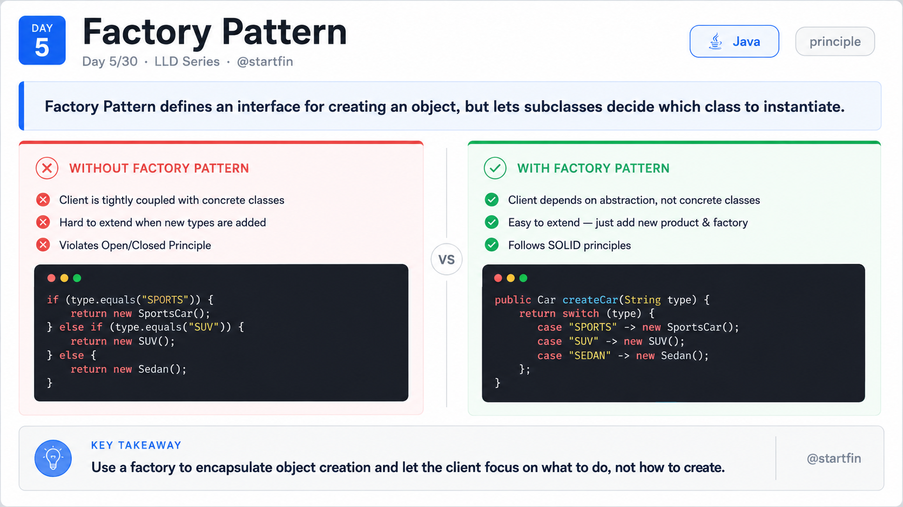
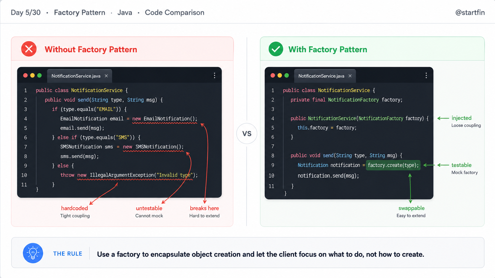
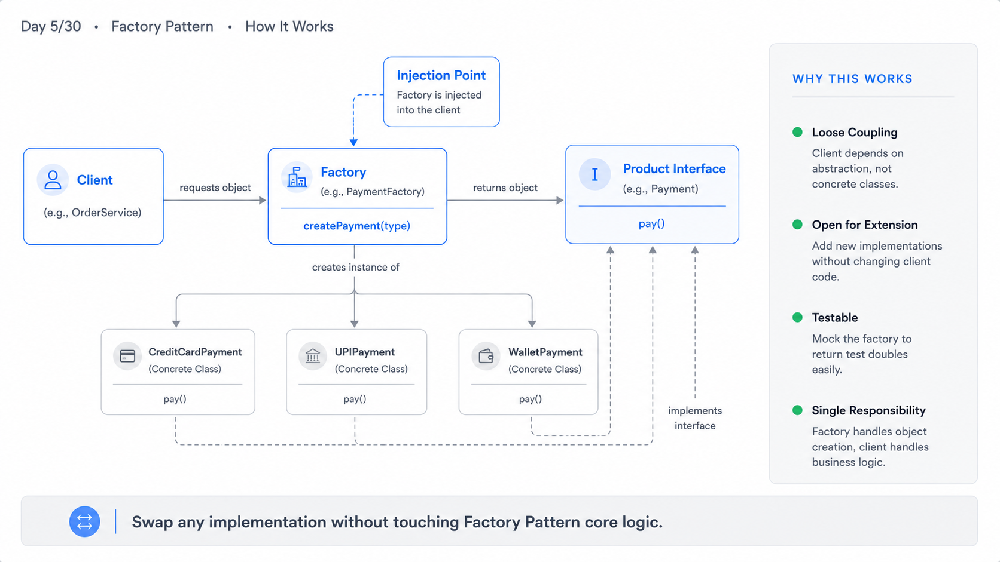
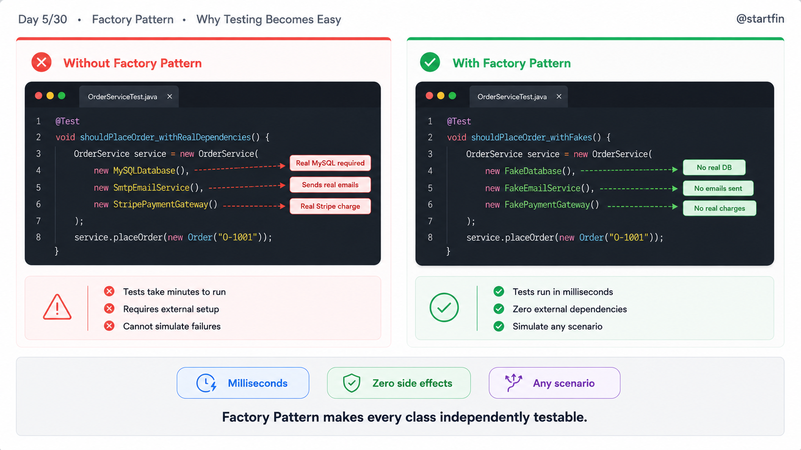

# Day 05 — Factory Pattern
## 30-Day LLD  Series
### Language: Java

---

## What is the Factory Pattern?

Think of a restaurant kitchen. You (the customer) say "I want pasta." You don't walk into the kitchen, grab flour, boil water, and knead dough yourself. You just say what you want — the kitchen figures out how to make it and hands it back.

The Factory Pattern works the same way. Instead of writing `new SomeClass()` all over your code, you ask a Factory to give you the right object. The Factory decides which class to instantiate, based on what you need.

---

## Why Does This Matter?

**WITHOUT the Factory Pattern:**
- Every caller hardcodes `new ConcreteClass()`, scattering object creation across the entire codebase.
- Adding a new type means hunting down every `new` call and updating it.
- Unit testing is painful because you can't swap real implementations for fakes.
- A single typo in a constructor call silently compiles, then explodes at runtime.
- Code is tightly coupled to specific implementations, making refactoring a nightmare.

**WITH the Factory Pattern:**
- Object creation is centralised in one place — change the factory, change everything at once.
- Adding a new type means one new class and one new line in the factory, nothing else.
- Tests swap in a fake factory and never touch a real database or API.
- You depend on interfaces, not concrete classes, so the rest of your code stays stable.
- The caller doesn't need to know which class it's getting — just what it can do.

---

## Bad Code — The Anti-Pattern

```java
// ─── Bad Code: Direct instantiation scattered everywhere ───────────────────

// Notification.java
public interface Notification {
    void send(String message);
}

// EmailNotification.java
public class EmailNotification implements Notification {
    @Override
    public void send(String message) {
        System.out.println("EMAIL: " + message);
    }
}

// SMSNotification.java
public class SMSNotification implements Notification {
    @Override
    public void send(String message) {
        System.out.println("SMS: " + message);
    }
}

// PushNotification.java
public class PushNotification implements Notification {
    @Override
    public void send(String message) {
        System.out.println("PUSH: " + message);
    }
}

// OrderService.java  ← BAD: this class knows too much
public class OrderService {
    public void notifyUser(String type, String message) {
        if (type.equals("EMAIL")) {
            EmailNotification n = new EmailNotification(); // BAD: hardcoded concrete class
            n.send(message);
        } else if (type.equals("SMS")) {
            SMSNotification n = new SMSNotification();     // BAD: repeated instantiation logic
            n.send(message);
        } else if (type.equals("PUSH")) {
            PushNotification n = new PushNotification();   // BAD: every new type = new if-block here
            n.send(message);
        }
        // BAD: adding "SLACK" means editing this method — violates Open/Closed Principle
    }
}

// UserService.java  ← BAD: same if-else duplicated in another service
public class UserService {
    public void alertUser(String type, String message) {
        if (type.equals("EMAIL")) {
            EmailNotification n = new EmailNotification(); // BAD: copy-pasted from OrderService
            n.send(message);
        } else if (type.equals("SMS")) {
            SMSNotification n = new SMSNotification();     // BAD: two places to update if SMS changes
            n.send(message);
        }
    }
}

// Main.java
public class Main {
    public static void main(String[] args) {
        OrderService orderService = new OrderService();
        orderService.notifyUser("EMAIL", "Your order has been placed.");
        orderService.notifyUser("SMS", "Your order has been placed.");

        UserService userService = new UserService();
        userService.alertUser("EMAIL", "Welcome to the platform!");
    }
}
```

**Output:**
```
EMAIL: Your order has been placed.
SMS: Your order has been placed.
EMAIL: Welcome to the platform!
```

What's wrong here? `OrderService` and `UserService` both know about `EmailNotification`, `SMSNotification`, and `PushNotification`. Add a `SlackNotification` and you're editing at least two files. Multiply that by 10 services and you have a maintenance disaster.



---

## Good Code — Factory Pattern Applied

### Step 1 — Define the product interface

Every notification type implements the same interface. Callers only ever talk to this interface, never to the concrete classes.

```java
// Notification.java
public interface Notification {
    void send(String message); // callers only depend on this — not on Email/SMS/Push
}
```

### Step 2 — Create the concrete products

Each type has one job. If `EmailNotification` changes, nothing else in the system is affected.

```java
// EmailNotification.java
public class EmailNotification implements Notification {
    @Override
    public void send(String message) {
        System.out.println("EMAIL: " + message); // single responsibility: send via email
    }
}

// SMSNotification.java
public class SMSNotification implements Notification {
    @Override
    public void send(String message) {
        System.out.println("SMS: " + message); // single responsibility: send via SMS
    }
}

// PushNotification.java
public class PushNotification implements Notification {
    @Override
    public void send(String message) {
        System.out.println("PUSH: " + message); // single responsibility: send via push
    }
}

// SlackNotification.java  ← adding a new type: ONE new file, zero changes elsewhere
public class SlackNotification implements Notification {
    @Override
    public void send(String message) {
        System.out.println("SLACK: " + message); // new type added without touching any existing class
    }
}
```

### Step 3 — Build the Factory

The factory is the only place that knows about concrete classes. Every other class in the system stays blissfully ignorant of which implementation it's getting.

```java
// NotificationFactory.java
public class NotificationFactory {

    // static factory method — callers get a Notification, not a specific class
    public static Notification create(String type) {
        switch (type.toUpperCase()) {
            case "EMAIL": return new EmailNotification(); // creation logic centralised here
            case "SMS":   return new SMSNotification();   // add "SLACK" → add ONE case here
            case "PUSH":  return new PushNotification();
            case "SLACK": return new SlackNotification(); // new type: one line in one file
            default:
                throw new IllegalArgumentException("Unknown notification type: " + type);
                // fail fast: unknown types blow up loudly, not silently
        }
    }
}
```

### Step 4 — Use the Factory in your services

`OrderService` and `UserService` are now completely decoupled from concrete notification classes. They only know about the `Notification` interface and `NotificationFactory`.

```java
// OrderService.java  ← GOOD: no concrete class imports, no if-else chains
public class OrderService {
    public void notifyUser(String type, String message) {
        Notification notification = NotificationFactory.create(type); // factory decides the type
        notification.send(message); // caller just uses the interface
    }
}

// UserService.java  ← GOOD: identical clean pattern, no duplication
public class UserService {
    public void alertUser(String type, String message) {
        Notification notification = NotificationFactory.create(type); // same factory, consistent behaviour
        notification.send(message);
    }
}

// Main.java
public class Main {
    public static void main(String[] args) {
        OrderService orderService = new OrderService();
        orderService.notifyUser("EMAIL", "Your order has been placed.");
        orderService.notifyUser("SMS",   "Your order has been placed.");
        orderService.notifyUser("SLACK", "Your order has been placed."); // new type — zero service changes

        UserService userService = new UserService();
        userService.alertUser("EMAIL", "Welcome to the platform!");
        userService.alertUser("PUSH",  "Your profile is complete.");
    }
}
```



---

## Output

```
EMAIL: Your order has been placed.
SMS: Your order has been placed.
SLACK: Your order has been placed.
EMAIL: Welcome to the platform!
PUSH: Your profile is complete.
```

---

## Bonus — Registry-Based Factory (Runtime Registration)

The basic factory uses a `switch` statement, which means you still need to edit the factory when you add a new type. Senior developers take this one step further: a **registry-based factory** where new types register themselves at startup. The factory never needs to change again.

This is how Spring's `ApplicationContext` works — beans register themselves; the container hands them out on demand.

```java
import java.util.HashMap;
import java.util.Map;
import java.util.function.Supplier;

// NotificationRegistry.java
public class NotificationRegistry {

    // registry maps a string key to a supplier (a factory lambda)
    private static final Map<String, Supplier<Notification>> registry = new HashMap<>();

    // register() is called once at startup, not in a switch
    public static void register(String type, Supplier<Notification> supplier) {
        registry.put(type.toUpperCase(), supplier);
    }

    // create() never mentions EmailNotification or SMSNotification
    public static Notification create(String type) {
        Supplier<Notification> supplier = registry.get(type.toUpperCase());
        if (supplier == null) {
            throw new IllegalArgumentException("No notification registered for: " + type);
        }
        return supplier.get(); // supplier.get() calls new EmailNotification() etc. lazily
    }
}

// App.java  ← registration happens here, at application startup
public class App {
    static {
        // register all known types once — add new types here without touching the factory
        NotificationRegistry.register("EMAIL", EmailNotification::new);
        NotificationRegistry.register("SMS",   SMSNotification::new);
        NotificationRegistry.register("PUSH",  PushNotification::new);
        NotificationRegistry.register("SLACK", SlackNotification::new);
        // adding WhatsApp? One line here. The factory is permanently closed to modification.
    }

    public static void main(String[] args) {
        Notification n = NotificationRegistry.create("SLACK");
        n.send("Registered at runtime — no switch needed.");

        // Runtime swap: override a registration for testing
        NotificationRegistry.register("EMAIL", () -> msg -> System.out.println("MOCK_EMAIL: " + msg));
        NotificationRegistry.create("EMAIL").send("This uses the mock now.");
    }
}
```

**Output:**
```
SLACK: Registered at runtime — no switch needed.
MOCK_EMAIL: This uses the mock now.
```

The registry pattern also enables plugin architectures — external JAR files can call `register()` and add new types without touching the core codebase at all.



---

## Unit Tests

```java
import org.junit.jupiter.api.Test;
import org.junit.jupiter.api.BeforeEach;
import static org.junit.jupiter.api.Assertions.*;
import java.util.ArrayList;
import java.util.List;

// ─── Fake implementations for testing — no real email/SMS APIs ────────────

class FakeNotification implements Notification {
    List<String> sentMessages = new ArrayList<>();

    @Override
    public void send(String message) {
        sentMessages.add(message); // captures messages instead of sending them
    }
}

// ─── Test the factory itself ───────────────────────────────────────────────

class NotificationFactoryTest {

    @Test
    void shouldReturnEmailNotificationForEmailType() {
        // verifies factory creates the correct concrete type for "EMAIL"
        Notification notification = NotificationFactory.create("EMAIL");
        assertNotNull(notification);
        assertTrue(notification instanceof EmailNotification);
    }

    @Test
    void shouldReturnSMSNotificationForSMSType() {
        // verifies factory creates the correct concrete type for "SMS"
        Notification notification = NotificationFactory.create("SMS");
        assertTrue(notification instanceof SMSNotification);
    }

    @Test
    void shouldBeCaseInsensitive() {
        // verifies "email", "Email", "EMAIL" all produce the same type
        Notification lower = NotificationFactory.create("email");
        Notification upper = NotificationFactory.create("EMAIL");
        assertEquals(lower.getClass(), upper.getClass());
    }

    @Test
    void shouldThrowForUnknownType() {
        // verifies unknown types fail fast with a clear error, not silently
        assertThrows(
            IllegalArgumentException.class,
            () -> NotificationFactory.create("CARRIER_PIGEON")
        );
    }
}

// ─── Test OrderService using a fake factory ────────────────────────────────

// FakeNotificationFactory.java — used to isolate OrderService from real implementations
class FakeNotificationFactory {
    private final FakeNotification fake = new FakeNotification();

    public Notification create(String type) {
        return fake; // always returns the same fake — we can inspect what was sent
    }

    public FakeNotification getFake() {
        return fake;
    }
}

// OrderServiceTest.java
class OrderServiceTest {

    // Refactored OrderService that accepts an injected factory (dependency injection)
    static class TestableOrderService {
        private final FakeNotificationFactory factory;

        TestableOrderService(FakeNotificationFactory factory) {
            this.factory = factory;
        }

        public void notifyUser(String type, String message) {
            factory.create(type).send(message);
        }
    }

    private FakeNotificationFactory fakeFactory;
    private TestableOrderService orderService;

    @BeforeEach
    void setUp() {
        fakeFactory = new FakeNotificationFactory();
        orderService = new TestableOrderService(fakeFactory);
    }

    @Test
    void shouldSendNotificationMessageToUser() {
        // verifies the message reaches the notification channel — happy path
        orderService.notifyUser("EMAIL", "Order confirmed");
        assertTrue(fakeFactory.getFake().sentMessages.contains("Order confirmed"));
    }

    @Test
    void shouldSendMultipleNotifications() {
        // verifies the service can send more than one notification in sequence
        orderService.notifyUser("EMAIL", "Msg 1");
        orderService.notifyUser("SMS",   "Msg 2");
        assertEquals(2, fakeFactory.getFake().sentMessages.size());
    }

    @Test
    void shouldSendNoMessageWhenMessageIsEmpty() {
        // edge case: empty message string should not crash — it's valid input
        assertDoesNotThrow(() -> orderService.notifyUser("EMAIL", ""));
        assertTrue(fakeFactory.getFake().sentMessages.contains(""));
    }
}
```



---

## Side-by-Side Comparison

```
╔══════════════════════╦══════════════════════════════════╦══════════════════════════════════╗
║ Dimension            ║ BEFORE (Direct new)              ║ AFTER (Factory Pattern)          ║
╠══════════════════════╬══════════════════════════════════╬══════════════════════════════════╣
║ Coupling             ║ Services import concrete classes ║ Services depend only on          ║
║                      ║ (EmailNotification, SMS etc)     ║ the Notification interface       ║
╠══════════════════════╬══════════════════════════════════╬══════════════════════════════════╣
║ Testability          ║ Cannot swap real classes for     ║ Inject a fake factory; services  ║
║                      ║ fakes — real sends happen        ║ never touch real implementations ║
╠══════════════════════╬══════════════════════════════════╬══════════════════════════════════╣
║ Flexibility          ║ Adding a type = editing every    ║ Adding a type = one new class    ║
║                      ║ if-else in every service         ║ + one line in the factory        ║
╠══════════════════════╬══════════════════════════════════╬══════════════════════════════════╣
║ Runtime behaviour    ║ Type is baked in at compile      ║ Registry pattern allows new      ║
║                      ║ time; no late binding possible   ║ types to register at runtime     ║
╠══════════════════════╬══════════════════════════════════╬══════════════════════════════════╣
║ Adding new variants  ║ Edit N service files; risk       ║ Add 1 class; 1 case in factory;  ║
║                      ║ breaking existing behaviour      ║ zero changes to existing code    ║
╚══════════════════════╩══════════════════════════════════╩══════════════════════════════════╝
```

<!-- IMAGE 3: This comparison table becomes the architecture / comparison slide -->

---

## When Should You Use This?

**Use the Factory Pattern when:**

1. You have multiple classes that implement the same interface, and the caller should not decide which one to use.
2. Object creation involves conditional logic (`if type == X`) that is duplicated across more than one class.
3. You want to swap implementations at runtime (e.g. different payment gateways per country).
4. You want unit tests that run without real databases, APIs, or network calls.
5. You expect new types to be added regularly — centralising creation means one change, not many.

**Do NOT use the Factory Pattern when:**

1. **You only have one implementation** — a factory for a single concrete class is pure overhead with no benefit.
2. **The object construction is trivial** — if it's just `new EmailNotification()` called in one place, a factory adds indirection with no payoff.
3. **You're inside a framework that already does this** — Spring's `@Bean` and `@Component`, for example, are factories. Wrapping them in your own factory usually creates confusion, not clarity.

---

## Project Structure

```
src/
└── main/
    └── java/
        └── com/startfin/lld/day05/
            ├── Notification.java               ← product interface
            ├── EmailNotification.java          ← concrete product
            ├── SMSNotification.java            ← concrete product
            ├── PushNotification.java           ← concrete product
            ├── SlackNotification.java          ← concrete product (new type, no edits elsewhere)
            ├── NotificationFactory.java        ← the factory (switch-based)
            ├── NotificationRegistry.java       ← bonus: registry-based factory
            ├── OrderService.java               ← client of the factory
            ├── UserService.java                ← client of the factory
            └── Main.java                       ← entry point / usage demo

src/
└── test/
    └── java/
        └── com/startfin/lld/day05/
            ├── FakeNotification.java           ← test double for unit tests
            ├── FakeNotificationFactory.java    ← injectable fake factory
            ├── NotificationFactoryTest.java    ← tests factory output and error handling
            └── OrderServiceTest.java           ← tests service in isolation
```

---

## Key Takeaways

1. The Factory Pattern moves object creation out of business logic and into a single, dedicated place.
2. Callers depend on an interface — they never import or know about concrete classes.
3. Adding a new type means one new class and one new line in the factory; no other file changes.
4. Factories make unit testing trivial — inject a fake factory and your service never touches a real API.
5. The registry-based factory eliminates the switch statement entirely, making the factory itself open for extension without modification.
6. Do not reach for a factory when you only have one implementation — patterns solve problems, not imagined future problems.

---