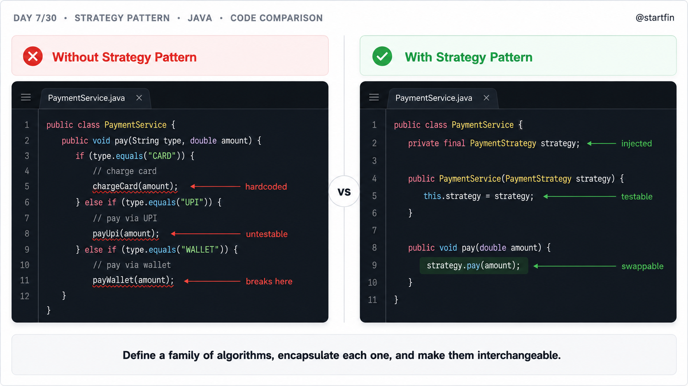
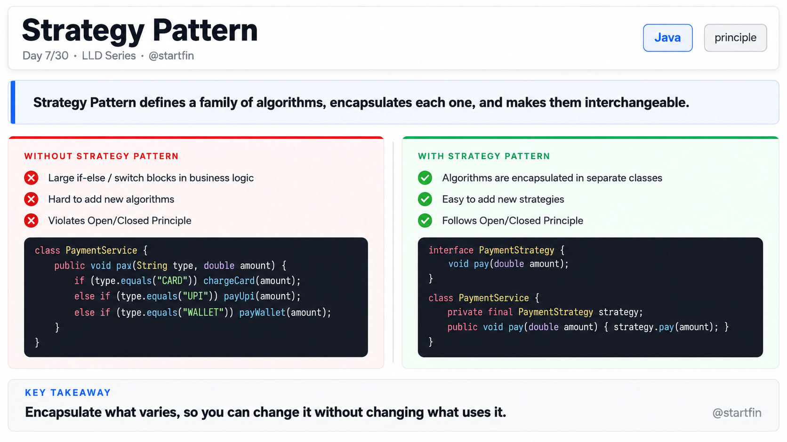
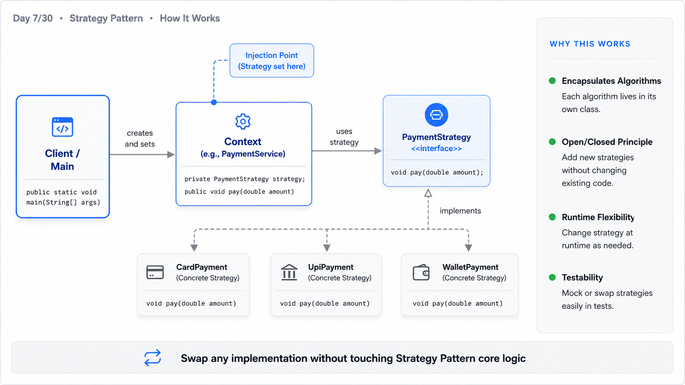
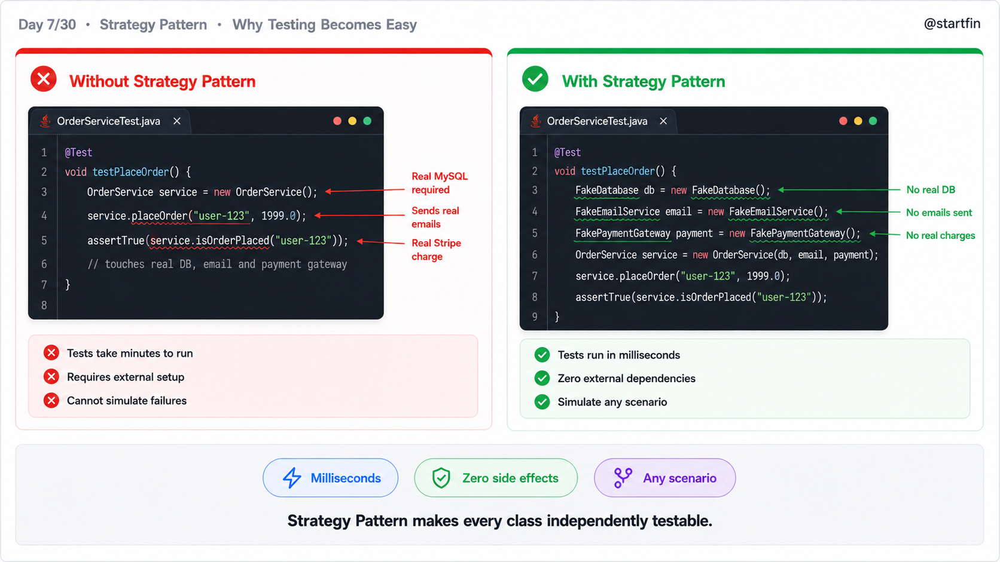

# Day 07 — Strategy Pattern
## 30-Day LLD  Series 
### Language: Java

---

## What is the Strategy Pattern?

Imagine you're at a restaurant and the waiter asks: "How would you like to pay?" You can say cash, card, or UPI — the bill doesn't change, the food doesn't change, only the *payment method* does. The Strategy Pattern works exactly like this. It lets you define a family of algorithms (or behaviours), wrap each one in its own class, and swap them at runtime — without touching the code that uses them.

---

## Why Does This Matter?

**WITHOUT Strategy Pattern:**
- Adding a new behaviour means opening an existing class and modifying it — breaking the Open/Closed Principle.
- Giant `if-else` or `switch` blocks grow every time requirements change.
- You can't test behaviours in isolation — they're all tangled in one class.
- Swapping an algorithm at runtime means rewriting logic, not just passing a different object.
- Two different features accidentally share code, and changing one breaks the other.

**WITH Strategy Pattern:**
- Each behaviour lives in its own class — you add new ones without touching existing code.
- The context class (e.g. `OrderService`) stays clean and focused on orchestration.
- Every strategy is independently unit-testable with a simple mock or stub.
- You can swap algorithms at runtime by passing a different strategy object.
- Behaviour changes are isolated — fixing one strategy never breaks another.

---

## Bad Code — The Anti-Pattern

```java
// OrderService.java — the anti-pattern (everything crammed in one class)

public class OrderService {

    // BAD: a plain String field to track payment type — no type safety, typo-prone
    private String paymentType;

    public OrderService(String paymentType) {
        this.paymentType = paymentType; // BAD: the caller must know the magic strings "CREDIT", "UPI", etc.
    }

    public void processPayment(double amount) {

        // BAD: every time a new payment method is added, we must open THIS class and add another branch
        if (paymentType.equals("CREDIT")) {
            System.out.println("Processing CREDIT card payment of ₹" + amount);
            System.out.println("Charging card via Visa gateway...");

        } else if (paymentType.equals("UPI")) { // BAD: growing if-else chain — classic violation of Open/Closed
            System.out.println("Processing UPI payment of ₹" + amount);
            System.out.println("Sending UPI push notification...");

        } else if (paymentType.equals("WALLET")) { // BAD: adding "WALLET" required editing this production class
            System.out.println("Processing Wallet payment of ₹" + amount);
            System.out.println("Deducting from wallet balance...");

        } else {
            // BAD: silent fallthrough — invalid payment type does nothing, no exception, hard to debug
            System.out.println("Unknown payment type. Doing nothing.");
        }
    }

    // BAD: to test credit-card logic you must instantiate the entire OrderService with a magic string
    public static void main(String[] args) {
        OrderService creditOrder = new OrderService("CREDIT");
        creditOrder.processPayment(1500.00);

        OrderService upiOrder = new OrderService("UPI");
        upiOrder.processPayment(200.00);

        OrderService walletOrder = new OrderService("WALLET");
        walletOrder.processPayment(50.00);

        // BAD: what happens when product team asks for "BNPL" (Buy Now Pay Later)?
        // Answer: you open this class, add another else-if, and pray you don't break the rest.
    }
}
```

**Output:**
```
Processing CREDIT card payment of ₹1500.0
Charging card via Visa gateway...
Processing UPI payment of ₹200.0
Sending UPI push notification...
Processing Wallet payment of ₹50.0
Deducting from wallet balance...
```



---

## Good Code — Strategy Pattern Applied

### Step 1 — Define the Strategy Interface

The contract every payment method must honour. One method, one responsibility.

```java
// PaymentStrategy.java
public interface PaymentStrategy {
    // GOOD: every payment algorithm is forced to implement the same method signature
    void pay(double amount);
}
```

---

### Step 2 — Implement Concrete Strategies

Each payment method lives in its own class. They never know about each other.

```java
// CreditCardPayment.java
public class CreditCardPayment implements PaymentStrategy {

    private String cardNumber;

    public CreditCardPayment(String cardNumber) {
        this.cardNumber = cardNumber; // GOOD: strategy carries its own config — context doesn't need to know
    }

    @Override
    public void pay(double amount) {
        // GOOD: all credit-card logic is isolated here — changing Visa to Mastercard gateway touches only this file
        System.out.println("Processing CREDIT card payment of ₹" + amount);
        System.out.println("Charging card ending in " + cardNumber.substring(cardNumber.length() - 4) + " via gateway...");
    }
}
```

```java
// UpiPayment.java
public class UpiPayment implements PaymentStrategy {

    private String upiId;

    public UpiPayment(String upiId) {
        this.upiId = upiId;
    }

    @Override
    public void pay(double amount) {
        // GOOD: UPI-specific logic (VPA validation, push notification) stays here and only here
        System.out.println("Processing UPI payment of ₹" + amount);
        System.out.println("Sending UPI push to " + upiId + "...");
    }
}
```

```java
// WalletPayment.java
public class WalletPayment implements PaymentStrategy {

    private String walletProvider;

    public WalletPayment(String walletProvider) {
        this.walletProvider = walletProvider;
    }

    @Override
    public void pay(double amount) {
        // GOOD: wallet deduction logic is self-contained — no risk of accidentally changing credit card behaviour
        System.out.println("Processing " + walletProvider + " Wallet payment of ₹" + amount);
        System.out.println("Deducting from wallet balance...");
    }
}
```

---

### Step 3 — Build the Context Class

`OrderService` is now slim. It delegates payment logic entirely to whichever strategy it holds.

```java
// OrderService.java — the context
public class OrderService {

    // GOOD: depends on the interface, not any concrete class — Dependency Inversion in action
    private PaymentStrategy paymentStrategy;

    public OrderService(PaymentStrategy paymentStrategy) {
        this.paymentStrategy = paymentStrategy; // GOOD: strategy is injected — easy to swap in tests
    }

    // GOOD: runtime swap — customer can change payment method mid-session without recreating the order
    public void setPaymentStrategy(PaymentStrategy paymentStrategy) {
        this.paymentStrategy = paymentStrategy;
    }

    public void checkout(double amount) {
        System.out.println("--- Checkout initiated for ₹" + amount + " ---");
        paymentStrategy.pay(amount); // GOOD: single delegation call — no if-else, no switch, just polymorphism
        System.out.println("--- Payment complete ---\n");
    }

    public static void main(String[] args) {
        // GOOD: swapping payment method = passing a different object, zero changes to OrderService
        OrderService order1 = new OrderService(new CreditCardPayment("4111111111111234"));
        order1.checkout(1500.00);

        OrderService order2 = new OrderService(new UpiPayment("user@okaxis"));
        order2.checkout(200.00);

        OrderService order3 = new OrderService(new WalletPayment("Paytm"));
        order3.checkout(50.00);

        // GOOD: runtime swap — customer switched from UPI to Wallet mid-session
        System.out.println("Customer switched payment method mid-session:");
        order2.setPaymentStrategy(new WalletPayment("PhonePe"));
        order2.checkout(200.00);
    }
}
```



---

## Output

```
--- Checkout initiated for ₹1500.0 ---
Processing CREDIT card payment of ₹1500.0
Charging card ending in 1234 via gateway...
--- Payment complete ---

--- Checkout initiated for ₹200.0 ---
Processing UPI payment of ₹200.0
Sending UPI push to user@okaxis...
--- Payment complete ---

--- Checkout initiated for ₹50.0 ---
Processing Paytm Wallet payment of ₹50.0
Deducting from wallet balance...
--- Payment complete ---

Customer switched payment method mid-session:
--- Checkout initiated for ₹200.0 ---
Processing PhonePe Wallet payment of ₹200.0
Deducting from wallet balance...
--- Payment complete ---
```

---

## Bonus — Runtime Strategy Swap + Strategy Registry

Senior engineers go one step further: they store strategies in a `Map` and resolve them by key at runtime. This is exactly how Spring's `@Qualifier` and many payment gateway SDKs work internally.

```java
import java.util.HashMap;
import java.util.Map;

// PaymentStrategyRegistry.java
public class PaymentStrategyRegistry {

    // GOOD: registry pattern — strategies are registered once at startup, resolved by key at runtime
    private final Map<String, PaymentStrategy> registry = new HashMap<>();

    public void register(String key, PaymentStrategy strategy) {
        registry.put(key.toUpperCase(), strategy);
    }

    public PaymentStrategy resolve(String key) {
        PaymentStrategy strategy = registry.get(key.toUpperCase());
        if (strategy == null) {
            // GOOD: fail-fast with a clear exception, not a silent no-op like the bad code
            throw new IllegalArgumentException("No payment strategy registered for: " + key);
        }
        return strategy;
    }
}

// Usage — wire up at app startup (or in a Spring @Configuration class)
class App {
    public static void main(String[] args) {
        PaymentStrategyRegistry registry = new PaymentStrategyRegistry();

        // GOOD: registering a new method (e.g. BNPL) = one line here, zero changes elsewhere
        registry.register("CREDIT", new CreditCardPayment("4111111111111234"));
        registry.register("UPI",    new UpiPayment("user@okaxis"));
        registry.register("WALLET", new WalletPayment("Paytm"));

        // Simulate a request coming in from an API: { "paymentMethod": "UPI", "amount": 750 }
        String methodFromRequest = "UPI";
        double amountFromRequest = 750.00;

        OrderService order = new OrderService(registry.resolve(methodFromRequest));
        order.checkout(amountFromRequest);
    }
}
```

**Output:**
```
--- Checkout initiated for ₹750.0 ---
Processing UPI payment of ₹750.0
Sending UPI push to user@okaxis...
--- Payment complete ---
```

> **Real-world connection:** Stripe's SDK uses exactly this pattern internally. Each payment method (card, SEPA, iDEAL) is a strategy. The `PaymentIntent` object is the context. You pass the `payment_method_type` string and the SDK resolves the right handler — you never touch the core payment flow.



---

## Unit Tests

```java
import org.junit.jupiter.api.Test;
import static org.junit.jupiter.api.Assertions.*;
import java.io.ByteArrayOutputStream;
import java.io.PrintStream;

class StrategyPatternTest {

    // Helper: captures System.out so we can assert on printed output
    private String captureOutput(Runnable action) {
        ByteArrayOutputStream baos = new ByteArrayOutputStream();
        PrintStream original = System.out;
        System.setOut(new PrintStream(baos));
        action.run();
        System.setOut(original);
        return baos.toString();
    }

    @Test
    void creditCardPayment_shouldPrintGatewayChargeMessage() {
        // Verifies: CreditCardPayment delegates to the Visa gateway message with last 4 digits
        OrderService order = new OrderService(new CreditCardPayment("4111111111111234"));
        String output = captureOutput(() -> order.checkout(1500.00));
        assertTrue(output.contains("CREDIT card"));
        assertTrue(output.contains("1234")); // last 4 digits must appear
    }

    @Test
    void upiPayment_shouldIncludeVpaInOutput() {
        // Verifies: UpiPayment uses the provided UPI ID in its output
        OrderService order = new OrderService(new UpiPayment("user@okaxis"));
        String output = captureOutput(() -> order.checkout(200.00));
        assertTrue(output.contains("user@okaxis"));
    }

    @Test
    void walletPayment_shouldNameTheProvider() {
        // Verifies: WalletPayment includes the wallet provider name in its confirmation message
        OrderService order = new OrderService(new WalletPayment("Paytm"));
        String output = captureOutput(() -> order.checkout(50.00));
        assertTrue(output.contains("Paytm"));
    }

    @Test
    void setPaymentStrategy_shouldSwapBehaviourAtRuntime() {
        // Verifies: calling setPaymentStrategy mid-session changes payment output without recreating OrderService
        OrderService order = new OrderService(new UpiPayment("user@okaxis"));
        order.setPaymentStrategy(new WalletPayment("PhonePe")); // runtime swap
        String output = captureOutput(() -> order.checkout(200.00));
        assertTrue(output.contains("PhonePe"));
        assertFalse(output.contains("UPI")); // old strategy must NOT appear
    }

    @Test
    void registry_shouldResolveStrategyByKey() {
        // Verifies: PaymentStrategyRegistry returns the correct strategy for a registered key
        PaymentStrategyRegistry registry = new PaymentStrategyRegistry();
        registry.register("UPI", new UpiPayment("test@upi"));
        PaymentStrategy resolved = registry.resolve("UPI");
        assertNotNull(resolved);
        assertInstanceOf(UpiPayment.class, resolved);
    }

    @Test
    void registry_shouldThrowForUnknownKey() {
        // Verifies: registry fails fast with IllegalArgumentException for unregistered payment types
        PaymentStrategyRegistry registry = new PaymentStrategyRegistry();
        assertThrows(IllegalArgumentException.class, () -> registry.resolve("BNPL"));
    }

    @Test
    void registry_resolveIsCaseInsensitive() {
        // Verifies: registry key lookup is case-insensitive ("upi" resolves same as "UPI")
        PaymentStrategyRegistry registry = new PaymentStrategyRegistry();
        registry.register("UPI", new UpiPayment("test@upi"));
        assertDoesNotThrow(() -> registry.resolve("upi"));
    }

    @Test
    void checkout_shouldAlwaysPrintCheckoutInitiatedLine() {
        // Verifies: OrderService always wraps payment output with the standard checkout header/footer
        OrderService order = new OrderService(new WalletPayment("Paytm"));
        String output = captureOutput(() -> order.checkout(99.00));
        assertTrue(output.contains("Checkout initiated"));
        assertTrue(output.contains("Payment complete"));
    }
}
```



---

## Side-by-Side Comparison

```
╔══════════════════╦══════════════════════════════════════╦══════════════════════════════════════════╗
║ Dimension        ║ BEFORE (if-else anti-pattern)        ║ AFTER (Strategy Pattern)                 ║
╠══════════════════╬══════════════════════════════════════╬══════════════════════════════════════════╣
║ Coupling         ║ OrderService knows every payment     ║ OrderService knows only the interface.   ║
║                  ║ algorithm — tightly coupled to all   ║ Concrete strategies are invisible to it. ║
╠══════════════════╬══════════════════════════════════════╬══════════════════════════════════════════╣
║ Testability      ║ Must instantiate the full service    ║ Each strategy is tested in isolation.    ║
║                  ║ with a magic string to test one      ║ Context is tested with a mock strategy.  ║
║                  ║ payment path.                        ║                                          ║
╠══════════════════╬══════════════════════════════════════╬══════════════════════════════════════════╣
║ Flexibility      ║ Adding BNPL = open OrderService,     ║ Adding BNPL = create BnplPayment.java.   ║
║                  ║ add an else-if, risk breaking        ║ Zero changes to OrderService or any      ║
║                  ║ existing branches.                   ║ other strategy.                          ║
╠══════════════════╬══════════════════════════════════════╬══════════════════════════════════════════╣
║ Runtime          ║ Not possible. Payment type is set    ║ Fully supported. Call setPaymentStrategy ║
║ Behaviour        ║ in the constructor and baked in      ║ anytime to swap behaviour on a live      ║
║                  ║ for the object's lifetime.           ║ OrderService instance.                   ║
╠══════════════════╬══════════════════════════════════════╬══════════════════════════════════════════╣
║ Adding New       ║ O(n) risk — every new variant        ║ O(1) effort — create one new class,      ║
║ Variants         ║ requires touching the switch/if      ║ implement the interface, register it.    ║
║                  ║ block and re-testing everything.     ║ Existing code is untouched.              ║
╚══════════════════╩══════════════════════════════════════╩══════════════════════════════════════════╝
```

<!-- IMAGE 3: This comparison table becomes the architecture / comparison slide -->

---

## When Should You Use This?

**Use the Strategy Pattern when:**

1. You have multiple algorithms or behaviours that do the same job but differently (sorting, payment, compression, notification).
2. You find yourself writing `if (type.equals("X"))` blocks that grow every sprint — that's your signal.
3. You need to select or swap an algorithm at runtime based on user input, config, or feature flags.
4. You want to test each variant independently without spinning up the entire context class.
5. Different parts of your system need the same behaviour but in different combinations (e.g. mobile app uses UPI, web uses credit card).

**Do NOT use it when:**

- You only have one algorithm and no realistic expectation of adding more. Adding an interface for a single implementation is over-engineering.
- The "strategies" need to share complex state with each other or with the context. If they're deeply entangled, a strategy isn't the right boundary — consider a different pattern.
- The variation is a simple boolean flag (`isDiscounted = true/false`). A full strategy class for a one-line change adds ceremony without value.

---

## Project Structure

```
src/
└── main/
    └── java/
        └── com/startfin/lld/day07/
            ├── strategy/
            │   ├── PaymentStrategy.java          ← interface (the contract)
            │   ├── CreditCardPayment.java         ← concrete strategy 1
            │   ├── UpiPayment.java                ← concrete strategy 2
            │   └── WalletPayment.java             ← concrete strategy 3
            ├── context/
            │   └── OrderService.java              ← context class
            ├── registry/
            │   └── PaymentStrategyRegistry.java   ← bonus: runtime registry
            └── App.java                           ← main() entry point

src/
└── test/
    └── java/
        └── com/startfin/lld/day07/
            └── StrategyPatternTest.java           ← JUnit 5 test class
```

---

## Key Takeaways

1. The Strategy Pattern replaces `if-else` chains with polymorphism — each algorithm lives in its own class.
2. The context class depends on an interface, not a concrete implementation — this is Dependency Inversion in practice.
3. Strategies are interchangeable at runtime, making feature flags and A/B tests trivial to implement.
4. Each strategy is independently unit-testable — no need to spin up the full context to verify a single algorithm.
5. Adding a new variant requires creating one new class and registering it — zero changes to existing code.
6. Don't reach for Strategy when you have a single behaviour with no growth expected — interfaces for one implementation is ceremony, not design.

---

