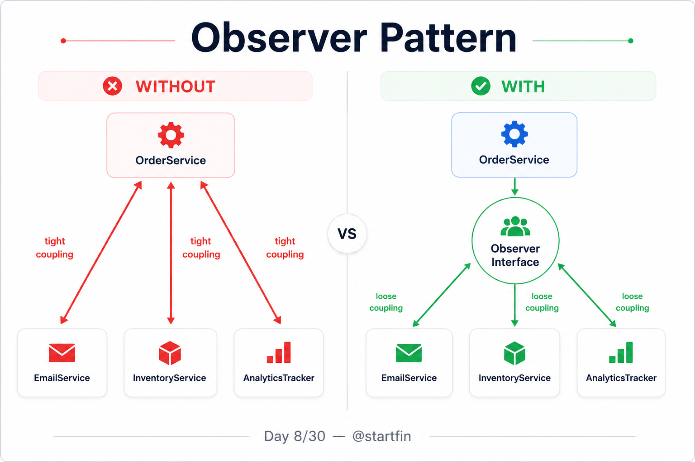
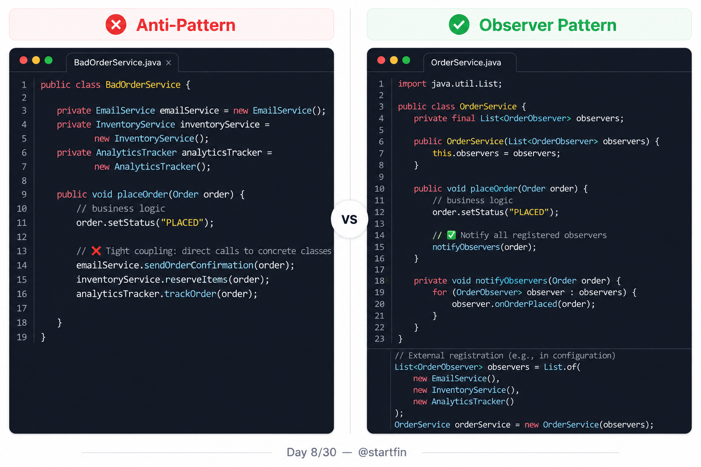
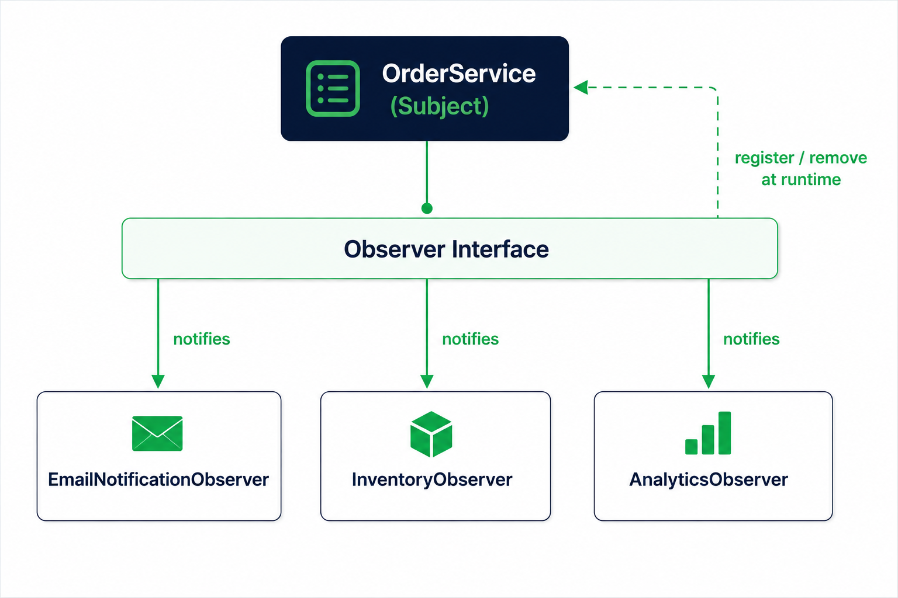
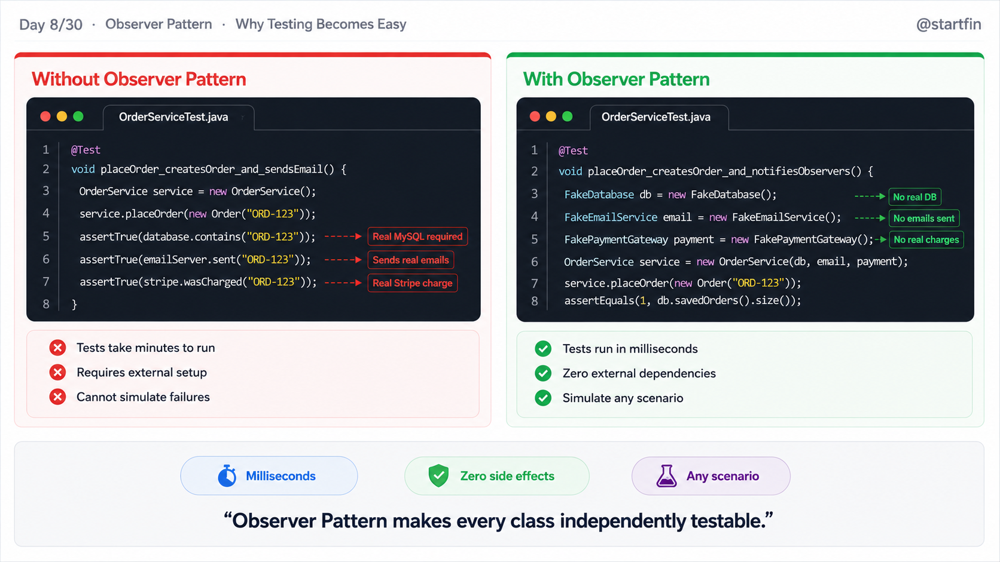

# Day 08 — Observer Pattern
## 30-Day LLD Series
### Language: Java

---

## What is the Observer Pattern?

Think of a newspaper subscription. You sign up once, and every morning the paper lands at your door without you doing anything. The newspaper doesn't know or care how many subscribers it has — it just publishes, and everyone who signed up gets notified automatically.

That's the Observer Pattern. One object (the **Subject**) holds state. Many other objects (the **Observers**) register interest in that state. When the state changes, the Subject tells all registered Observers — without being tightly coupled to any of them.

---

## Why Does This Matter?

**Without the Observer Pattern:**
- Every component that cares about a state change must be manually called, one by one, inside the same method.
- Adding a new listener means editing the core business class — violating the Open/Closed Principle.
- Unit testing the subject forces you to instantiate every dependent component, even ones you don't care about.
- Removing or reordering listeners requires hunting through the same tangled method every time.
- The subject class grows endlessly as new "notify X, notify Y, notify Z" calls pile up.

**With the Observer Pattern:**
- The subject fires one event; every registered observer handles it independently.
- New listeners are added at runtime without touching the subject's source code.
- Each observer can be unit tested in complete isolation with a mock subject.
- Observers can register and deregister dynamically, giving you runtime flexibility for free.
- The subject stays lean and focused — it owns state, not a growing list of side effects.

---

## Bad Code — The Anti-Pattern

The problem we'll solve throughout this file: an e-commerce `OrderService` that needs to notify an email system, an inventory system, and an analytics tracker every time an order is placed.

```java
// BadOrderService.java — hardwired notification, no abstraction

public class BadOrderService {

    // BAD: EmailNotifier is a concrete class — swapping it requires editing this file
    private EmailNotifier emailNotifier = new EmailNotifier();

    // BAD: InventoryService is directly instantiated — impossible to mock in tests
    private InventoryService inventoryService = new InventoryService();

    // BAD: AnalyticsTracker hardcoded — adding a new tracker means editing this class
    private AnalyticsTracker analyticsTracker = new AnalyticsTracker();

    public void placeOrder(String orderId, String product, int quantity) {
        System.out.println("[OrderService] Order placed: " + orderId);

        // BAD: This method now owns the responsibility of every downstream system
        // A single method is doing order placement AND notification AND inventory AND analytics
        emailNotifier.sendConfirmation(orderId);          // BAD: tightly coupled call
        inventoryService.decrementStock(product, quantity); // BAD: business logic mixed with side effects
        analyticsTracker.recordSale(product, quantity);   // BAD: adding a 4th listener = editing this method

        // BAD: If AnalyticsTracker throws, the order appears to fail even though it succeeded
        // There is zero fault isolation between these three concerns
    }
}

class EmailNotifier {
    public void sendConfirmation(String orderId) {
        System.out.println("[Email] Confirmation sent for order: " + orderId);
    }
}

class InventoryService {
    public void decrementStock(String product, int quantity) {
        System.out.println("[Inventory] Stock reduced: " + product + " by " + quantity);
    }
}

class AnalyticsTracker {
    public void recordSale(String product, int quantity) {
        System.out.println("[Analytics] Sale recorded: " + product + " x" + quantity);
    }
}

// Main — BAD version
class BadMain {
    public static void main(String[] args) {
        BadOrderService service = new BadOrderService();
        service.placeOrder("ORD-001", "Laptop", 1);
    }
}
```

**Output:**
```
[OrderService] Order placed: ORD-001
[Email] Confirmation sent for order: ORD-001
[Inventory] Stock reduced: Laptop by 1
[Analytics] Sale recorded: Laptop x1
```



---

## Good Code — Observer Pattern Applied

**Step 1: Define the Observer interface**

Every listener implements this single contract. The subject never needs to know what type of object it's notifying.

**Step 2: Define the Subject interface**

The subject exposes register, remove, and notify. This is what lets you swap implementations freely and test in isolation.

**Step 3: Implement the concrete Subject and Observers**

`OrderService` manages its own list of observers internally. Each observer does exactly one job. Wiring is done in `main()` — not inside the subject.

```java
// ──────────────────────────────────────────────
// Step 1: Observer interface
// ──────────────────────────────────────────────

// GOOD: All observers share one contract — the subject only talks to this interface
public interface OrderObserver {
    void onOrderPlaced(String orderId, String product, int quantity);
}

// ──────────────────────────────────────────────
// Step 2: Subject interface
// ──────────────────────────────────────────────

// GOOD: Separating the subject contract means you can mock it in tests
public interface OrderSubject {
    void registerObserver(OrderObserver observer);   // add a listener at runtime
    void removeObserver(OrderObserver observer);     // remove a listener at runtime
    void notifyObservers(String orderId, String product, int quantity);
}

// ──────────────────────────────────────────────
// Step 3a: Concrete Subject
// ──────────────────────────────────────────────

import java.util.ArrayList;
import java.util.List;

public class OrderService implements OrderSubject {

    // GOOD: The list holds the interface type — not concrete classes
    private final List<OrderObserver> observers = new ArrayList<>();

    public void registerObserver(OrderObserver observer) {
        observers.add(observer); // GOOD: any object implementing the interface can be added
    }

    public void removeObserver(OrderObserver observer) {
        observers.remove(observer); // GOOD: deregistration costs nothing — no source changes
    }

    public void notifyObservers(String orderId, String product, int quantity) {
        // GOOD: The subject loops once — it doesn't know or care who is in the list
        for (OrderObserver observer : observers) {
            observer.onOrderPlaced(orderId, product, quantity);
        }
    }

    public void placeOrder(String orderId, String product, int quantity) {
        System.out.println("[OrderService] Order placed: " + orderId);
        notifyObservers(orderId, product, quantity); // GOOD: one call handles all downstream concerns
    }
}

// ──────────────────────────────────────────────
// Step 3b: Concrete Observers — each owns exactly one responsibility
// ──────────────────────────────────────────────

public class EmailNotificationObserver implements OrderObserver {
    @Override
    public void onOrderPlaced(String orderId, String product, int quantity) {
        // GOOD: This class only knows about email — it can be tested in isolation
        System.out.println("[Email] Confirmation sent for order: " + orderId);
    }
}

public class InventoryObserver implements OrderObserver {
    @Override
    public void onOrderPlaced(String orderId, String product, int quantity) {
        // GOOD: Inventory logic is entirely contained here — no leakage into OrderService
        System.out.println("[Inventory] Stock reduced: " + product + " by " + quantity);
    }
}

public class AnalyticsObserver implements OrderObserver {
    @Override
    public void onOrderPlaced(String orderId, String product, int quantity) {
        // GOOD: Adding analytics required ZERO changes to OrderService
        System.out.println("[Analytics] Sale recorded: " + product + " x" + quantity);
    }
}

// ──────────────────────────────────────────────
// Main — wire it up
// ──────────────────────────────────────────────

public class Main {
    public static void main(String[] args) {
        OrderService orderService = new OrderService();

        // GOOD: All wiring is external — OrderService knows nothing about these classes
        orderService.registerObserver(new EmailNotificationObserver());
        orderService.registerObserver(new InventoryObserver());
        orderService.registerObserver(new AnalyticsObserver());

        orderService.placeOrder("ORD-001", "Laptop", 1);

        System.out.println("\n-- Removing analytics observer at runtime --\n");

        // GOOD: Removing a listener requires no source code changes anywhere
        AnalyticsObserver analytics = new AnalyticsObserver();
        orderService.registerObserver(analytics);
        orderService.removeObserver(analytics);

        orderService.placeOrder("ORD-002", "Mouse", 3);
    }
}
```



---

## Output

```
[OrderService] Order placed: ORD-001
[Email] Confirmation sent for order: ORD-001
[Inventory] Stock reduced: Laptop by 1
[Analytics] Sale recorded: Laptop x1

-- Removing analytics observer at runtime --

[OrderService] Order placed: ORD-002
[Email] Confirmation sent for order: ORD-002
[Inventory] Stock reduced: Mouse by 3
```

---

## Bonus — Priority Observers + Event Bus Pattern

Most tutorials stop at basic registration. Here's what senior engineers actually build: **typed events with priority ordering**, closer to what Spring's `ApplicationEventPublisher` and Android's `EventBus` do internally.

Instead of a raw `onOrderPlaced(...)` signature, you wrap the data in an event object. Observers declare which event type they care about. The subject dispatches by type.

```java
// ──────────────────────────────────────────────
// Bonus: Typed Event + Priority-Ordered Observer
// ──────────────────────────────────────────────

import java.util.*;

// Wrap all event data in one object — easy to extend without breaking observer signatures
public class OrderPlacedEvent {
    public final String orderId;
    public final String product;
    public final int quantity;

    public OrderPlacedEvent(String orderId, String product, int quantity) {
        this.orderId = orderId;
        this.product = product;
        this.quantity = quantity;
    }
}

// Priority-aware observer: lower number = higher priority (runs first)
public interface PriorityOrderObserver {
    void onEvent(OrderPlacedEvent event);
    int getPriority(); // GOOD: lets the bus sort before dispatching
}

// Simple typed event bus
public class OrderEventBus {
    private final List<PriorityOrderObserver> observers = new ArrayList<>();

    public void subscribe(PriorityOrderObserver observer) {
        observers.add(observer);
        // GOOD: sort on every subscribe — list stays ordered, dispatch is O(n) not O(n log n)
        observers.sort(Comparator.comparingInt(PriorityOrderObserver::getPriority));
    }

    public void publish(OrderPlacedEvent event) {
        for (PriorityOrderObserver observer : observers) {
            observer.onEvent(event); // dispatches in priority order, highest first
        }
    }
}

// FraudCheckObserver runs first (priority 1) — blocks others if fraud detected
public class FraudCheckObserver implements PriorityOrderObserver {
    @Override
    public void onEvent(OrderPlacedEvent event) {
        System.out.println("[Fraud] Checking order: " + event.orderId + " — PASSED");
    }
    @Override public int getPriority() { return 1; } // runs before email and inventory
}

// EmailObserver runs second (priority 2)
public class EmailEventObserver implements PriorityOrderObserver {
    @Override
    public void onEvent(OrderPlacedEvent event) {
        System.out.println("[Email] Sending confirmation for: " + event.orderId);
    }
    @Override public int getPriority() { return 2; }
}

// Main — Bonus
public class BonusMain {
    public static void main(String[] args) {
        OrderEventBus bus = new OrderEventBus();

        // Register out of order — bus will sort by priority automatically
        bus.subscribe(new EmailEventObserver());    // priority 2
        bus.subscribe(new FraudCheckObserver());    // priority 1

        bus.publish(new OrderPlacedEvent("ORD-003", "Headphones", 2));
    }
}
```

**Bonus Output:**
```
[Fraud] Checking order: ORD-003 — PASSED
[Email] Sending confirmation for: ORD-003
```

**Real-world connections:**
- Spring's `@EventListener` and `ApplicationEventPublisher` are exactly this pattern with `@Order` for priority.
- Android's `LiveData` and `EventBus` use typed observers with lifecycle-aware subscriptions.
- Kafka's consumer groups are the Observer Pattern at infrastructure scale — the broker is the subject.



---

## Unit Tests

```java
// OrderServiceTest.java

import org.junit.jupiter.api.BeforeEach;
import org.junit.jupiter.api.Test;
import java.util.ArrayList;
import java.util.List;

import static org.junit.jupiter.api.Assertions.*;

class OrderServiceTest {

    // Fake observer that records what it receives — no database, no HTTP, no real systems
    static class CapturingObserver implements OrderObserver {
        List<String> received = new ArrayList<>();

        @Override
        public void onOrderPlaced(String orderId, String product, int quantity) {
            received.add(orderId + ":" + product + ":" + quantity);
        }
    }

    private OrderService orderService;
    private CapturingObserver observer1;
    private CapturingObserver observer2;

    @BeforeEach
    void setUp() {
        orderService = new OrderService();
        observer1 = new CapturingObserver();
        observer2 = new CapturingObserver();
    }

    @Test
    void registeredObserver_receivesNotificationWhenOrderPlaced() {
        // Verifies: a registered observer gets called with the correct order data
        orderService.registerObserver(observer1);
        orderService.placeOrder("ORD-001", "Laptop", 1);

        assertEquals(1, observer1.received.size());
        assertEquals("ORD-001:Laptop:1", observer1.received.get(0));
    }

    @Test
    void multipleObservers_allReceiveTheSameNotification() {
        // Verifies: every registered observer is notified — none are skipped
        orderService.registerObserver(observer1);
        orderService.registerObserver(observer2);
        orderService.placeOrder("ORD-002", "Mouse", 3);

        assertEquals(1, observer1.received.size());
        assertEquals(1, observer2.received.size());
        assertEquals(observer1.received.get(0), observer2.received.get(0));
    }

    @Test
    void removedObserver_doesNotReceiveNotificationAfterDeregistration() {
        // Verifies: removeObserver() actually prevents future notifications
        orderService.registerObserver(observer1);
        orderService.removeObserver(observer1);
        orderService.placeOrder("ORD-003", "Keyboard", 2);

        assertTrue(observer1.received.isEmpty());
    }

    @Test
    void noObservers_placeOrderDoesNotThrow() {
        // Verifies: the subject is safe to use with zero registered observers (edge case)
        assertDoesNotThrow(() -> orderService.placeOrder("ORD-004", "Monitor", 1));
    }

    @Test
    void sameObserverRegisteredTwice_receivesNotificationTwice() {
        // Verifies: duplicate registration is allowed by default — callers must guard against it
        orderService.registerObserver(observer1);
        orderService.registerObserver(observer1);
        orderService.placeOrder("ORD-005", "Charger", 1);

        assertEquals(2, observer1.received.size()); // intentional — documents the behaviour
    }
}
```



---

## Side-by-Side Comparison

```
┌─────────────────────┬──────────────────────────────────┬──────────────────────────────────────┐
│ Dimension           │ BEFORE (Hardwired)               │ AFTER (Observer Pattern)             │
├─────────────────────┼──────────────────────────────────┼──────────────────────────────────────┤
│ Coupling            │ Subject holds concrete           │ Subject only knows the Observer      │
│                     │ references to every listener.    │ interface. Zero concrete deps.       │
├─────────────────────┼──────────────────────────────────┼──────────────────────────────────────┤
│ Testability         │ Must instantiate all listeners   │ Pass a CapturingObserver fake.       │
│                     │ to test the subject at all.      │ Test subject completely in isolation. │
├─────────────────────┼──────────────────────────────────┼──────────────────────────────────────┤
│ Flexibility         │ Adding a new listener requires   │ New listeners added at any time      │
│                     │ editing the subject's method.    │ with zero changes to the subject.    │
├─────────────────────┼──────────────────────────────────┼──────────────────────────────────────┤
│ Runtime Behaviour   │ The set of listeners is fixed    │ Observers register and deregister    │
│                     │ at compile time. Cannot change.  │ while the application is running.    │
├─────────────────────┼──────────────────────────────────┼──────────────────────────────────────┤
│ Adding New Variants │ Edit the subject. Re-test.       │ Write one new Observer class.        │
│                     │ Risk of breaking existing logic. │ Subject and other observers untouched.│
└─────────────────────┴──────────────────────────────────┴──────────────────────────────────────┘
```

<!-- IMAGE 3: This comparison table becomes the architecture / comparison slide -->

---

## When Should You Use This?

**Use the Observer Pattern when:**

1. One object's state change should automatically trigger reactions in one or more other objects — and you don't want the subject to know who those objects are.
2. The set of dependent objects can grow or shrink over time (new features, A/B tests, toggleable integrations).
3. You need to decouple the source of an event from the code that handles it — especially across module or package boundaries.
4. You're building any kind of event-driven feature: order notifications, user activity feeds, real-time dashboard updates, audit logging.
5. You want each reaction to be independently testable without spinning up the whole system.

**Do NOT use the Observer Pattern when:**

1. **You only have one listener and it will never change.** The indirection adds complexity with no payoff. A direct method call is correct.
2. **Order of notification matters and is business-critical.** Basic observers don't guarantee execution order. A hardwired sequence or the priority bus from the Bonus section is clearer.
3. **You need a return value or synchronous confirmation from the listener.** Observers are fire-and-forget. If the subject needs to know whether the listener succeeded, use a different pattern (Chain of Responsibility, Command with result).
4. **The number of observers grows into the hundreds and performance is critical.** Linear notification loops can bottleneck hot paths. Consider batching or async event queues.

---

## Project Structure

```
src/
└── main/
    └── java/
        └── com/startfin/lld/day08/
            ├── observer/
            │   ├── OrderObserver.java              ← Observer interface
            │   └── OrderSubject.java               ← Subject interface
            ├── service/
            │   └── OrderService.java               ← Concrete Subject
            ├── listeners/
            │   ├── EmailNotificationObserver.java  ← Concrete Observer 1
            │   ├── InventoryObserver.java          ← Concrete Observer 2
            │   └── AnalyticsObserver.java          ← Concrete Observer 3
            ├── events/
            │   └── OrderPlacedEvent.java           ← Typed event (Bonus)
            ├── bus/
            │   ├── PriorityOrderObserver.java      ← Priority observer interface (Bonus)
            │   └── OrderEventBus.java              ← Event bus (Bonus)
            ├── Main.java                           ← Good code entry point
            └── BonusMain.java                      ← Bonus entry point

src/
└── test/
    └── java/
        └── com/startfin/lld/day08/
            └── OrderServiceTest.java               ← JUnit 5 tests
```

---

## Key Takeaways

1. The Observer Pattern decouples the source of a state change from everything that reacts to it.
2. The Subject only knows the Observer interface — never the concrete class behind it.
3. Observers can be added, removed, and swapped at runtime without touching the Subject's source code.
4. Each Observer has a single responsibility, which makes it trivially easy to unit test in isolation.
5. The pattern is already inside Java's standard library (`java.util.Observable`), Spring (`ApplicationEventPublisher`), and Android (`LiveData`).
6. Do not use it when order matters critically, when you need a return value, or when you only have one static listener.

---

## Twitter Thread — Copy Paste Ready

**Tweet 1 (Hook):**
Every time you add a new feature and have to touch 3 other classes — that's a design problem.
The Observer Pattern fixes it at the root.
Day 8/30 — LLD Series 🧵 #Java #LLD

---

**Tweet 2 (The Problem):**
Your OrderService calls EmailService, InventoryService, and AnalyticsTracker directly.
Add a FraudCheck? Edit OrderService.
Add push notifications? Edit OrderService again.
One class that never stops growing — and breaks every time.
[POST Image 1 — main infographic]

---

**Tweet 3 (The Fix):**
Observer Pattern: the subject fires one event.
Everyone who cares registers themselves.

```java
orderService.registerObserver(new EmailNotificationObserver());
orderService.registerObserver(new InventoryObserver());
// Add FraudCheck? One line. Zero edits to OrderService.
orderService.registerObserver(new FraudCheckObserver());
```

[POST Image 2 — code comparison slide]

---

**Tweet 4 (The Insight):**
Most tutorials never show you how to remove observers at runtime.
That's the most powerful part.
You can toggle a feature flag, disable analytics in a test environment, or A/B test listeners — all without touching business logic.
[POST Image 3 — architecture diagram]

---

**Tweet 5 (The Rule):**
If your subject class grows every time a new "thing" needs to react to it — you need the Observer Pattern.
Full notes + code on GitHub 👇
[YOUR GITHUB LINK HERE]

---

**Tweet 6 (CTA):**
Day 8: Observer Pattern ✅
→ Decouple state changes from reactions
→ Add/remove listeners at runtime
→ Test every observer in isolation

Day 8/30 ✅ Follow for Day 9 tomorrow.

#Java #LLD #SystemDesign #CleanCode #OOP #DesignPatterns #SoftwareEngineering #100DaysOfCode #Backend #TechTwitter

---