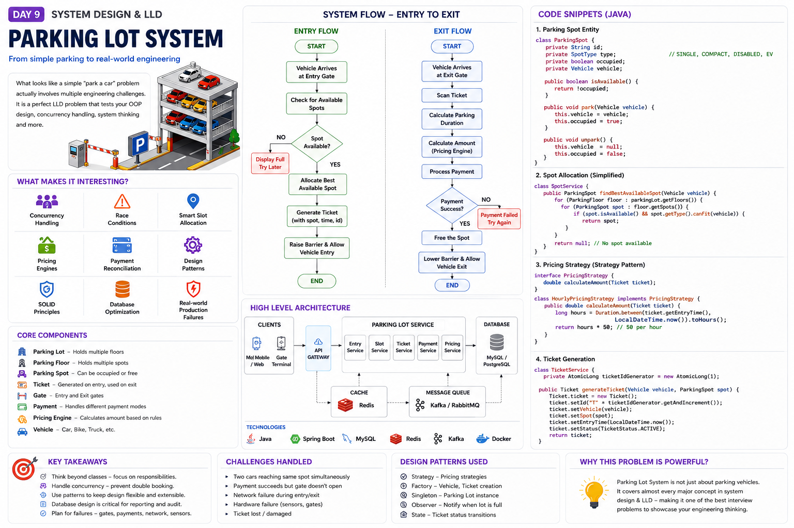

# 🅿️ Parking Lot System — Complete Low Level Design (LLD)
### A Premium Engineering Handbook for Interview Preparation & Production Architecture


---

> **Audience:** Software Engineers (Junior → Senior), Interview Candidates, System Design Enthusiasts  
> **Language:** Java (primary), with design-language agnostic principles  
> **Depth:** Production-grade, not toy examples  

---



---
## Table of Contents

1. [Introduction](#1-introduction)
2. [Problem Statement](#2-problem-statement)
3. [Requirement Analysis](#3-requirement-analysis)
4. [Real-World Thinking Process](#4-real-world-thinking-process)
5. [Step-by-Step Design Approach](#5-step-by-step-design-approach)
6. [Core Entities](#6-core-entities)
7. [UML / Class Diagram](#7-uml--class-diagram)
8. [Design Patterns Used](#8-design-patterns-used)
9. [SOLID Principles](#9-solid-principles)
10. [Complete Code Implementation](#10-complete-code-implementation)
11. [Explain Every Class](#11-explain-every-class)
12. [Parking Allocation Logic](#12-parking-allocation-logic)
13. [Pricing Engine](#13-pricing-engine)
14. [Concurrency Handling](#14-concurrency-handling)
15. [Database Design](#15-database-design)
16. [API Design](#16-api-design)
17. [Flowcharts & Sequence Diagrams](#17-flowcharts--sequence-diagrams)
18. [Machine Coding Round Perspective](#18-machine-coding-round-perspective)
19. [Scaling to Production](#19-scaling-to-production)
20. [Monitoring & Observability](#20-monitoring--observability)
21. [Security Considerations](#21-security-considerations)
22. [Real Production Challenges](#22-real-production-challenges)
23. [Testing Strategy](#23-testing-strategy)
24. [Improvements & Future Enhancements](#24-improvements--future-enhancements)
25. [Interview Revision Section](#25-interview-revision-section)

---

# 1. Introduction

## What Is a Parking Lot System?

A **Parking Lot System** is a software solution that manages the lifecycle of vehicle entry, slot allocation, ticket generation, payment processing, and vehicle exit — across a physical parking infrastructure.

At its core, it answers three fundamental questions:

1. **Is there space available?**
2. **Where should this vehicle park?**
3. **How much does it cost, and how do we collect payment?**

But the *engineering* behind these questions is rich with design decisions spanning object-oriented design, concurrency, data modeling, pricing strategies, and distributed systems.

---

## Real-World Examples

| Venue | Characteristics | Engineering Complexity |
|-------|----------------|----------------------|
| **Shopping Mall** | High traffic, short stays, multiple vehicle types, peak weekends | Dynamic pricing, fast throughput |
| **Airport** | Long-stay, departure/arrival surges, premium & economy zones | VIP zones, reservation system, multi-day billing |
| **Smart City** | IoT sensors, license plate recognition, city-wide coordination | Distributed, real-time slot prediction |
| **Corporate Office** | Reserved spots, employee badges, monthly passes | RFID integration, access control |
| **Hospital** | Priority for ambulances, short-term visitor, staff lots | Emergency override, time-sensitive entry |
| **Metro Station** | Park-and-ride, daily commuters, overnight stays | Season passes, multi-modal integration |

---

## Why Companies Ask This in Interviews

This problem is a goldmine for evaluating multiple engineering competencies at once:

```
┌─────────────────────────────────────────────────────────────┐
│           WHAT PARKING LOT LLD TESTS                        │
├─────────────────────────────────────────────────────────────┤
│  OOP Design         → Inheritance, polymorphism, abstraction │
│  Design Patterns    → Strategy, Factory, Singleton, State   │
│  SOLID Principles   → Clean, extensible architecture        │
│  Concurrency        → Race conditions, thread safety        │
│  Data Modeling      → Relationships, normalization          │
│  API Design         → RESTful thinking                      │
│  System Thinking    → Edge cases, failure handling          │
└─────────────────────────────────────────────────────────────┘
```

Companies like **Google, Amazon, Microsoft, Uber, Flipkart, and Swiggy** use this problem because it has the right balance of complexity — not trivial, not overwhelming — perfect for a 60-90 minute design session.

---

## Engineering Concepts It Tests

- **Abstraction & Encapsulation:** Vehicle types, slot types as hierarchies
- **Polymorphism:** Different pricing strategies, different gate behaviors
- **Composition over Inheritance:** ParkingLot composed of Floors, Floors of Spots
- **Strategy Pattern:** Pluggable pricing algorithms
- **Factory Pattern:** Creating vehicles and tickets
- **Singleton Pattern:** Single ParkingLot instance per location
- **Observer Pattern:** Notify management when lot is full
- **State Machine:** Ticket states (ACTIVE → PAID → CLOSED)
- **Concurrency:** Multiple threads booking the same slot
- **Database Design:** Normalized schema for audit and analytics

---

# 2. Problem Statement

## Scenario

You are designing the backend system for a **multi-level parking lot** at a large shopping mall. The system must handle vehicle entry and exit, allocate appropriate spots, generate tickets, process payments, and provide real-time availability.

---

## Functional Requirements

### Core Features

1. **Vehicle Entry**
   - Accept vehicles at entry gates
   - Validate that space is available
   - Generate a unique parking ticket
   - Assign the most appropriate available spot
   - Raise entry barrier on success

2. **Vehicle Exit**
   - Accept ticket at exit gate
   - Calculate parking duration and fee
   - Process payment (cash, card, UPI)
   - Mark spot as available
   - Lower exit barrier on payment confirmation

3. **Slot Management**
   - Support multiple floors (B1, B2, G, 1, 2...)
   - Support multiple spot types: `COMPACT`, `LARGE`, `MOTORCYCLE`, `EV`, `HANDICAPPED`
   - Track real-time availability per type per floor

4. **Ticketing**
   - Unique ticket ID (e.g., `TKT-20240101-001`)
   - Entry timestamp, spot ID, vehicle number
   - Ticket lifecycle: `ACTIVE → PAYMENT_PENDING → PAID → CLOSED`

5. **Payment**
   - Multiple payment modes: Cash, Credit/Debit Card, UPI, Wallet
   - Receipt generation
   - Refund handling for overpayments

6. **Pricing**
   - Per-hour pricing per vehicle type
   - Daily caps (e.g., max ₹500/day for cars)
   - Lost ticket penalty
   - Grace period (e.g., 15 minutes free)

---

## Non-Functional Requirements

| Requirement | Target | Reasoning |
|-------------|--------|-----------|
| **Availability** | 99.9% uptime | Gates must always function |
| **Latency** | < 2 seconds for entry/exit | Queues form if gates are slow |
| **Throughput** | 100+ vehicles/minute peak | Mall rush hour scenario |
| **Consistency** | No double bookings | Strong consistency for slots |
| **Scalability** | 10,000+ spots, 50+ locations | Chain parking operator |
| **Audit Trail** | 7 years of records | Tax, legal compliance |
| **Offline Mode** | Basic ops without internet | Network failure resilience |

---

## Constraints

- Each spot can hold exactly **one vehicle** at a time
- A vehicle can only have **one active ticket** at a time
- A motorcycle cannot park in a car spot (and vice versa) *unless overflow mode is enabled*
- Payment must be confirmed before the exit barrier opens
- System must generate a unique ticket even under high concurrency

---

## Assumptions

```
1. Physical sensors detect vehicle presence (we model the software layer)
2. License plate recognition is a future enhancement (not V1)
3. A single parking lot location for V1 (multi-location is scaling concern)
4. Time is in the system's local timezone
5. All prices are in Indian Rupees (INR) — adaptable via configuration
6. Motorcycles take dedicated 2-wheeler spots
7. EVs can use any large spot but EV-dedicated spots have charging
8. One entry gate = one concurrent entry request at a time (hardware constraint)
```

---

# 3. Requirement Analysis

## Breaking Down Requirements

### Tier 1: Core (Must-Have for V1)

```
✅ Vehicle entry and exit
✅ Spot allocation (nearest available)
✅ Ticket generation (unique ID, timestamps)
✅ Basic hourly pricing
✅ Payment processing (at least one method)
✅ Real-time spot availability count
✅ Multiple vehicle types (car, motorcycle, truck)
✅ Multiple spot types matching vehicle types
```

### Tier 2: Extended (Should-Have)

```
🔵 Multiple floors
🔵 VIP/Reserved spots
🔵 Multiple payment modes
🔵 Grace period (first 15 min free)
🔵 Lost ticket handling
🔵 Daily billing cap
🔵 Email/SMS receipt
🔵 Spot reservation in advance
```

### Tier 3: Future Scalability

```
🟡 License plate recognition (LPR) for gateless entry
🟡 AI-based spot prediction
🟡 Dynamic pricing (surge on weekends/events)
🟡 EV charging with energy billing
🟡 Multi-location management dashboard
🟡 Mobile app with navigation to spot
🟡 Season passes and subscriptions
🟡 Integration with mall loyalty programs
```

---

## Why Each Requirement Matters — Production Impact

### "Multiple Vehicle Types" Matters Because:

In production, a car spot is ~2.5m × 5m and a motorcycle spot is ~1m × 2.5m. If you don't type-match vehicles to spots, you physically cannot fit them. The software must mirror physical reality.

**Production impact:** If a 12-foot truck is assigned a compact car spot, you get a damaged vehicle, an angry customer, and a lawsuit. The system *must* enforce type constraints.

### "Real-Time Availability" Matters Because:

Drivers make entry decisions based on displayed availability (signs at mall entrance). Stale data = driver enters and finds no spot = reversal traffic jam = security incident.

**Production impact:** The system feeds LED display boards at entry. If availability is cached for 60 seconds, you might show "20 spots available" when actually there are 0.

### "Audit Trail" Matters Because:

Monthly passes, employee disputes, payment reconciliation, and insurance claims all require historical records. A customer can dispute a charge 30 days later.

**Production impact:** Without logs, you cannot reconcile your POS system against actual vehicle entries. You lose money and trust.

---

# 4. Real-World Thinking Process

## How a Senior Engineer Approaches This

A senior engineer doesn't start coding immediately. They **interrogate the problem first**.

```
┌─────────────────────────────────────────────────────────────────┐
│  SENIOR ENGINEER MENTAL MODEL                                   │
│                                                                 │
│  1. UNDERSTAND the problem deeply                               │
│  2. IDENTIFY the entities and their relationships               │
│  3. THINK about failure modes before happy path                 │
│  4. CHOOSE design patterns that solve real problems             │
│  5. CODE with extensibility in mind                             │
│  6. DISCUSS tradeoffs explicitly                                │
└─────────────────────────────────────────────────────────────────┘
```

---

## Questions to Ask the Interviewer

These questions demonstrate experience and shape the design:

### Capacity & Scale Questions
```
Q: How many total parking spots? 
   → Affects data structure choice (array vs. map vs. priority queue)

Q: How many floors?
   → Single vs. multi-floor allocation algorithm

Q: How many entry/exit gates?
   → Concurrency model (one lock per gate vs. global lock)

Q: Peak vehicles per hour?
   → Determines whether we need async processing or sync is fine
```

### Business Logic Questions
```
Q: What vehicle types do we support?
   → Defines the Vehicle type hierarchy

Q: Is there reserved parking (monthly passes, VIP)?
   → Need a reservation system separate from walk-in

Q: What's the pricing model? Flat rate? Hourly? Daily cap?
   → Strategy pattern for pricing

Q: What happens if a customer loses their ticket?
   → Lost ticket fee + identity verification flow

Q: Is there a grace period?
   → Adds complexity to fee calculation
```

### Operational Questions
```
Q: What happens if the payment terminal goes offline?
   → Offline mode requirement, queueing mechanism

Q: What if the barrier hardware fails to open?
   → Manual override + alert system

Q: Are there accessibility requirements?
   → Handicapped spots always near exits/elevators
```

---

## Critical Edge Cases

### Case 1: Race Condition on Last Spot

```
Scenario: Two cars arrive simultaneously, only 1 compact spot left.

Thread A: reads spot as AVAILABLE
Thread B: reads spot as AVAILABLE  (before A has reserved it)
Thread A: assigns spot, marks RESERVED
Thread B: assigns same spot ← DOUBLE BOOKING!

Solution: Optimistic locking / DB-level unique constraint / 
          Compare-and-swap on spot status
```

### Case 2: Payment Success but Gate Failure

```
Scenario: Customer pays ₹120. Payment processor returns SUCCESS.
          Gate barrier motor fails. Gate doesn't open.

Problem:  Customer has paid but cannot exit. 
          If we rollback payment, we lose revenue.
          If we don't open gate, customer is trapped.

Solution: Payment and gate are separate states.
          Gate failure triggers manual override + alert.
          Customer gets paid=TRUE record.
          Operations team manually opens gate.
          Payment is NOT rolled back.
```

### Case 3: Network Outage at Entry Gate

```
Scenario: Mall entry gate loses internet connectivity.

Impact:   Cannot create ticket in central DB.
          Cannot verify if lot is full.

Solution: Local cache of availability count.
          Offline ticket generation (local ID, sync later).
          Gate continues operating in degraded mode.
          Sync when connectivity restored.
```

### Case 4: Vehicle Doesn't Exit (Overnight Stay)

```
Scenario: Customer parks at 8 PM, forgets car, returns next day at 9 AM.

Problem:  Is it 13 hours × hourly rate? That could be ₹1300+.
          Is there a daily cap?
          What if the system treats it as abandoned vehicle at midnight?

Solution: Daily cap configuration (e.g., ₹500/day max for cars).
          Multi-day billing = daily caps × days + remaining hours.
```

### Case 5: Duplicate Ticket Presentation

```
Scenario: Customer photographs ticket, gives photo to accomplice.
          Both present same ticket ID at exit.

Solution: One-time use ticket (mark as PRESENTED immediately on scan).
          Vehicle number verification at exit (must match entry).
```

---

## Concurrency Concerns Summary

| Scenario | Problem | Solution |
|----------|---------|---------|
| Two cars, one spot | Double booking | Atomic compare-and-swap |
| High ticket generation | Duplicate ticket IDs | UUID or DB sequence |
| Spot count cache | Stale count shows false availability | Pessimistic lock on count update |
| Payment race | Charge twice | Idempotency key on payment |
| Gate control | Multiple commands sent | Hardware mutex + queue |

---

# 5. Step-by-Step Design Approach

## The 7-Step Framework

### Step 1: Identify Entities (Nouns in Requirements)

Read the requirements and extract **all nouns** — they become your classes:

```
"A vehicle enters through a gate, receives a ticket for a parking spot 
on a floor of the parking lot. Upon exit, payment is processed."

Entities extracted:
→ Vehicle
→ Gate (Entry/Exit)  
→ Ticket
→ ParkingSpot
→ ParkingFloor
→ ParkingLot
→ Payment
```

Additional entities from domain knowledge:
```
→ PricingStrategy (behavior, not physical)
→ ParkingManager (orchestration)
→ Receipt
→ VehicleType (enum)
→ SpotType (enum)
→ TicketStatus (enum)
```

---

### Step 2: Define Relationships

```
ParkingLot        HAS-MANY    ParkingFloor
ParkingFloor      HAS-MANY    ParkingSpot
ParkingLot        HAS-MANY    Gate
Gate              IS-A        (EntryGate | ExitGate)
Ticket            BELONGS-TO  Vehicle
Ticket            REFERENCES  ParkingSpot
Payment           BELONGS-TO  Ticket
Vehicle           IS-A        (Car | Motorcycle | Truck | ElectricVehicle)
ParkingSpot       IS-A        (CompactSpot | LargeSpot | MotorcycleSpot | EVSpot)
PricingStrategy   APPLIED-TO  Ticket
ParkingManager    MANAGES     ParkingLot
```

---

### Step 3: Define Responsibilities

Each class should have **one clear responsibility** (Single Responsibility Principle):

| Class | Responsibility |
|-------|---------------|
| `ParkingLot` | Knows floors, gates, total capacity |
| `ParkingFloor` | Manages spots on one floor |
| `ParkingSpot` | Tracks availability, holds vehicle reference |
| `Vehicle` | Represents vehicle identity and type |
| `Ticket` | Captures entry/exit contract |
| `EntryGate` | Validates entry, creates ticket |
| `ExitGate` | Validates exit, processes payment |
| `Payment` | Handles financial transaction |
| `PricingStrategy` | Calculates fee given duration |
| `ParkingManager` | Coordinates allocation across floors |

---

### Step 4: Choose Design Patterns

```
Problem                          → Pattern
─────────────────────────────────────────────────────────
One ParkingLot instance          → Singleton
Create different vehicle types   → Factory Method
Pluggable pricing algorithms     → Strategy
Track spot availability changes  → Observer
Spot lifecycle (available/taken) → State
Create tickets uniformly         → Factory / Builder
```

---

### Step 5: Design APIs

Think REST-first, even for LLD:

```
POST   /api/v1/entry              → Park vehicle (in)
POST   /api/v1/exit               → Exit vehicle (out)
GET    /api/v1/spots/available    → Availability
POST   /api/v1/payment            → Process payment
GET    /api/v1/tickets/{id}       → Get ticket info
```

---

### Step 6: Database Thinking

Before writing Java, think about persistence:

```sql
-- Core tables
vehicles (id, license_plate, type, created_at)
parking_spots (id, floor_id, spot_number, type, status)
tickets (id, vehicle_id, spot_id, entry_time, exit_time, status)
payments (id, ticket_id, amount, mode, status, processed_at)
parking_floors (id, lot_id, floor_number, total_spots)
```

---

### Step 7: Scalability Mindset

Even in LLD, think about what breaks at scale:

- Spot lookup: Use a `PriorityQueue` (nearest spot first) or floor-indexed Map
- Availability count: Keep in-memory with DB sync, not query every time
- Ticket generation: Use atomic counter or UUID to avoid collisions
- Payment: Idempotency keys to avoid double-charges

---

# 6. Core Entities

## 6.1 ParkingLot

### Real-World Analogy
Think of ParkingLot as the **building management office** of a shopping mall. It knows how many floors there are, where the gates are, and the overall status of the facility.

### Responsibilities
- Maintains reference to all floors and gates
- Provides availability statistics
- Acts as the entry point for the entire system (Singleton)
- Delegates spot allocation to `ParkingManager`

### Attributes

```java
class ParkingLot {
    private String id;                          // Unique lot identifier
    private String name;                        // "DLF Mall Parking - Level B"
    private String address;                     // Physical location
    private List<ParkingFloor> floors;          // All floors
    private List<EntryGate> entryGates;         // Entry control points
    private List<ExitGate> exitGates;           // Exit control points
    private ParkingManager parkingManager;      // Allocation orchestrator
    private Map<SpotType, Integer> capacity;    // Total capacity by type
    private Map<SpotType, Integer> available;   // Current availability by type
}
```

### Methods

| Method | Purpose | Complexity |
|--------|---------|-----------|
| `getAvailability()` | Real-time spot counts | O(1) with cached counters |
| `isParkingFull()` | Quick full-check | O(1) |
| `getFloors()` | List all floors | O(1) |
| `getEntry/ExitGates()` | Gate access | O(1) |

---

## 6.2 ParkingFloor

### Real-World Analogy
Each floor is like a **department in a warehouse** — it has a specific zone, knows what's stored (parked) where, and can report its own availability.

### Responsibilities
- Manages all spots on a single floor
- Reports floor-level availability
- Groups spots by type for efficient lookup

### Attributes

```java
class ParkingFloor {
    private String id;
    private int floorNumber;                              // -1, 0, 1, 2...
    private String floorName;                             // "B1", "Ground", "Level 1"
    private Map<SpotType, List<ParkingSpot>> spotsByType; // Grouped for O(1) lookup
    private Map<String, ParkingSpot> spotMap;             // spotId → spot for direct access
    private int totalSpots;
    private Map<SpotType, AtomicInteger> availableCount;  // Thread-safe counters
}
```

### Why AtomicInteger for Available Count?

Because multiple threads (cars arriving simultaneously) may increment/decrement this counter. `AtomicInteger` ensures atomic read-modify-write without explicit `synchronized` blocks.

---

## 6.3 ParkingSpot

### Real-World Analogy
A ParkingSpot is a **physical parking bay**. It has a location, a type, and an occupancy state. It's the most fundamental unit.

### Spot Type Hierarchy

```
          ParkingSpot (abstract)
               │
    ┌──────────┼──────────────┐──────────────┐
    │          │              │              │
CompactSpot  LargeSpot  MotorcycleSpot   EVSpot
  (sedan)    (SUV/truck)  (2-wheeler)   (EV only)
```

### Attributes

```java
abstract class ParkingSpot {
    protected String spotId;           // e.g., "B1-A-012"
    protected int floorNumber;
    protected String spotNumber;       // Row A, Number 012
    protected SpotType type;
    protected SpotStatus status;       // AVAILABLE / OCCUPIED / RESERVED / MAINTENANCE
    protected Vehicle currentVehicle;  // null if empty
    protected boolean isHandicapped;   // Accessibility flag
    protected boolean isNearElevator;  // Proximity flag for allocation preference
}
```

### State Transitions

```
  ┌───────────────────────────────────────────┐
  │                AVAILABLE                  │
  └────────────────────┬──────────────────────┘
                       │ assignVehicle()
                       ▼
  ┌───────────────────────────────────────────┐
  │                 OCCUPIED                  │
  └────────────────────┬──────────────────────┘
                       │ removeVehicle()
                       ▼
  ┌───────────────────────────────────────────┐
  │                AVAILABLE                  │
  └───────────────────────────────────────────┘

  Special transitions:
  AVAILABLE → RESERVED  (pre-booking)
  OCCUPIED  → MAINTENANCE  (admin action only)
  MAINTENANCE → AVAILABLE  (after repair)
```

---

## 6.4 Vehicle

### Real-World Analogy
The Vehicle is the **customer's identity** in the parking system. Just as a person has a name and ID, a vehicle has a license plate and type.

### Vehicle Type Hierarchy

```
         Vehicle (abstract)
              │
   ┌──────────┼──────────────┬──────────────┐
   │          │              │              │
  Car    Motorcycle        Truck    ElectricVehicle
  (2-4t)   (2-whl)        (HGV)    (EV charging)
```

### Attributes

```java
abstract class Vehicle {
    protected String licensePlate;       // "MH02AB1234"
    protected VehicleType type;          // CAR, MOTORCYCLE, TRUCK, EV
    protected String color;              // Optional, for identification
    protected String ownerContactInfo;   // For notifications
    protected LocalDateTime entryTime;   // Set at gate
}
```

### Why Abstract Vehicle?

Because different vehicle types:
- Map to different spot types (motorcycle → MotorcycleSpot)
- Have different pricing rates
- May have different entry logic (oversized vehicles need height check)

Using inheritance here allows `instanceof` checks and polymorphic dispatch.

---

## 6.5 Ticket

### Real-World Analogy
A Ticket is a **contract** between the parking lot and the vehicle owner. It records what was promised (a spot), when, and at what terms.

### Ticket Lifecycle

```
   ACTIVE ──(exit scan)──► PAYMENT_PENDING ──(paid)──► PAID ──(gate opens)──► CLOSED
     │                                                                          │
     └──────────────────────(lost ticket declared)──────────────────────────────►
```

### Attributes

```java
class Ticket {
    private String ticketId;             // "TKT-20240115-000142"
    private Vehicle vehicle;
    private ParkingSpot assignedSpot;
    private LocalDateTime entryTime;
    private LocalDateTime exitTime;      // null until exit scan
    private TicketStatus status;
    private BigDecimal calculatedFee;    // null until calculated
    private Payment payment;             // null until payment initiated
    private String entryGateId;
    private String exitGateId;
}
```

### Ticket ID Generation Strategy

```java
// Option 1: Timestamp + Sequence (readable, sortable)
"TKT-" + yyyyMMdd + "-" + String.format("%06d", sequence.getAndIncrement())
// "TKT-20240115-000142"

// Option 2: UUID (guaranteed unique across distributed systems)
UUID.randomUUID().toString()
// "550e8400-e29b-41d4-a716-446655440000"

// Production recommendation: UUID4 for distributed systems,
// timestamp-sequence for single-location systems (human-readable)
```

---

## 6.6 Gate (Entry & Exit)

### Real-World Analogy
Gates are the **border control checkpoints** of the parking lot. Entry gate = immigration in, exit gate = immigration out. The barrier is the physical gate arm.

### EntryGate Responsibilities

```java
class EntryGate {
    private String gateId;
    private ParkingManager manager;    // Delegate allocation
    private TicketService ticketService;
    
    public Ticket processEntry(Vehicle vehicle) {
        // 1. Check availability
        // 2. Find best spot
        // 3. Reserve spot
        // 4. Generate ticket
        // 5. Open barrier
        // 6. Return ticket
    }
}
```

### ExitGate Responsibilities

```java
class ExitGate {
    private String gateId;
    private PaymentService paymentService;
    private PricingStrategy pricingStrategy;
    
    public void processExit(String ticketId, PaymentMethod method) {
        // 1. Fetch ticket
        // 2. Calculate fee
        // 3. Process payment
        // 4. Mark spot as available
        // 5. Close ticket
        // 6. Open barrier
    }
}
```

---

## 6.7 Payment

### Real-World Analogy
Payment is the **cash register transaction** at exit. It records what was owed, what was tendered, and whether the transaction was successful.

### Payment States

```
INITIATED → PROCESSING → SUCCESS / FAILED / REFUNDED
```

### Attributes

```java
class Payment {
    private String paymentId;
    private String ticketId;
    private BigDecimal amount;
    private PaymentMode mode;          // CASH, CARD, UPI, WALLET
    private PaymentStatus status;
    private LocalDateTime initiatedAt;
    private LocalDateTime completedAt;
    private String transactionReference; // External payment gateway ref
    private BigDecimal refundAmount;     // For overpayments
}
```

---

## 6.8 PricingStrategy

### Real-World Analogy
PricingStrategy is like a **tariff board** — the rules the parking lot uses to calculate your bill. Different lots can have different strategies.

### Strategy Hierarchy

```
    PricingStrategy (interface)
           │
    ┌──────┼──────────────────┬───────────────┐
    │      │                  │               │
HourlyFlat DynamicPricing  DailyRate  SubscriptionRate
(₹50/hr)  (surge pricing)  (₹500/day) (monthly pass)
```

---

## 6.9 ParkingManager

### Real-World Analogy
The ParkingManager is like the **valet supervisor** — they know every available spot across all floors and direct each vehicle to the optimal one.

### Responsibilities

```java
class ParkingManager {
    private ParkingLot parkingLot;
    private Map<VehicleType, SpotType> vehicleToSpotMapping;
    
    // Core allocation
    public Optional<ParkingSpot> findBestSpot(Vehicle vehicle);
    
    // Release
    public void releaseSpot(ParkingSpot spot);
    
    // Query
    public Map<SpotType, Integer> getAvailabilityByType();
    public List<ParkingSpot> getAvailableSpots(SpotType type);
}
```

### Vehicle-to-Spot Mapping

```java
vehicleToSpotMapping = Map.of(
    VehicleType.MOTORCYCLE,  SpotType.MOTORCYCLE,
    VehicleType.CAR,         SpotType.COMPACT,
    VehicleType.SUV,         SpotType.LARGE,
    VehicleType.TRUCK,       SpotType.LARGE,
    VehicleType.EV,          SpotType.EV        // EV preferred, large as fallback
);
```

---

# 7. UML / Class Diagram

## Full ASCII Class Diagram

```
┌─────────────────────────────────────────────────────────────────────┐
│                         «Singleton»                                 │
│                         ParkingLot                                  │
├─────────────────────────────────────────────────────────────────────┤
│ - instance: ParkingLot                                              │
│ - id: String                                                        │
│ - floors: List<ParkingFloor>                                        │
│ - entryGates: List<EntryGate>                                       │
│ - exitGates: List<ExitGate>                                         │
│ - manager: ParkingManager                                           │
├─────────────────────────────────────────────────────────────────────┤
│ + getInstance(): ParkingLot                                         │
│ + getAvailability(): Map<SpotType, Integer>                         │
│ + isParkingFull(): boolean                                          │
└─────────────────────────────┬───────────────────────────────────────┘
                              │ 1..*
                              │ COMPOSITION
                              ▼
┌─────────────────────────────────────────────┐
│                ParkingFloor                 │
├─────────────────────────────────────────────┤
│ - floorNumber: int                          │
│ - spots: Map<SpotType, List<ParkingSpot>>   │
│ - available: Map<SpotType, AtomicInteger>   │
├─────────────────────────────────────────────┤
│ + getAvailableSpot(SpotType): Optional<...> │
│ + releaseSpot(spotId): void                 │
│ + getAvailabilityCount(): Map<...>          │
└──────────────────┬──────────────────────────┘
                   │ 1..*
                   │ COMPOSITION
                   ▼
┌──────────────────────────────────────────────────────────────────┐
│                  «abstract» ParkingSpot                          │
├──────────────────────────────────────────────────────────────────┤
│ # spotId: String                                                 │
│ # type: SpotType                                                 │
│ # status: SpotStatus {AVAILABLE, OCCUPIED, RESERVED, MAINT}      │
│ # currentVehicle: Vehicle                                        │
├──────────────────────────────────────────────────────────────────┤
│ + assignVehicle(v: Vehicle): boolean                             │
│ + removeVehicle(): Vehicle                                       │
│ + isAvailable(): boolean                                         │
│ + canFit(v: Vehicle): boolean  «abstract»                        │
└──────────┬─────────┬──────────────┬────────────────┘
           │         │              │
     ┌─────┴──┐  ┌───┴────┐  ┌─────┴────┐  ┌──────────┐
     │Compact │  │ Large  │  │Motorcycle│  │  EVSpot  │
     │  Spot  │  │  Spot  │  │   Spot   │  │          │
     └────────┘  └────────┘  └──────────┘  └──────────┘

┌─────────────────────────────────────────┐
│          «abstract» Vehicle             │
├─────────────────────────────────────────┤
│ # licensePlate: String                  │
│ # type: VehicleType                     │
├─────────────────────────────────────────┤
│ + getType(): VehicleType                │
│ + getRequiredSpotType(): SpotType       │
└────────────┬───────────────┬────────────┘
             │               │
         ┌───┴──┐      ┌──────┴───────┐
         │  Car │      │  Motorcycle  │
         └──────┘      └──────────────┘

┌──────────────────────────────────────────────────────────────────┐
│                           Ticket                                 │
├──────────────────────────────────────────────────────────────────┤
│ - ticketId: String                                               │
│ - vehicle: Vehicle                                               │
│ - spot: ParkingSpot                                              │
│ - entryTime: LocalDateTime                                       │
│ - exitTime: LocalDateTime                                        │
│ - status: TicketStatus {ACTIVE, PAYMENT_PENDING, PAID, CLOSED}   │
│ - fee: BigDecimal                                                │
│ - payment: Payment                                               │
├──────────────────────────────────────────────────────────────────┤
│ + calculateDuration(): Duration                                  │
│ + markExited(exitTime): void                                     │
│ + setPayment(p: Payment): void                                   │
└──────────────────────────────────────────────────────────────────┘

┌─────────────────────────────────────────┐
│        «interface» PricingStrategy      │
├─────────────────────────────────────────┤
│ + calculateFee(ticket: Ticket)          │
│     : BigDecimal                        │
└───────────┬─────────────────────────────┘
            │
    ┌───────┴────────┬──────────────────┐
    │                │                  │
┌───┴──────────┐ ┌───┴───────────┐ ┌───┴──────────┐
│HourlyPricing │ │DynamicPricing │ │DailyCapPricing│
│              │ │               │ │               │
│rate/hr/type  │ │surge factor   │ │max daily cap  │
└──────────────┘ └───────────────┘ └───────────────┘
```

---

## Relationship Legend

| Symbol | Meaning |
|--------|---------|
| `HAS-MANY` (→ with 1..*) | Composition or Aggregation |
| `IS-A` (→ subclass) | Inheritance |
| `USES` | Dependency |
| Filled diamond `◆` | Composition (child cannot exist without parent) |
| Open diamond `◇` | Aggregation (child can exist independently) |

### Composition vs Aggregation in Our Design

- `ParkingLot ◆─ ParkingFloor`: If the lot is deleted, floors are deleted too
- `ParkingFloor ◆─ ParkingSpot`: Spots are part of a floor, deleted with it
- `Ticket ◇─ Vehicle`: A vehicle can exist without a ticket (it's parked elsewhere)
- `Payment ◇─ Ticket`: A payment record persists even after a ticket is closed

---

# 8. Design Patterns Used

## 8.1 Strategy Pattern

### The Problem It Solves

Without Strategy, pricing logic gets tangled into `if/else` chains:

```java
// ❌ BAD: Open/closed principle violated
public BigDecimal calculateFee(Ticket ticket) {
    if (ticketType.equals("HOURLY")) {
        return hours * ratePerHour;
    } else if (ticketType.equals("DAILY")) {
        return Math.min(hours * ratePerHour, dailyCap);
    } else if (ticketType.equals("WEEKEND_SURGE")) {
        return hours * ratePerHour * surgeFactor;
    }
    // Every new pricing rule = modify this method. FRAGILE.
}
```

### The Solution

Define a `PricingStrategy` interface. Each algorithm lives in its own class:

```java
// ✅ GOOD: Open for extension, closed for modification
public interface PricingStrategy {
    BigDecimal calculateFee(Ticket ticket);
}

public class HourlyPricingStrategy implements PricingStrategy {
    private Map<VehicleType, BigDecimal> ratePerHour;
    
    @Override
    public BigDecimal calculateFee(Ticket ticket) {
        long hours = ticket.calculateDuration().toHours();
        BigDecimal rate = ratePerHour.get(ticket.getVehicle().getType());
        return rate.multiply(BigDecimal.valueOf(hours));
    }
}

public class DailyCapStrategy implements PricingStrategy {
    private PricingStrategy baseStrategy;
    private BigDecimal dailyCap;
    
    @Override
    public BigDecimal calculateFee(Ticket ticket) {
        BigDecimal baseFee = baseStrategy.calculateFee(ticket);
        return baseFee.min(dailyCap);                  // Decorator-like
    }
}
```

### Real-World Benefit

When the mall runs a **Diwali special** (flat ₹50 for 3 hours), you add `FlatRatePricingStrategy` without touching any existing code. The ExitGate just uses the new strategy.

---

## 8.2 Factory Pattern

### The Problem It Solves

```java
// ❌ BAD: Client code knows too much about construction
Vehicle v;
if (type == "CAR") v = new Car(plate);
else if (type == "MOTORCYCLE") v = new Motorcycle(plate);
// Every new type = modify all client code
```

### The Solution

```java
// ✅ GOOD: Factory centralizes object creation
public class VehicleFactory {
    public static Vehicle createVehicle(VehicleType type, String licensePlate) {
        return switch (type) {
            case CAR        -> new Car(licensePlate);
            case MOTORCYCLE -> new Motorcycle(licensePlate);
            case TRUCK      -> new Truck(licensePlate);
            case EV         -> new ElectricVehicle(licensePlate);
        };
    }
}

// Client code is clean
Vehicle v = VehicleFactory.createVehicle(VehicleType.CAR, "MH02AB1234");
```

### Real-World Benefit

When you add **bicycle** support in v2, you only modify `VehicleFactory`. All gates, managers, and pricing engines work without modification because they program to the `Vehicle` abstraction.

---

## 8.3 Singleton Pattern

### The Problem It Solves

A parking lot is a **physical singleton** — there is exactly one instance of "DLF Mall Parking." If you create two `ParkingLot` objects, you have two separate availability counters — a consistency nightmare.

### The Solution (Thread-Safe)

```java
public class ParkingLot {
    // volatile ensures visibility across threads (Java Memory Model)
    private static volatile ParkingLot instance;
    
    private ParkingLot() {}  // Private constructor
    
    // Double-checked locking for thread safety
    public static ParkingLot getInstance() {
        if (instance == null) {
            synchronized (ParkingLot.class) {
                if (instance == null) {
                    instance = new ParkingLot();
                }
            }
        }
        return instance;
    }
}
```

### Why Double-Checked Locking?

- First `null` check: avoids acquiring the lock (expensive) on every call after initialization
- `synchronized` block: only one thread can initialize
- Second `null` check: handles the race between multiple threads that passed the first check
- `volatile`: ensures the write to `instance` is visible to all threads immediately

### Real-World Benefit

In a web application with 100 concurrent requests, all 100 threads safely get the same `ParkingLot` instance. No duplicate counter issues.

---

## 8.4 Observer Pattern

### The Problem It Solves

When the parking lot fills up, **multiple systems** need to know:
- LED sign at mall entrance → "PARKING FULL"
- Parking manager app → push notification
- Traffic management system → reroute incoming vehicles

Without Observer, you'd hardcode these notifications everywhere.

### The Solution

```java
public interface ParkingLotObserver {
    void onLotFull(ParkingLot lot);
    void onSpotAvailable(ParkingSpot spot, VehicleType type);
}

public class ParkingLot {
    private List<ParkingLotObserver> observers = new ArrayList<>();
    
    public void subscribe(ParkingLotObserver observer) {
        observers.add(observer);
    }
    
    private void notifyObservers_LotFull() {
        observers.forEach(o -> o.onLotFull(this));
    }
}

// Implementations
public class DisplayBoardObserver implements ParkingLotObserver {
    @Override
    public void onLotFull(ParkingLot lot) {
        displayBoard.showMessage("PARKING FULL — Please Try Adjacent Lot");
    }
}

public class PushNotificationObserver implements ParkingLotObserver {
    @Override
    public void onLotFull(ParkingLot lot) {
        pushService.sendAlert(adminContacts, "Lot " + lot.getName() + " is full");
    }
}
```

---

## 8.5 State Pattern

### The Problem It Solves

Ticket behavior depends on its current state. Without State pattern:

```java
// ❌ BAD: Scattered state logic
public void scan(String ticketId) {
    if (ticket.status == ACTIVE) { ... }
    else if (ticket.status == PAYMENT_PENDING) { ... }
    else if (ticket.status == PAID) { ... }
    // Gets messy fast
}
```

### The Solution

```java
public interface TicketState {
    void scan(Ticket ticket);
    void processPayment(Ticket ticket, BigDecimal amount);
    void close(Ticket ticket);
}

public class ActiveState implements TicketState {
    @Override
    public void scan(Ticket ticket) {
        ticket.setExitTime(LocalDateTime.now());
        ticket.setState(new PaymentPendingState());
    }
    
    @Override
    public void processPayment(Ticket ticket, BigDecimal amount) {
        throw new IllegalStateException("Cannot pay before scanning at exit");
    }
}

public class PaymentPendingState implements TicketState {
    @Override
    public void processPayment(Ticket ticket, BigDecimal amount) {
        // Process payment...
        ticket.setState(new PaidState());
    }
}
```

### Real-World Benefit

Each state class handles its own transitions cleanly. Adding a new `DISPUTED` state (for when a customer contests the fee) only requires a new class, not modifying existing states.

---

# 9. SOLID Principles

## S — Single Responsibility Principle

> "A class should have only one reason to change."

### In Parking Lot Context

**Bad Example:**
```java
// ❌ BAD: TicketService does too many things
class TicketService {
    public Ticket generateTicket(Vehicle v, ParkingSpot s) { ... }
    public BigDecimal calculateFee(Ticket t) { ... }    // Should be in PricingStrategy
    public void processPayment(Ticket t) { ... }        // Should be in PaymentService
    public void sendEmailReceipt(Ticket t) { ... }      // Should be in NotificationService
    public void saveToDatabase(Ticket t) { ... }        // Should be in TicketRepository
}
```

**Correct Implementation:**
```java
// ✅ GOOD: Each class has one job
class TicketService {
    public Ticket generateTicket(Vehicle v, ParkingSpot s) { ... }
    public Optional<Ticket> findById(String ticketId) { ... }
    public void updateStatus(String ticketId, TicketStatus status) { ... }
}

class PricingService {
    public BigDecimal calculateFee(Ticket t) { ... }
}

class PaymentService {
    public Payment processPayment(Ticket t, PaymentMode mode) { ... }
}

class NotificationService {
    public void sendReceipt(Ticket t, String contact) { ... }
}
```

**Why it matters:** If pricing rules change (new taxes), only `PricingService` changes. The `TicketService` is untouched — no risk of breaking ticket generation.

---

## O — Open/Closed Principle

> "Software entities should be open for extension, closed for modification."

**Bad Example:**
```java
// ❌ BAD: Must modify existing class to add new payment type
class PaymentProcessor {
    public void process(Payment payment) {
        if (payment.getMode() == CASH) { ... }
        else if (payment.getMode() == CARD) { ... }
        // Adding UPI requires modifying this class
    }
}
```

**Correct Implementation:**
```java
// ✅ GOOD: New payment mode = new class
public interface PaymentProcessor {
    boolean process(Payment payment);
    boolean supports(PaymentMode mode);
}

public class CashPaymentProcessor implements PaymentProcessor {
    @Override
    public boolean process(Payment payment) { /* cash logic */ return true; }
    @Override
    public boolean supports(PaymentMode mode) { return mode == PaymentMode.CASH; }
}

public class UPIPaymentProcessor implements PaymentProcessor {
    @Override
    public boolean process(Payment payment) { /* UPI API call */ return true; }
    @Override
    public boolean supports(PaymentMode mode) { return mode == PaymentMode.UPI; }
}

// Registry auto-discovers processors
public class PaymentProcessorRegistry {
    private List<PaymentProcessor> processors;
    
    public PaymentProcessor getProcessor(PaymentMode mode) {
        return processors.stream()
            .filter(p -> p.supports(mode))
            .findFirst()
            .orElseThrow(() -> new UnsupportedPaymentModeException(mode));
    }
}
```

---

## L — Liskov Substitution Principle

> "Objects of a subclass should be substitutable for objects of the superclass."

**Bad Example:**
```java
// ❌ BAD: ElectricVehicle violates LSP
class Vehicle {
    public void refuel() { /* add petrol/diesel */ }
}

class ElectricVehicle extends Vehicle {
    @Override
    public void refuel() {
        throw new UnsupportedOperationException("EVs don't refuel, they recharge!");
    }
    // Any code using Vehicle.refuel() will BREAK when passed an EV
}
```

**Correct Implementation:**
```java
// ✅ GOOD: Model correctly
abstract class Vehicle {
    public abstract void replenishEnergy();  // Abstraction that works for all
}

class Car extends Vehicle {
    @Override
    public void replenishEnergy() { refuelWithPetrol(); }
}

class ElectricVehicle extends Vehicle {
    @Override
    public void replenishEnergy() { chargeBattery(); }
}
// Now any Vehicle.replenishEnergy() call works for ALL subclasses
```

---

## I — Interface Segregation Principle

> "Clients should not be forced to depend on interfaces they don't use."

**Bad Example:**
```java
// ❌ BAD: One fat interface
interface ParkingOperations {
    Ticket generateTicket(Vehicle v);
    void processPayment(Ticket t);
    void manageSpots(List<ParkingSpot> spots);     // Gate doesn't need this
    void generateReport(DateRange range);           // Gate definitely doesn't need this
    void configureHardware(GateConfig config);      // Pricing engine doesn't need this
}
```

**Correct Implementation:**
```java
// ✅ GOOD: Segregated interfaces
interface TicketOperations {
    Ticket generateTicket(Vehicle v, ParkingSpot s);
    Optional<Ticket> findTicket(String ticketId);
}

interface PaymentOperations {
    Payment processPayment(Ticket t, PaymentMode mode);
    Payment refund(Payment p, BigDecimal amount);
}

interface SpotManagement {
    Optional<ParkingSpot> allocateSpot(VehicleType type);
    void releaseSpot(String spotId);
}

interface ReportingOperations {
    RevenueReport getDailyRevenue(LocalDate date);
    OccupancyReport getOccupancyStats(DateRange range);
}

// EntryGate only implements what it needs
class EntryGate implements TicketOperations, SpotManagement { ... }

// ReportingService only implements what it needs
class ReportingService implements ReportingOperations { ... }
```

---

## D — Dependency Inversion Principle

> "Depend on abstractions, not concrete implementations."

**Bad Example:**
```java
// ❌ BAD: ExitGate is tightly coupled to concrete payment implementation
class ExitGate {
    private RazorpayPaymentService razorpay = new RazorpayPaymentService();
    
    public void processExit(Ticket ticket) {
        razorpay.charge(ticket.getFee());  // Can't swap to Paytm without rewriting ExitGate
    }
}
```

**Correct Implementation:**
```java
// ✅ GOOD: Depend on interface, inject concrete at runtime
class ExitGate {
    private final PaymentService paymentService;  // Interface, not concrete class
    
    // Dependency injected via constructor
    public ExitGate(PaymentService paymentService) {
        this.paymentService = paymentService;
    }
    
    public void processExit(Ticket ticket) {
        paymentService.charge(ticket.getFee());  // Works with ANY PaymentService impl
    }
}

// Production: inject Razorpay
ExitGate gate = new ExitGate(new RazorpayPaymentService());

// Testing: inject mock
ExitGate gate = new ExitGate(new MockPaymentService());

// Switch to Paytm: zero changes to ExitGate
ExitGate gate = new ExitGate(new PaytmPaymentService());
```

---

# 10. Complete Code Implementation

## File Structure

```
parking-lot/
├── src/
│   └── main/
│       └── java/
│           └── com/
│               └── parkinglot/
│                   ├── model/
│                   │   ├── enums/
│                   │   │   ├── VehicleType.java
│                   │   │   ├── SpotType.java
│                   │   │   ├── SpotStatus.java
│                   │   │   ├── TicketStatus.java
│                   │   │   └── PaymentMode.java
│                   │   ├── vehicle/
│                   │   │   ├── Vehicle.java (abstract)
│                   │   │   ├── Car.java
│                   │   │   ├── Motorcycle.java
│                   │   │   ├── Truck.java
│                   │   │   └── ElectricVehicle.java
│                   │   ├── spot/
│                   │   │   ├── ParkingSpot.java (abstract)
│                   │   │   ├── CompactSpot.java
│                   │   │   ├── LargeSpot.java
│                   │   │   ├── MotorcycleSpot.java
│                   │   │   └── EVSpot.java
│                   │   ├── Ticket.java
│                   │   ├── Payment.java
│                   │   └── Receipt.java
│                   ├── lot/
│                   │   ├── ParkingLot.java
│                   │   ├── ParkingFloor.java
│                   │   └── ParkingManager.java
│                   ├── gate/
│                   │   ├── Gate.java (abstract)
│                   │   ├── EntryGate.java
│                   │   └── ExitGate.java
│                   ├── pricing/
│                   │   ├── PricingStrategy.java (interface)
│                   │   ├── HourlyPricingStrategy.java
│                   │   ├── DailyCapPricingStrategy.java
│                   │   └── DynamicPricingStrategy.java
│                   ├── payment/
│                   │   ├── PaymentProcessor.java (interface)
│                   │   ├── CashPaymentProcessor.java
│                   │   ├── CardPaymentProcessor.java
│                   │   └── UPIPaymentProcessor.java
│                   ├── factory/
│                   │   ├── VehicleFactory.java
│                   │   └── TicketFactory.java
│                   ├── observer/
│                   │   ├── ParkingLotObserver.java (interface)
│                   │   ├── DisplayBoardObserver.java
│                   │   └── AlertObserver.java
│                   ├── service/
│                   │   ├── TicketService.java
│                   │   ├── PaymentService.java
│                   │   └── PricingService.java
│                   └── Main.java
└── test/
    └── ... (mirrors src structure)
```

---

## Enums

```java
// VehicleType.java
package com.parkinglot.model.enums;

public enum VehicleType {
    CAR,
    MOTORCYCLE,
    TRUCK,
    ELECTRIC_VEHICLE,
    SUV;
}

// SpotType.java
public enum SpotType {
    COMPACT,       // Regular car spots
    LARGE,         // SUV, Truck spots
    MOTORCYCLE,    // 2-wheeler specific
    EV,            // Electric vehicle with charger
    HANDICAPPED;   // Accessibility spots (near elevator)
}

// SpotStatus.java
public enum SpotStatus {
    AVAILABLE,
    OCCUPIED,
    RESERVED,       // Pre-booked
    OUT_OF_SERVICE; // Under maintenance
}

// TicketStatus.java
public enum TicketStatus {
    ACTIVE,             // Vehicle is parked
    PAYMENT_PENDING,    // Exit scanned, awaiting payment
    PAID,               // Payment complete, gate not opened yet
    CLOSED,             // Gate opened, vehicle exited
    LOST;               // Reported as lost ticket
}

// PaymentMode.java
public enum PaymentMode {
    CASH,
    CREDIT_CARD,
    DEBIT_CARD,
    UPI,
    WALLET,
    FASTAG;
}
```

---

## Vehicle Hierarchy

```java
// Vehicle.java
package com.parkinglot.model.vehicle;

import com.parkinglot.model.enums.SpotType;
import com.parkinglot.model.enums.VehicleType;

public abstract class Vehicle {
    private final String licensePlate;
    private final VehicleType type;
    private String color;
    
    protected Vehicle(String licensePlate, VehicleType type) {
        if (licensePlate == null || licensePlate.trim().isEmpty()) {
            throw new IllegalArgumentException("License plate cannot be null or empty");
        }
        this.licensePlate = licensePlate.toUpperCase().trim();
        this.type = type;
    }
    
    public String getLicensePlate() { return licensePlate; }
    public VehicleType getType() { return type; }
    
    /**
     * Returns the preferred spot type for this vehicle.
     * Subclasses override to define their natural spot type.
     * Used by ParkingManager for allocation decisions.
     */
    public abstract SpotType getRequiredSpotType();
    
    @Override
    public String toString() {
        return String.format("%s[%s]", type, licensePlate);
    }
    
    @Override
    public boolean equals(Object o) {
        if (this == o) return true;
        if (!(o instanceof Vehicle)) return false;
        return licensePlate.equals(((Vehicle) o).licensePlate);
    }
    
    @Override
    public int hashCode() { return licensePlate.hashCode(); }
}

// Car.java
public class Car extends Vehicle {
    public Car(String licensePlate) {
        super(licensePlate, VehicleType.CAR);
    }
    
    @Override
    public SpotType getRequiredSpotType() { return SpotType.COMPACT; }
}

// Motorcycle.java
public class Motorcycle extends Vehicle {
    public Motorcycle(String licensePlate) {
        super(licensePlate, VehicleType.MOTORCYCLE);
    }
    
    @Override
    public SpotType getRequiredSpotType() { return SpotType.MOTORCYCLE; }
}

// Truck.java
public class Truck extends Vehicle {
    public Truck(String licensePlate) {
        super(licensePlate, VehicleType.TRUCK);
    }
    
    @Override
    public SpotType getRequiredSpotType() { return SpotType.LARGE; }
}

// ElectricVehicle.java
public class ElectricVehicle extends Vehicle {
    private final int batteryLevel;  // 0–100%
    
    public ElectricVehicle(String licensePlate, int batteryLevel) {
        super(licensePlate, VehicleType.ELECTRIC_VEHICLE);
        this.batteryLevel = batteryLevel;
    }
    
    @Override
    public SpotType getRequiredSpotType() { return SpotType.EV; }
    
    public int getBatteryLevel() { return batteryLevel; }
    
    /** EVs need charging if battery < 20% */
    public boolean needsCharging() { return batteryLevel < 20; }
}
```

---

## Parking Spot Hierarchy

```java
// ParkingSpot.java
package com.parkinglot.model.spot;

public abstract class ParkingSpot {
    protected final String spotId;          // e.g., "B1-A-012"
    protected final SpotType type;
    protected final int floorNumber;
    protected final String row;
    protected final int spotNumber;
    protected SpotStatus status;
    protected Vehicle currentVehicle;
    protected final boolean isHandicapped;
    protected final boolean isNearElevator;
    
    protected ParkingSpot(String spotId, SpotType type, int floorNumber,
                          String row, int spotNumber,
                          boolean isHandicapped, boolean isNearElevator) {
        this.spotId = spotId;
        this.type = type;
        this.floorNumber = floorNumber;
        this.row = row;
        this.spotNumber = spotNumber;
        this.status = SpotStatus.AVAILABLE;
        this.isHandicapped = isHandicapped;
        this.isNearElevator = isNearElevator;
    }
    
    /**
     * Thread-safe spot assignment.
     * Returns true if assignment succeeded, false if spot was already taken.
     * Uses synchronized to prevent race conditions.
     */
    public synchronized boolean assignVehicle(Vehicle vehicle) {
        if (status != SpotStatus.AVAILABLE) {
            return false;  // Spot taken — let caller handle this
        }
        if (!canFit(vehicle)) {
            return false;  // Vehicle type mismatch
        }
        this.currentVehicle = vehicle;
        this.status = SpotStatus.OCCUPIED;
        return true;
    }
    
    /**
     * Returns the vehicle that was removed, or null if spot was empty.
     */
    public synchronized Vehicle removeVehicle() {
        if (status != SpotStatus.OCCUPIED) {
            return null;
        }
        Vehicle removed = currentVehicle;
        this.currentVehicle = null;
        this.status = SpotStatus.AVAILABLE;
        return removed;
    }
    
    /**
     * Abstract method — each spot type defines what vehicles can fit.
     */
    public abstract boolean canFit(Vehicle vehicle);
    
    public boolean isAvailable() { return status == SpotStatus.AVAILABLE; }
    public String getSpotId() { return spotId; }
    public SpotType getType() { return type; }
    public SpotStatus getStatus() { return status; }
    public Vehicle getCurrentVehicle() { return currentVehicle; }
    public int getFloorNumber() { return floorNumber; }
    public boolean isNearElevator() { return isNearElevator; }
    
    @Override
    public String toString() {
        return String.format("Spot[%s, %s, %s]", spotId, type, status);
    }
}

// CompactSpot.java
public class CompactSpot extends ParkingSpot {
    public CompactSpot(String spotId, int floorNumber, String row, int spotNumber,
                       boolean isHandicapped, boolean isNearElevator) {
        super(spotId, SpotType.COMPACT, floorNumber, row, spotNumber,
              isHandicapped, isNearElevator);
    }
    
    @Override
    public boolean canFit(Vehicle vehicle) {
        // Compact spots accept cars and EVs (compact EVs)
        return vehicle.getType() == VehicleType.CAR ||
               vehicle.getType() == VehicleType.ELECTRIC_VEHICLE;
    }
}

// LargeSpot.java
public class LargeSpot extends ParkingSpot {
    public LargeSpot(String spotId, int floorNumber, String row, int spotNumber,
                     boolean isHandicapped, boolean isNearElevator) {
        super(spotId, SpotType.LARGE, floorNumber, row, spotNumber,
              isHandicapped, isNearElevator);
    }
    
    @Override
    public boolean canFit(Vehicle vehicle) {
        // Large spots take trucks, SUVs, and as fallback: cars
        return vehicle.getType() == VehicleType.TRUCK ||
               vehicle.getType() == VehicleType.SUV ||
               vehicle.getType() == VehicleType.CAR; // Fallback when compact full
    }
}

// MotorcycleSpot.java
public class MotorcycleSpot extends ParkingSpot {
    public MotorcycleSpot(String spotId, int floorNumber, String row, int spotNumber) {
        super(spotId, SpotType.MOTORCYCLE, floorNumber, row, spotNumber, false, false);
    }
    
    @Override
    public boolean canFit(Vehicle vehicle) {
        return vehicle.getType() == VehicleType.MOTORCYCLE;
    }
}

// EVSpot.java
public class EVSpot extends ParkingSpot {
    private final int chargingCapacityKW;   // 7.2 kW, 22 kW, 50 kW...
    private boolean chargerOccupied;
    
    public EVSpot(String spotId, int floorNumber, String row, int spotNumber,
                  int chargingCapacityKW) {
        super(spotId, SpotType.EV, floorNumber, row, spotNumber, false, false);
        this.chargingCapacityKW = chargingCapacityKW;
    }
    
    @Override
    public boolean canFit(Vehicle vehicle) {
        // Only EVs in EV spots (to ensure charger availability)
        return vehicle.getType() == VehicleType.ELECTRIC_VEHICLE;
    }
    
    public int getChargingCapacityKW() { return chargingCapacityKW; }
}
```

---

## Ticket

```java
// Ticket.java
package com.parkinglot.model;

import java.math.BigDecimal;
import java.time.Duration;
import java.time.LocalDateTime;
import java.util.UUID;

public class Ticket {
    private final String ticketId;
    private final Vehicle vehicle;
    private final ParkingSpot assignedSpot;
    private final LocalDateTime entryTime;
    private final String entryGateId;
    
    private LocalDateTime exitTime;
    private String exitGateId;
    private TicketStatus status;
    private BigDecimal calculatedFee;
    private Payment payment;
    
    public Ticket(Vehicle vehicle, ParkingSpot spot, String entryGateId) {
        this.ticketId = generateTicketId();
        this.vehicle = vehicle;
        this.assignedSpot = spot;
        this.entryTime = LocalDateTime.now();
        this.entryGateId = entryGateId;
        this.status = TicketStatus.ACTIVE;
    }
    
    private String generateTicketId() {
        // Format: TKT-YYYYMMDD-UUID8
        String date = LocalDate.now().format(DateTimeFormatter.BASIC_ISO_DATE);
        String shortUUID = UUID.randomUUID().toString().replace("-", "").substring(0, 8).toUpperCase();
        return "TKT-" + date + "-" + shortUUID;
    }
    
    /**
     * Calculate how long the vehicle has been parked.
     * Returns Duration.ZERO if still active.
     */
    public Duration calculateDuration() {
        LocalDateTime end = (exitTime != null) ? exitTime : LocalDateTime.now();
        return Duration.between(entryTime, end);
    }
    
    /**
     * Returns billed hours (ceiling: partial hour = full hour in most lots).
     */
    public long getBilledHours() {
        long minutes = calculateDuration().toMinutes();
        // Grace period: first 15 minutes free
        if (minutes <= 15) return 0;
        // Ceil to nearest hour after grace period
        long billableMinutes = minutes - 15;
        return (long) Math.ceil(billableMinutes / 60.0);
    }
    
    public void markExited(String exitGateId) {
        if (this.status != TicketStatus.ACTIVE) {
            throw new IllegalStateException("Cannot exit: ticket status is " + status);
        }
        this.exitTime = LocalDateTime.now();
        this.exitGateId = exitGateId;
        this.status = TicketStatus.PAYMENT_PENDING;
    }
    
    public void setFee(BigDecimal fee) {
        if (this.status != TicketStatus.PAYMENT_PENDING) {
            throw new IllegalStateException("Fee can only be set in PAYMENT_PENDING state");
        }
        this.calculatedFee = fee;
    }
    
    public void setPayment(Payment payment) {
        this.payment = payment;
        if (payment.getStatus() == PaymentStatus.SUCCESS) {
            this.status = TicketStatus.PAID;
        }
    }
    
    public void close() {
        if (this.status != TicketStatus.PAID) {
            throw new IllegalStateException("Cannot close unpaid ticket");
        }
        this.status = TicketStatus.CLOSED;
    }
    
    public void markAsLost() {
        this.status = TicketStatus.LOST;
    }
    
    // Getters
    public String getTicketId() { return ticketId; }
    public Vehicle getVehicle() { return vehicle; }
    public ParkingSpot getAssignedSpot() { return assignedSpot; }
    public LocalDateTime getEntryTime() { return entryTime; }
    public LocalDateTime getExitTime() { return exitTime; }
    public TicketStatus getStatus() { return status; }
    public BigDecimal getCalculatedFee() { return calculatedFee; }
    public Payment getPayment() { return payment; }
}
```

---

## ParkingFloor

```java
// ParkingFloor.java
package com.parkinglot.lot;

public class ParkingFloor {
    private final String floorId;
    private final int floorNumber;
    private final String floorName;
    
    // Primary storage: spotId → spot, for O(1) lookup by ID
    private final Map<String, ParkingSpot> spotById;
    
    // Secondary index: spotType → available spots, for O(1) availability query
    // Using LinkedHashMap to maintain insertion order (nearest first)
    private final Map<SpotType, Queue<ParkingSpot>> availableByType;
    
    // Thread-safe counters for real-time availability
    private final Map<SpotType, AtomicInteger> availabilityCount;
    
    public ParkingFloor(String floorId, int floorNumber, String floorName) {
        this.floorId = floorId;
        this.floorNumber = floorNumber;
        this.floorName = floorName;
        this.spotById = new ConcurrentHashMap<>();
        this.availableByType = new EnumMap<>(SpotType.class);
        this.availabilityCount = new EnumMap<>(SpotType.class);
        
        // Initialize for all spot types
        for (SpotType type : SpotType.values()) {
            availableByType.put(type, new ConcurrentLinkedQueue<>());
            availabilityCount.put(type, new AtomicInteger(0));
        }
    }
    
    /**
     * Add a spot to this floor during initialization.
     */
    public void addSpot(ParkingSpot spot) {
        spotById.put(spot.getSpotId(), spot);
        if (spot.isAvailable()) {
            availableByType.get(spot.getType()).add(spot);
            availabilityCount.get(spot.getType()).incrementAndGet();
        }
    }
    
    /**
     * Find and reserve an available spot of the given type.
     * Thread-safe: uses compare-and-swap style logic.
     * 
     * Time complexity: O(k) where k is contended spots (typically O(1))
     */
    public Optional<ParkingSpot> getAndReserveSpot(VehicleType vehicleType) {
        SpotType targetType = getSpotTypeForVehicle(vehicleType);
        Queue<ParkingSpot> available = availableByType.get(targetType);
        
        ParkingSpot spot;
        while ((spot = available.poll()) != null) {
            // The spot was in the available queue, but we must verify atomically
            // Another thread might have just claimed it
            synchronized (spot) {
                if (spot.isAvailable()) {
                    // Tentatively mark as occupied to prevent others from claiming
                    spot.setStatus(SpotStatus.OCCUPIED);
                    availabilityCount.get(targetType).decrementAndGet();
                    return Optional.of(spot);
                }
                // Spot was taken between poll() and synchronized — loop continues
            }
        }
        
        return Optional.empty(); // No available spot of this type
    }
    
    /**
     * Release a spot back to the available pool.
     */
    public void releaseSpot(String spotId) {
        ParkingSpot spot = spotById.get(spotId);
        if (spot == null) {
            throw new SpotNotFoundException("Spot not found: " + spotId);
        }
        synchronized (spot) {
            spot.removeVehicle();
            availableByType.get(spot.getType()).add(spot);
            availabilityCount.get(spot.getType()).incrementAndGet();
        }
    }
    
    public Map<SpotType, Integer> getAvailabilityCount() {
        Map<SpotType, Integer> counts = new EnumMap<>(SpotType.class);
        availabilityCount.forEach((type, counter) -> counts.put(type, counter.get()));
        return Collections.unmodifiableMap(counts);
    }
    
    public int getTotalAvailableSpots() {
        return availabilityCount.values().stream()
            .mapToInt(AtomicInteger::get)
            .sum();
    }
    
    private SpotType getSpotTypeForVehicle(VehicleType vehicleType) {
        return switch (vehicleType) {
            case MOTORCYCLE        -> SpotType.MOTORCYCLE;
            case CAR, SUV          -> SpotType.COMPACT;
            case TRUCK             -> SpotType.LARGE;
            case ELECTRIC_VEHICLE  -> SpotType.EV;
        };
    }
    
    public int getFloorNumber() { return floorNumber; }
    public String getFloorName() { return floorName; }
}
```

---

## ParkingLot (Singleton)

```java
// ParkingLot.java
package com.parkinglot.lot;

public class ParkingLot {
    
    // Thread-safe lazy initialization via double-checked locking
    private static volatile ParkingLot instance;
    
    private final String lotId;
    private final String name;
    private final String address;
    private final List<ParkingFloor> floors;
    private final List<EntryGate> entryGates;
    private final List<ExitGate> exitGates;
    private final ParkingManager parkingManager;
    
    // Observer list for lot events
    private final List<ParkingLotObserver> observers;
    
    private ParkingLot(String lotId, String name, String address) {
        this.lotId = lotId;
        this.name = name;
        this.address = address;
        this.floors = new ArrayList<>();
        this.entryGates = new ArrayList<>();
        this.exitGates = new ArrayList<>();
        this.observers = new CopyOnWriteArrayList<>();  // Thread-safe observer list
        this.parkingManager = new ParkingManager(this);
    }
    
    public static ParkingLot getInstance() {
        if (instance == null) {
            synchronized (ParkingLot.class) {
                if (instance == null) {
                    // In production: these would come from config/DB
                    instance = new ParkingLot("LOT-001", "DLF Mall Parking", "DLF Cyber City, Gurgaon");
                }
            }
        }
        return instance;
    }
    
    /**
     * For testing: allow resetting singleton (NOT for production use)
     */
    static synchronized void resetInstance() {
        instance = null;
    }
    
    public void addFloor(ParkingFloor floor) {
        floors.add(floor);
    }
    
    public void addEntryGate(EntryGate gate) {
        entryGates.add(gate);
    }
    
    public void addExitGate(ExitGate gate) {
        exitGates.add(gate);
    }
    
    public void subscribe(ParkingLotObserver observer) {
        observers.add(observer);
    }
    
    /**
     * Returns total available spots across all floors.
     * O(floors × spot_types) but cached in practice.
     */
    public Map<SpotType, Integer> getAvailability() {
        Map<SpotType, Integer> total = new EnumMap<>(SpotType.class);
        for (SpotType type : SpotType.values()) {
            total.put(type, 0);
        }
        for (ParkingFloor floor : floors) {
            floor.getAvailabilityCount().forEach(
                (type, count) -> total.merge(type, count, Integer::sum)
            );
        }
        return Collections.unmodifiableMap(total);
    }
    
    public boolean isParkingFull() {
        return floors.stream().allMatch(f -> f.getTotalAvailableSpots() == 0);
    }
    
    // Notify observers when lot becomes full
    void notifyLotFull() {
        observers.forEach(o -> o.onLotFull(this));
    }
    
    void notifySpotFreed(ParkingSpot spot) {
        observers.forEach(o -> o.onSpotAvailable(spot, 
            spot.getCurrentVehicle() != null ? 
            spot.getCurrentVehicle().getType() : null));
    }
    
    public List<ParkingFloor> getFloors() { return Collections.unmodifiableList(floors); }
    public ParkingManager getParkingManager() { return parkingManager; }
    public String getName() { return name; }
    public String getLotId() { return lotId; }
}
```

---

## ParkingManager

```java
// ParkingManager.java
package com.parkinglot.lot;

public class ParkingManager {
    private final ParkingLot parkingLot;
    
    // Track active tickets: licensePlate → Ticket
    private final Map<String, Ticket> activeTickets;
    
    // Track all tickets: ticketId → Ticket
    private final Map<String, Ticket> allTickets;
    
    public ParkingManager(ParkingLot parkingLot) {
        this.parkingLot = parkingLot;
        this.activeTickets = new ConcurrentHashMap<>();
        this.allTickets = new ConcurrentHashMap<>();
    }
    
    /**
     * Main entry point: finds best available spot and creates ticket.
     * 
     * Algorithm:
     * 1. Check if vehicle already parked (prevent duplicate entries)
     * 2. Try each floor from ground up (prefer lower floors)
     * 3. Within floor, spot queue returns nearest-to-elevator first
     * 4. If preferred spot type unavailable, try fallback type
     * 
     * @throws ParkingLotFullException if no spot available
     * @throws VehicleAlreadyParkedException if vehicle already has active ticket
     */
    public synchronized Ticket parkVehicle(Vehicle vehicle, String entryGateId) {
        // Guard: one vehicle, one ticket
        if (activeTickets.containsKey(vehicle.getLicensePlate())) {
            throw new VehicleAlreadyParkedException(
                "Vehicle " + vehicle.getLicensePlate() + " already has an active ticket");
        }
        
        // Find best spot across all floors
        Optional<ParkingSpot> spotOpt = findBestSpot(vehicle);
        
        if (spotOpt.isEmpty()) {
            throw new ParkingLotFullException("No " + vehicle.getRequiredSpotType() + 
                                              " spots available");
        }
        
        ParkingSpot spot = spotOpt.get();
        spot.assignVehicle(vehicle);
        
        Ticket ticket = new Ticket(vehicle, spot, entryGateId);
        activeTickets.put(vehicle.getLicensePlate(), ticket);
        allTickets.put(ticket.getTicketId(), ticket);
        
        // Check if lot just became full
        if (parkingLot.isParkingFull()) {
            parkingLot.notifyLotFull();
        }
        
        return ticket;
    }
    
    /**
     * Find the best available spot for a vehicle.
     * Preference order: lowest floor, nearest to elevator, correct spot type.
     */
    private Optional<ParkingSpot> findBestSpot(Vehicle vehicle) {
        // Try floors in order (ground up preferred)
        List<ParkingFloor> sortedFloors = parkingLot.getFloors().stream()
            .sorted(Comparator.comparingInt(ParkingFloor::getFloorNumber))
            .collect(Collectors.toList());
        
        for (ParkingFloor floor : sortedFloors) {
            Optional<ParkingSpot> spot = floor.getAndReserveSpot(vehicle.getType());
            if (spot.isPresent()) {
                return spot;
            }
        }
        
        // Fallback: try large spots for cars if compact is full
        if (vehicle.getType() == VehicleType.CAR) {
            for (ParkingFloor floor : sortedFloors) {
                Optional<ParkingSpot> spot = floor.getAndReserveSpot(VehicleType.TRUCK); // Large spots
                if (spot.isPresent()) return spot;
            }
        }
        
        return Optional.empty();
    }
    
    /**
     * Process vehicle exit: release spot, calculate fee.
     */
    public BigDecimal exitVehicle(String ticketId, String exitGateId, 
                                   PricingStrategy pricingStrategy) {
        Ticket ticket = allTickets.get(ticketId);
        if (ticket == null) {
            throw new TicketNotFoundException("Ticket not found: " + ticketId);
        }
        
        ticket.markExited(exitGateId);
        BigDecimal fee = pricingStrategy.calculateFee(ticket);
        ticket.setFee(fee);
        
        return fee;
    }
    
    /**
     * Confirm payment and release spot.
     */
    public void confirmPaymentAndRelease(String ticketId, Payment payment) {
        Ticket ticket = allTickets.get(ticketId);
        ticket.setPayment(payment);
        
        // Release the spot
        ParkingSpot spot = ticket.getAssignedSpot();
        spot.removeVehicle();
        
        // Update floor availability
        parkingLot.getFloors().stream()
            .filter(f -> f.getFloorNumber() == spot.getFloorNumber())
            .findFirst()
            .ifPresent(f -> f.releaseSpot(spot.getSpotId()));
        
        // Remove from active tickets
        activeTickets.remove(ticket.getVehicle().getLicensePlate());
        
        ticket.close();
        
        parkingLot.notifySpotFreed(spot);
    }
    
    public Optional<Ticket> findTicketById(String ticketId) {
        return Optional.ofNullable(allTickets.get(ticketId));
    }
    
    public Optional<Ticket> findActiveTicketByPlate(String licensePlate) {
        return Optional.ofNullable(activeTickets.get(licensePlate));
    }
}
```

---

## Pricing Strategies

```java
// PricingStrategy.java
package com.parkinglot.pricing;

@FunctionalInterface
public interface PricingStrategy {
    /**
     * Calculate the fee for a given ticket.
     * The ticket must be in PAYMENT_PENDING state (exitTime set).
     */
    BigDecimal calculateFee(Ticket ticket);
}

// HourlyPricingStrategy.java
public class HourlyPricingStrategy implements PricingStrategy {
    
    private final Map<VehicleType, BigDecimal> ratesPerHour;
    
    public HourlyPricingStrategy() {
        this.ratesPerHour = new EnumMap<>(VehicleType.class);
        // Default rates in INR
        ratesPerHour.put(VehicleType.MOTORCYCLE,      BigDecimal.valueOf(20));
        ratesPerHour.put(VehicleType.CAR,             BigDecimal.valueOf(50));
        ratesPerHour.put(VehicleType.SUV,             BigDecimal.valueOf(60));
        ratesPerHour.put(VehicleType.TRUCK,           BigDecimal.valueOf(100));
        ratesPerHour.put(VehicleType.ELECTRIC_VEHICLE, BigDecimal.valueOf(40));
    }
    
    @Override
    public BigDecimal calculateFee(Ticket ticket) {
        long billedHours = ticket.getBilledHours();
        if (billedHours == 0) return BigDecimal.ZERO;  // Grace period
        
        BigDecimal rate = ratesPerHour.getOrDefault(
            ticket.getVehicle().getType(), 
            BigDecimal.valueOf(50)  // Default rate
        );
        
        return rate.multiply(BigDecimal.valueOf(billedHours))
                   .setScale(2, RoundingMode.HALF_UP);
    }
}

// DailyCapPricingStrategy.java
/**
 * Decorator pattern: wraps any base strategy and applies a daily cap.
 * Uses Strategy + Decorator pattern combination.
 */
public class DailyCapPricingStrategy implements PricingStrategy {
    
    private final PricingStrategy baseStrategy;
    private final Map<VehicleType, BigDecimal> dailyCaps;
    
    public DailyCapPricingStrategy(PricingStrategy baseStrategy) {
        this.baseStrategy = baseStrategy;
        this.dailyCaps = new EnumMap<>(VehicleType.class);
        dailyCaps.put(VehicleType.MOTORCYCLE,      BigDecimal.valueOf(150));
        dailyCaps.put(VehicleType.CAR,             BigDecimal.valueOf(500));
        dailyCaps.put(VehicleType.SUV,             BigDecimal.valueOf(600));
        dailyCaps.put(VehicleType.TRUCK,           BigDecimal.valueOf(1000));
        dailyCaps.put(VehicleType.ELECTRIC_VEHICLE, BigDecimal.valueOf(400));
    }
    
    @Override
    public BigDecimal calculateFee(Ticket ticket) {
        long totalMinutes = ticket.calculateDuration().toMinutes();
        long totalDays = totalMinutes / (24 * 60);
        long remainingMinutes = totalMinutes % (24 * 60);
        
        BigDecimal dailyCap = dailyCaps.getOrDefault(
            ticket.getVehicle().getType(), BigDecimal.valueOf(500));
        
        // Full days × daily cap
        BigDecimal fullDaysFee = dailyCap.multiply(BigDecimal.valueOf(totalDays));
        
        // Remaining hours fee (using base strategy on a partial ticket)
        BigDecimal remainingFee = baseStrategy.calculateFee(ticket)
            .remainder(dailyCap);  // Simplified: remaining hours fee
        
        BigDecimal totalFee = fullDaysFee.add(remainingFee);
        
        return totalFee.setScale(2, RoundingMode.HALF_UP);
    }
}

// DynamicPricingStrategy.java
public class DynamicPricingStrategy implements PricingStrategy {
    private final PricingStrategy baseStrategy;
    
    @Override
    public BigDecimal calculateFee(Ticket ticket) {
        BigDecimal baseFee = baseStrategy.calculateFee(ticket);
        double surgeFactor = calculateSurgeFactor(ticket.getEntryTime());
        
        return baseFee.multiply(BigDecimal.valueOf(surgeFactor))
                      .setScale(2, RoundingMode.HALF_UP);
    }
    
    private double calculateSurgeFactor(LocalDateTime entryTime) {
        DayOfWeek day = entryTime.getDayOfWeek();
        int hour = entryTime.getHour();
        
        // Weekend surge: 1.5x
        if (day == DayOfWeek.SATURDAY || day == DayOfWeek.SUNDAY) return 1.5;
        
        // Peak hours (8-10 AM, 5-8 PM): 1.3x
        if ((hour >= 8 && hour <= 10) || (hour >= 17 && hour <= 20)) return 1.3;
        
        return 1.0;  // No surge
    }
}
```

---

## Entry & Exit Gates

```java
// EntryGate.java
package com.parkinglot.gate;

public class EntryGate {
    private final String gateId;
    private final ParkingManager manager;
    private final VehicleFactory vehicleFactory;
    
    private static final Logger logger = LoggerFactory.getLogger(EntryGate.class);
    
    public EntryGate(String gateId, ParkingManager manager) {
        this.gateId = gateId;
        this.manager = manager;
        this.vehicleFactory = new VehicleFactory();
    }
    
    /**
     * Process a vehicle entering the parking lot.
     * 
     * Flow:
     * 1. Validate vehicle details
     * 2. Check if lot has space
     * 3. Allocate spot via ParkingManager
     * 4. Generate and return ticket
     * 5. Signal barrier to open (hardware call in production)
     * 
     * @param licensePlate Vehicle's license plate
     * @param vehicleType  Type of vehicle
     * @return Generated parking ticket
     * @throws ParkingLotFullException if no spots available
     */
    public Ticket processEntry(String licensePlate, VehicleType vehicleType) {
        logger.info("Entry request: {} {} at gate {}", vehicleType, licensePlate, gateId);
        
        Vehicle vehicle = vehicleFactory.createVehicle(vehicleType, licensePlate);
        
        try {
            Ticket ticket = manager.parkVehicle(vehicle, gateId);
            
            logger.info("Ticket generated: {} for {} at spot {}", 
                ticket.getTicketId(), licensePlate, 
                ticket.getAssignedSpot().getSpotId());
            
            openBarrier();  // Signal hardware
            printTicket(ticket);
            
            return ticket;
            
        } catch (ParkingLotFullException e) {
            logger.warn("Entry denied for {}: lot full", licensePlate);
            displayFullMessage();
            throw e;
        } catch (VehicleAlreadyParkedException e) {
            logger.warn("Entry denied for {}: already parked", licensePlate);
            throw e;
        }
    }
    
    private void openBarrier() {
        // In production: send signal to gate controller hardware
        // GateController.sendCommand(gateId, GateCommand.OPEN);
        logger.debug("Barrier opened at gate {}", gateId);
    }
    
    private void printTicket(Ticket ticket) {
        // In production: send to thermal printer connected to gate terminal
        logger.info("Ticket printed: {}", ticket.getTicketId());
    }
    
    private void displayFullMessage() {
        // In production: update display board at gate
        logger.info("Displaying 'PARKING FULL' at gate {}", gateId);
    }
    
    public String getGateId() { return gateId; }
}

// ExitGate.java
public class ExitGate {
    private final String gateId;
    private final ParkingManager manager;
    private final PricingStrategy pricingStrategy;
    private final PaymentProcessorRegistry paymentRegistry;
    
    public ExitGate(String gateId, ParkingManager manager, 
                    PricingStrategy pricingStrategy,
                    PaymentProcessorRegistry paymentRegistry) {
        this.gateId = gateId;
        this.manager = manager;
        this.pricingStrategy = pricingStrategy;
        this.paymentRegistry = paymentRegistry;
    }
    
    /**
     * Process vehicle exit.
     * 
     * Flow:
     * 1. Scan/read ticket
     * 2. Calculate fee
     * 3. Collect payment
     * 4. Release spot
     * 5. Open barrier
     * 6. Print receipt
     */
    public Receipt processExit(String ticketId, PaymentMode paymentMode) {
        // Step 1 & 2: Calculate fee
        BigDecimal fee = manager.exitVehicle(ticketId, gateId, pricingStrategy);
        
        // Step 3: Process payment
        Payment payment = processPayment(ticketId, fee, paymentMode);
        
        // Step 4: Release spot and close ticket
        manager.confirmPaymentAndRelease(ticketId, payment);
        
        // Step 5: Open barrier
        openBarrier();
        
        // Step 6: Generate receipt
        return generateReceipt(ticketId, fee, payment);
    }
    
    /**
     * Handle lost ticket scenario.
     * Charges maximum daily rate + penalty.
     */
    public Receipt processLostTicket(String licensePlate, PaymentMode paymentMode) {
        Optional<Ticket> ticketOpt = manager.findActiveTicketByPlate(licensePlate);
        
        if (ticketOpt.isEmpty()) {
            throw new TicketNotFoundException("No active ticket for plate: " + licensePlate);
        }
        
        Ticket ticket = ticketOpt.get();
        ticket.markAsLost();
        
        // Lost ticket penalty: maximum daily rate
        BigDecimal penalty = BigDecimal.valueOf(500); // Configurable
        
        Payment payment = processPayment(ticket.getTicketId(), penalty, paymentMode);
        manager.confirmPaymentAndRelease(ticket.getTicketId(), payment);
        
        openBarrier();
        return generateReceipt(ticket.getTicketId(), penalty, payment);
    }
    
    private Payment processPayment(String ticketId, BigDecimal amount, PaymentMode mode) {
        PaymentProcessor processor = paymentRegistry.getProcessor(mode);
        
        Payment payment = new Payment(ticketId, amount, mode);
        boolean success = processor.process(payment);
        
        if (!success) {
            throw new PaymentFailedException("Payment failed for ticket: " + ticketId);
        }
        
        return payment;
    }
    
    private void openBarrier() {
        logger.debug("Opening barrier at exit gate {}", gateId);
    }
    
    private Receipt generateReceipt(String ticketId, BigDecimal fee, Payment payment) {
        Ticket ticket = manager.findTicketById(ticketId).orElseThrow();
        return new Receipt(ticket, fee, payment);
    }
}
```

---

## Factory Classes

```java
// VehicleFactory.java
package com.parkinglot.factory;

public class VehicleFactory {
    
    public Vehicle createVehicle(VehicleType type, String licensePlate) {
        return switch (type) {
            case CAR              -> new Car(licensePlate);
            case MOTORCYCLE       -> new Motorcycle(licensePlate);
            case TRUCK            -> new Truck(licensePlate);
            case SUV              -> new Car(licensePlate);  // SUV extends Car in simple model
            case ELECTRIC_VEHICLE -> new ElectricVehicle(licensePlate, 80);
        };
    }
    
    public Vehicle createVehicleWithDetails(VehicleType type, String licensePlate, 
                                             Map<String, Object> additionalDetails) {
        Vehicle vehicle = createVehicle(type, licensePlate);
        // Apply additional details (color, owner info, etc.)
        if (additionalDetails.containsKey("color")) {
            vehicle.setColor((String) additionalDetails.get("color"));
        }
        return vehicle;
    }
}
```

---

## Observer Implementations

```java
// ParkingLotObserver.java
package com.parkinglot.observer;

public interface ParkingLotObserver {
    void onLotFull(ParkingLot lot);
    void onSpotAvailable(ParkingSpot spot, VehicleType freedByType);
    void onHighOccupancy(ParkingLot lot, double occupancyPercent);
}

// DisplayBoardObserver.java
public class DisplayBoardObserver implements ParkingLotObserver {
    private final String displayBoardId;
    
    @Override
    public void onLotFull(ParkingLot lot) {
        // In production: send to LED controller API
        System.out.println("[DISPLAY BOARD " + displayBoardId + "] " +
            "PARKING FULL — Alternate: Sector 29 Parking (500m)");
    }
    
    @Override
    public void onSpotAvailable(ParkingSpot spot, VehicleType freedByType) {
        // Update display with new count
        Map<SpotType, Integer> availability = ParkingLot.getInstance().getAvailability();
        System.out.println("[DISPLAY BOARD] Available spots updated: " + availability);
    }
    
    @Override
    public void onHighOccupancy(ParkingLot lot, double occupancyPercent) {
        if (occupancyPercent >= 90) {
            System.out.println("[DISPLAY BOARD] WARNING: Parking 90% full");
        }
    }
}

// AlertObserver.java
public class AlertObserver implements ParkingLotObserver {
    private final List<String> adminContacts;
    private final NotificationService notificationService;
    
    @Override
    public void onLotFull(ParkingLot lot) {
        String message = "ALERT: Parking lot '" + lot.getName() + "' is FULL at " + 
                        LocalDateTime.now();
        adminContacts.forEach(contact -> 
            notificationService.sendSMS(contact, message));
    }
    
    @Override
    public void onSpotAvailable(ParkingSpot spot, VehicleType freedByType) {
        // Optionally notify customers on waitlist (future feature)
    }
    
    @Override
    public void onHighOccupancy(ParkingLot lot, double occupancyPercent) {
        if (occupancyPercent >= 95) {
            adminContacts.forEach(c -> 
                notificationService.sendPushAlert(c, "Lot at 95% capacity"));
        }
    }
}
```

---

## Main Application (Demo)

```java
// Main.java
package com.parkinglot;

public class Main {
    
    public static void main(String[] args) {
        // ─────────────────────────────────────────────
        //  1. INITIALIZE PARKING LOT
        // ─────────────────────────────────────────────
        ParkingLot lot = ParkingLot.getInstance();
        
        // Create floors
        ParkingFloor basement1 = new ParkingFloor("F-B1", -1, "Basement 1");
        ParkingFloor ground    = new ParkingFloor("F-G0", 0,  "Ground Floor");
        
        // Add spots to basement 1
        for (int i = 1; i <= 50; i++) {
            String spotId = "B1-A-" + String.format("%03d", i);
            boolean nearElevator = i <= 5;
            basement1.addSpot(new CompactSpot(spotId, -1, "A", i, false, nearElevator));
        }
        for (int i = 1; i <= 20; i++) {
            basement1.addSpot(new MotorcycleSpot("B1-M-" + i, -1, "M", i));
        }
        for (int i = 1; i <= 5; i++) {
            basement1.addSpot(new EVSpot("B1-EV-" + i, -1, "EV", i, 22));
        }
        
        lot.addFloor(basement1);
        lot.addFloor(ground);
        
        // ─────────────────────────────────────────────
        //  2. ADD OBSERVERS
        // ─────────────────────────────────────────────
        lot.subscribe(new DisplayBoardObserver("MAIN-ENTRANCE"));
        lot.subscribe(new AlertObserver(
            List.of("+919876543210"), 
            new SMSNotificationService()
        ));
        
        // ─────────────────────────────────────────────
        //  3. SET UP PRICING & PAYMENT
        // ─────────────────────────────────────────────
        PricingStrategy pricing = new DailyCapPricingStrategy(
                                      new HourlyPricingStrategy());
        
        PaymentProcessorRegistry paymentRegistry = new PaymentProcessorRegistry();
        paymentRegistry.register(new CashPaymentProcessor());
        paymentRegistry.register(new CardPaymentProcessor());
        paymentRegistry.register(new UPIPaymentProcessor());
        
        // ─────────────────────────────────────────────
        //  4. SET UP GATES
        // ─────────────────────────────────────────────
        ParkingManager manager = lot.getParkingManager();
        EntryGate entryGate1 = new EntryGate("ENTRY-01", manager);
        ExitGate  exitGate1  = new ExitGate("EXIT-01", manager, pricing, paymentRegistry);
        
        lot.addEntryGate(entryGate1);
        lot.addExitGate(exitGate1);
        
        // ─────────────────────────────────────────────
        //  5. SIMULATE ENTRY
        // ─────────────────────────────────────────────
        System.out.println("\n=== VEHICLE ENTRIES ===");
        
        Ticket ticket1 = entryGate1.processEntry("MH02AB1234", VehicleType.CAR);
        System.out.println("Car parked: " + ticket1.getTicketId() + 
                          " at spot " + ticket1.getAssignedSpot().getSpotId());
        
        Ticket ticket2 = entryGate1.processEntry("DL05CD5678", VehicleType.MOTORCYCLE);
        System.out.println("Bike parked: " + ticket2.getTicketId());
        
        Ticket ticket3 = entryGate1.processEntry("KA03EF9012", VehicleType.ELECTRIC_VEHICLE);
        System.out.println("EV parked: " + ticket3.getTicketId() + 
                          " at spot " + ticket3.getAssignedSpot().getSpotId());
        
        // ─────────────────────────────────────────────
        //  6. CHECK AVAILABILITY
        // ─────────────────────────────────────────────
        System.out.println("\n=== AVAILABILITY ===");
        lot.getAvailability().forEach((type, count) -> 
            System.out.printf("%-15s : %d%n", type, count));
        
        // ─────────────────────────────────────────────
        //  7. SIMULATE EXIT (after some time)
        // ─────────────────────────────────────────────
        System.out.println("\n=== VEHICLE EXIT ===");
        
        // Simulate 2 hours passing (in test, we'd mock time)
        Receipt receipt = exitGate1.processExit(ticket1.getTicketId(), PaymentMode.UPI);
        System.out.println("Receipt: ₹" + receipt.getAmount() + 
                          " via " + receipt.getPaymentMode());
        
        System.out.println("\n=== UPDATED AVAILABILITY ===");
        lot.getAvailability().forEach((type, count) -> 
            System.out.printf("%-15s : %d%n", type, count));
    }
}
```

---

# 11. Explain Every Class

## Why Each Class Exists

### Vehicle (abstract)

**Why it exists:** We need to represent the concept of "a thing that parks" without knowing which specific thing it is. The abstract class forces every subclass to implement `getRequiredSpotType()`.

**Why the methods are needed:**
- `getLicensePlate()` — identity for ticket generation and anti-duplicate check
- `getType()` — for pricing calculations (different types = different rates)
- `getRequiredSpotType()` — for allocation logic (where should this vehicle go?)

**Time complexity:** All methods O(1) — just field access.

---

### ParkingSpot (abstract)

**Why it exists:** Encapsulates the state of a single physical parking bay. The abstract `canFit()` method enforces that each spot type defines its own vehicle compatibility.

**Why synchronized on `assignVehicle` and `removeVehicle`:**
Two entry gates could simultaneously try to assign the same spot (race condition). `synchronized` makes these operations atomic at the spot level, ensuring only one assignment succeeds.

**Time complexity:**
- `assignVehicle()` — O(1) 
- `removeVehicle()` — O(1)
- `canFit()` — O(1) (enum comparison)

**Space complexity:** O(1) per spot — only stores references, not vehicle data copies.

---

### ParkingFloor

**Why `ConcurrentLinkedQueue` for available spots:**
- Thread-safe without global locks
- `poll()` is atomic — removes and returns head
- If `poll()` returns a spot that was already taken (by another thread), we simply continue to the next one (optimistic approach)
- `LinkedList` would be faster in a single-threaded context but is not thread-safe

**Why `AtomicInteger` for counts:**
- Provides atomic `getAndDecrement()` / `getAndIncrement()`
- Avoids `synchronized` overhead for the very frequent "how many spots left?" query
- Display boards hit this endpoint constantly — it must be lock-free

---

### ParkingManager

**Why `synchronized` on `parkVehicle()`:**
The check for "already parked" and the parking action must be atomic. Without synchronization:
```
Thread A: checks active tickets — no ticket for MH02AB1234  ← A passes check
Thread B: checks active tickets — no ticket for MH02AB1234  ← B passes check too
Thread A: parks vehicle, adds to activeTickets
Thread B: parks vehicle, adds to activeTickets   ← DUPLICATE ENTRY!
```
`synchronized` prevents this by allowing only one thread at a time.

---

### PricingStrategy (interface)

**Why a `@FunctionalInterface`:**
Marking it `@FunctionalInterface` enables lambda usage for simple pricing:

```java
// Quick test pricing: flat ₹100 for any vehicle
PricingStrategy flatRate = ticket -> BigDecimal.valueOf(100);
ExitGate testGate = new ExitGate("TEST", manager, flatRate, registry);
```

This is powerful for testing and dynamic configuration without creating full classes.

---

# 12. Parking Allocation Logic

## Strategy 1: Nearest Available Spot

The simplest and most common strategy — assign the first available spot.

```java
// Implementation: Queue-based (spots added in physical order during setup)
// First spot in queue = nearest spot
public Optional<ParkingSpot> getAndReserveSpot(VehicleType vehicleType) {
    Queue<ParkingSpot> available = availableByType.get(targetType);
    return Optional.ofNullable(available.poll());  // O(1)
}
```

**Tradeoff:** Simple and fast, but doesn't consider spot quality (aisle width, proximity to elevator).

---

## Strategy 2: Nearest to Elevator

Use a `PriorityQueue` sorted by distance to elevator:

```java
// Comparator: spots nearer to elevator have lower "distance score"
PriorityQueue<ParkingSpot> byElevatorProximity = new PriorityQueue<>(
    Comparator.comparingInt(spot -> spot.isNearElevator() ? 0 : 1)
              .thenComparingInt(spot -> spot.getSpotNumber())
);
```

**When to use:** Handicapped parking (must be near elevator), VIP spots.

---

## Strategy 3: Vehicle-Specific Allocation

```
VehicleType     →  Primary SpotType   →  Fallback SpotType
──────────────────────────────────────────────────────────
MOTORCYCLE      →  MOTORCYCLE         →  (none — no fallback)
CAR             →  COMPACT            →  LARGE (if compact full)
SUV             →  LARGE              →  (none)
TRUCK           →  LARGE              →  (none)
ELECTRIC_VEHICLE→  EV                 →  COMPACT (non-charging)
```

**Key decision: Should cars take large spots when compact is full?**

- **Pro:** Revenue — better to park a car in a large spot than leave it empty
- **Con:** If a truck comes later, there's no large spot
- **Production answer:** Implement "overflow mode" — disabled by default, enabled manually when lot is >90% full

---

## Strategy 4: Smart Allocation (Floor Balancing)

Instead of always picking the lowest floor first, distribute vehicles across floors to reduce congestion at exit:

```java
// Round-robin floor selection for load balancing
private int currentFloorIndex = 0;

public ParkingFloor getNextFloor() {
    List<ParkingFloor> floors = parkingLot.getFloors();
    ParkingFloor selected = floors.get(currentFloorIndex % floors.size());
    currentFloorIndex++;
    return selected;
}
```

**When to use:** Large lots (airports, malls with 5+ floors) where exit congestion is a bottleneck.

---

## Algorithm: Full Allocation Flow

```
                    ┌──────────────────────┐
                    │  Vehicle arrives      │
                    └──────────┬───────────┘
                               │
                    ┌──────────▼───────────┐
                    │  Already parked?      │─── YES ──► DENY + Alert
                    └──────────┬───────────┘
                               │ NO
                    ┌──────────▼───────────┐
                    │  Lot full?            │─── YES ──► DENY + Display
                    └──────────┬───────────┘
                               │ NO
                    ┌──────────▼───────────┐
                    │  Get vehicle's        │
                    │  preferred spot type  │
                    └──────────┬───────────┘
                               │
                    ┌──────────▼───────────┐
                    │  For each floor       │
                    │  (lowest first):      │
                    │  Find available spot  │─── FOUND ──► Reserve it
                    │  of preferred type    │
                    └──────────┬───────────┘
                               │ NOT FOUND
                    ┌──────────▼───────────┐
                    │  Try fallback type    │─── FOUND ──► Reserve it
                    └──────────┬───────────┘
                               │ NOT FOUND
                    ┌──────────▼───────────┐
                    │  Throw               │
                    │  ParkingLotFullEx    │
                    └──────────────────────┘
```

---

# 13. Pricing Engine

## Pricing Architecture

```
PricingService
      │
      ├── HourlyPricingStrategy (base)
      │
      ├── DailyCapPricingStrategy (decorator wrapping hourly)
      │
      ├── DynamicPricingStrategy (decorator applying surge)
      │
      └── FlatRatePricingStrategy (events, promotions)
```

**Configuration at startup:**
```java
// Standard: hourly with daily cap
PricingStrategy standard = new DailyCapPricingStrategy(new HourlyPricingStrategy());

// Weekend: dynamic surge on top of daily cap
PricingStrategy weekend = new DynamicPricingStrategy(standard);

// Mall promotion: flat ₹50 for 3 hours
PricingStrategy promo = new FlatRatePricingStrategy(BigDecimal.valueOf(50), Duration.ofHours(3));
```

---

## Pricing Table (Default Rates)

| Vehicle Type | First 15 min | Per Hour | Daily Cap | Overnight Cap |
|--------------|-------------|---------|----------|--------------|
| Motorcycle | Free | ₹20 | ₹150 | ₹200 |
| Car | Free | ₹50 | ₹500 | ₹700 |
| SUV | Free | ₹60 | ₹600 | ₹800 |
| Truck | Free | ₹100 | ₹1000 | ₹1500 |
| EV | Free | ₹40 | ₹400 | + charging fee |
| Lost Ticket | — | — | Daily cap × 1.5 | — |

---

## Fee Calculation Walkthrough

```java
// Example: Car parks at 10:00 AM, exits at 3:45 PM
// Duration = 5h 45m

// Step 1: Subtract grace period
// 5h 45m − 15m = 5h 30m = 330 billable minutes

// Step 2: Ceiling to full hours
// ceil(330 / 60) = ceil(5.5) = 6 billable hours

// Step 3: Apply rate
// 6 × ₹50 = ₹300

// Step 4: Apply daily cap
// ₹300 < ₹500 cap → ₹300 final fee

// Step 5: Dynamic pricing check
// Wednesday 3:45 PM → no surge factor
// Final fee: ₹300
```

---

## Lost Ticket Handling

```java
public class LostTicketPricingStrategy implements PricingStrategy {
    private final BigDecimal lostTicketFee;
    
    @Override
    public BigDecimal calculateFee(Ticket ticket) {
        // Cannot calculate exact duration without entry time on lost ticket
        // Charge maximum daily rate as penalty
        return lostTicketFee;  // e.g., ₹750 for cars
    }
}
```

**Operational flow for lost ticket:**
1. Vehicle owner approaches exit gate
2. Provides license plate number
3. Attendant looks up plate in system
4. If active ticket found: apply lost ticket fee
5. If no ticket found: possible fraud — escalate to security

---

# 14. Concurrency Handling

## The Core Problem

At peak hours, a large mall sees **5-10 vehicles/minute** entering. Multiple entry gates run simultaneously. Each gate is a thread trying to modify shared state (available spots, active tickets).

```
                    Shared State
                         │
          ┌──────────────┼──────────────┐
          │              │              │
     EntryGate1    EntryGate2    EntryGate3
     (Thread 1)    (Thread 2)    (Thread 3)
          │              │              │
          └──────────────┼──────────────┘
                    Race Conditions Here!
```

---

## Race Condition: Last Available Spot

**Without protection:**
```
T=0ms: Gate1 and Gate2 both read "1 compact spot available"
T=1ms: Gate1 calls getAndReserveSpot() — gets spot B1-A-050
T=1ms: Gate2 calls getAndReserveSpot() — ALSO gets spot B1-A-050 (from same queue position)
T=2ms: Gate1 assigns Car A to B1-A-050
T=2ms: Gate2 assigns Car B to B1-A-050 ← DOUBLE BOOKING
```

**With our protection:**
```java
// In ParkingSpot.assignVehicle():
public synchronized boolean assignVehicle(Vehicle vehicle) {
    if (status != SpotStatus.AVAILABLE) {
        return false;  // Gate2 gets false here
    }
    // ... assign
    return true;
}

// In ParkingFloor.getAndReserveSpot():
// poll() is atomic — removes from queue
ParkingSpot spot = available.poll();

// Synchronized block verifies spot is still available
synchronized (spot) {
    if (spot.isAvailable()) {
        spot.setStatus(SpotStatus.OCCUPIED);
        return Optional.of(spot);
    }
}
// If not available, loop to next spot in queue
```

---

## Locking Strategy Comparison

| Strategy | Throughput | Safety | Complexity |
|----------|-----------|--------|-----------|
| **Global lock on ParkingManager** | Low — all gates blocked | High | Simple |
| **Per-floor lock** | Medium — gates share floor | High | Medium |
| **Per-spot lock** | High — only spot-level contention | High | Medium |
| **Optimistic locking (CAS)** | Highest | High | High |
| **Database-level locking** | Low — network round-trip | High | Low (DB handles it) |

**Our choice: Per-spot lock + ConcurrentLinkedQueue**

This is the sweet spot:
- Multiple threads can concurrently work on different spots
- Contention only when two threads try the *same* spot
- ConcurrentLinkedQueue's `poll()` is lock-free for the queue itself

---

## Preventing Duplicate Ticket Generation

```java
// In ParkingManager.parkVehicle() — synchronized method
public synchronized Ticket parkVehicle(Vehicle vehicle, String entryGateId) {
    // CRITICAL: This check + insert must be atomic
    if (activeTickets.containsKey(vehicle.getLicensePlate())) {
        throw new VehicleAlreadyParkedException(...);
    }
    
    // If two threads got past the check somehow (they can't — method is synchronized),
    // ConcurrentHashMap.putIfAbsent provides additional safety
    Ticket ticket = new Ticket(vehicle, spot, entryGateId);
    Ticket existing = (Ticket) activeTickets.putIfAbsent(vehicle.getLicensePlate(), ticket);
    if (existing != null) {
        // Another thread beat us — rollback spot assignment
        spot.removeVehicle();
        throw new VehicleAlreadyParkedException(...);
    }
    
    return ticket;
}
```

---

## Payment Idempotency

**Problem:** Network timeout causes client to retry payment. Server may have processed it the first time.

**Solution:** Idempotency key on payment

```java
public class Payment {
    private final String idempotencyKey;  // = ticketId + "-" + paymentAttemptNumber
    
    // PaymentProcessor checks this before processing
    // If key already processed → return previous result
}
```

```java
public class CardPaymentProcessor implements PaymentProcessor {
    private final Set<String> processedKeys = ConcurrentHashMap.newKeySet();
    
    @Override
    public boolean process(Payment payment) {
        // Idempotency check
        if (!processedKeys.add(payment.getIdempotencyKey())) {
            // Already processed — return success without charging again
            return true;
        }
        
        // Actually charge card
        return chargeCard(payment);
    }
}
```

---

# 15. Database Design

## Schema

```sql
-- ============================================================
--  PARKING LOT SYSTEM — DATABASE SCHEMA
-- ============================================================

-- Parking lot (supports multi-location in future)
CREATE TABLE parking_lots (
    id           VARCHAR(36)  PRIMARY KEY,         -- UUID
    name         VARCHAR(100) NOT NULL,
    address      TEXT         NOT NULL,
    city         VARCHAR(50)  NOT NULL,
    total_floors TINYINT      NOT NULL,
    is_active    BOOLEAN      DEFAULT TRUE,
    created_at   TIMESTAMP    DEFAULT CURRENT_TIMESTAMP
);

-- Floors within a lot
CREATE TABLE parking_floors (
    id           VARCHAR(36)  PRIMARY KEY,
    lot_id       VARCHAR(36)  NOT NULL,
    floor_number TINYINT      NOT NULL,   -- -2, -1, 0, 1, 2...
    floor_name   VARCHAR(20)  NOT NULL,   -- "B2", "Ground", "Level 1"
    total_spots  SMALLINT     NOT NULL,
    
    FOREIGN KEY (lot_id) REFERENCES parking_lots(id),
    UNIQUE (lot_id, floor_number)
);

-- Individual parking spots
CREATE TABLE parking_spots (
    id              VARCHAR(36)  PRIMARY KEY,
    floor_id        VARCHAR(36)  NOT NULL,
    lot_id          VARCHAR(36)  NOT NULL,   -- Denormalized for faster queries
    spot_number     VARCHAR(20)  NOT NULL,   -- "A-012"
    spot_type       ENUM('COMPACT','LARGE','MOTORCYCLE','EV','HANDICAPPED') NOT NULL,
    status          ENUM('AVAILABLE','OCCUPIED','RESERVED','OUT_OF_SERVICE')
                    NOT NULL DEFAULT 'AVAILABLE',
    is_handicapped  BOOLEAN      DEFAULT FALSE,
    is_near_elevator BOOLEAN     DEFAULT FALSE,
    ev_charger_kw   TINYINT      NULL,        -- kW capacity if EV spot
    created_at      TIMESTAMP    DEFAULT CURRENT_TIMESTAMP,
    
    FOREIGN KEY (floor_id) REFERENCES parking_floors(id),
    FOREIGN KEY (lot_id)   REFERENCES parking_lots(id),
    UNIQUE (floor_id, spot_number)
);

-- Vehicles
CREATE TABLE vehicles (
    id              VARCHAR(36)  PRIMARY KEY,
    license_plate   VARCHAR(20)  NOT NULL UNIQUE,
    vehicle_type    ENUM('CAR','MOTORCYCLE','TRUCK','ELECTRIC_VEHICLE','SUV') NOT NULL,
    color           VARCHAR(30)  NULL,
    owner_contact   VARCHAR(20)  NULL,
    created_at      TIMESTAMP    DEFAULT CURRENT_TIMESTAMP,
    
    INDEX idx_license_plate (license_plate)
);

-- Tickets (core transaction table)
CREATE TABLE tickets (
    id              VARCHAR(36)   PRIMARY KEY,
    vehicle_id      VARCHAR(36)   NOT NULL,
    spot_id         VARCHAR(36)   NOT NULL,
    lot_id          VARCHAR(36)   NOT NULL,    -- For fast lot-level queries
    entry_gate_id   VARCHAR(20)   NOT NULL,
    exit_gate_id    VARCHAR(20)   NULL,
    entry_time      TIMESTAMP     NOT NULL,
    exit_time       TIMESTAMP     NULL,
    status          ENUM('ACTIVE','PAYMENT_PENDING','PAID','CLOSED','LOST')
                    NOT NULL DEFAULT 'ACTIVE',
    calculated_fee  DECIMAL(10,2) NULL,
    duration_minutes INT          GENERATED ALWAYS AS
                    (TIMESTAMPDIFF(MINUTE, entry_time, exit_time)) VIRTUAL,
    created_at      TIMESTAMP     DEFAULT CURRENT_TIMESTAMP,
    updated_at      TIMESTAMP     DEFAULT CURRENT_TIMESTAMP 
                                  ON UPDATE CURRENT_TIMESTAMP,
    
    FOREIGN KEY (vehicle_id) REFERENCES vehicles(id),
    FOREIGN KEY (spot_id)    REFERENCES parking_spots(id),
    FOREIGN KEY (lot_id)     REFERENCES parking_lots(id),
    
    -- Critical indexes for query patterns
    INDEX idx_vehicle_status    (vehicle_id, status),       -- Find active ticket by vehicle
    INDEX idx_spot_status       (spot_id, status),          -- Find if spot occupied
    INDEX idx_lot_entry_time    (lot_id, entry_time),       -- Daily/hourly reports
    INDEX idx_status            (status)                    -- Count by status
);

-- Payments
CREATE TABLE payments (
    id                    VARCHAR(36)   PRIMARY KEY,
    ticket_id             VARCHAR(36)   NOT NULL,
    amount                DECIMAL(10,2) NOT NULL,
    payment_mode          ENUM('CASH','CREDIT_CARD','DEBIT_CARD','UPI','WALLET','FASTAG')
                          NOT NULL,
    status                ENUM('INITIATED','PROCESSING','SUCCESS','FAILED','REFUNDED')
                          NOT NULL DEFAULT 'INITIATED',
    idempotency_key       VARCHAR(100)  UNIQUE,              -- Prevent duplicate charges
    transaction_reference VARCHAR(100)  NULL,               -- External gateway ref
    refund_amount         DECIMAL(10,2) NULL,
    initiated_at          TIMESTAMP     DEFAULT CURRENT_TIMESTAMP,
    completed_at          TIMESTAMP     NULL,
    
    FOREIGN KEY (ticket_id) REFERENCES tickets(id),
    INDEX idx_ticket_id    (ticket_id),
    INDEX idx_status       (status),
    INDEX idx_completed_at (completed_at)                   -- Revenue reports
);

-- Audit log (immutable — never UPDATE or DELETE)
CREATE TABLE audit_log (
    id           BIGINT       AUTO_INCREMENT PRIMARY KEY,
    entity_type  VARCHAR(50)  NOT NULL,    -- 'TICKET', 'PAYMENT', 'SPOT'
    entity_id    VARCHAR(36)  NOT NULL,
    action       VARCHAR(50)  NOT NULL,    -- 'CREATED', 'STATUS_CHANGED', etc.
    old_value    JSON         NULL,
    new_value    JSON         NULL,
    actor        VARCHAR(50)  NOT NULL,    -- gate_id or user_id
    occurred_at  TIMESTAMP    DEFAULT CURRENT_TIMESTAMP,
    
    INDEX idx_entity  (entity_type, entity_id),
    INDEX idx_time    (occurred_at)
);
```

---

## Why These Indexes?

### `idx_vehicle_status` on tickets

**Query:** "Does this vehicle have an active ticket?" (called at EVERY entry)
```sql
SELECT * FROM tickets WHERE vehicle_id = ? AND status = 'ACTIVE';
```
Without index: Full table scan on millions of tickets = slow.
With index: Index lookup → near-instant.

### `idx_lot_entry_time` on tickets

**Query:** "How many vehicles entered today?" (operations dashboard)
```sql
SELECT COUNT(*) FROM tickets 
WHERE lot_id = ? AND entry_time >= '2024-01-15 00:00:00';
```
Composite index on `(lot_id, entry_time)` serves this query perfectly.

### `idempotency_key` UNIQUE on payments

Not just an index — a constraint. Even if application code fails to catch a duplicate, the database will reject it. Defense in depth.

---

# 16. API Design

## REST API Specification

### POST /api/v1/parking/entry — Park Vehicle

**Request:**
```json
{
  "licensePlate": "MH02AB1234",
  "vehicleType": "CAR",
  "gateId": "ENTRY-01"
}
```

**Response (201 Created):**
```json
{
  "ticketId": "TKT-20240115-A3F2E1B0",
  "licensePlate": "MH02AB1234",
  "vehicleType": "CAR",
  "assignedSpot": {
    "spotId": "B1-A-012",
    "floor": "Basement 1",
    "floorNumber": -1,
    "spotType": "COMPACT"
  },
  "entryTime": "2024-01-15T10:30:00+05:30",
  "status": "ACTIVE",
  "lotName": "DLF Mall Parking"
}
```

**Error Responses:**
```json
// 409 Conflict — vehicle already parked
{
  "error": "VEHICLE_ALREADY_PARKED",
  "message": "Vehicle MH02AB1234 already has an active ticket: TKT-20240115-XXXX",
  "existingTicketId": "TKT-20240115-XXXX"
}

// 503 Service Unavailable — lot full
{
  "error": "PARKING_LOT_FULL",
  "message": "No COMPACT spots available",
  "availability": {
    "COMPACT": 0, "LARGE": 2, "MOTORCYCLE": 5, "EV": 1
  }
}
```

---

### POST /api/v1/parking/exit — Exit Vehicle

**Request:**
```json
{
  "ticketId": "TKT-20240115-A3F2E1B0",
  "paymentMode": "UPI",
  "gateId": "EXIT-01"
}
```

**Response (200 OK):**
```json
{
  "receiptId": "RCT-20240115-001",
  "ticketId": "TKT-20240115-A3F2E1B0",
  "licensePlate": "MH02AB1234",
  "entryTime": "2024-01-15T10:30:00+05:30",
  "exitTime": "2024-01-15T12:45:00+05:30",
  "durationMinutes": 135,
  "billedHours": 3,
  "fee": {
    "baseAmount": 150.00,
    "gracePeriodDiscount": 0.00,
    "surgePremium": 0.00,
    "finalAmount": 150.00,
    "currency": "INR"
  },
  "payment": {
    "paymentId": "PAY-20240115-XYZW",
    "mode": "UPI",
    "status": "SUCCESS",
    "transactionRef": "UPI-RAZORPAY-123456"
  }
}
```

---

### GET /api/v1/parking/availability — Get Availability

**Request:** `GET /api/v1/parking/availability?lotId=LOT-001`

**Response (200 OK):**
```json
{
  "lotId": "LOT-001",
  "lotName": "DLF Mall Parking",
  "totalCapacity": 350,
  "totalAvailable": 127,
  "occupancyPercent": 63.7,
  "byType": {
    "COMPACT": { "total": 200, "available": 75 },
    "LARGE": { "total": 50, "available": 12 },
    "MOTORCYCLE": { "total": 80, "available": 35 },
    "EV": { "total": 20, "available": 5 }
  },
  "byFloor": [
    {
      "floorNumber": -1,
      "floorName": "Basement 1",
      "available": 45,
      "total": 120
    },
    {
      "floorNumber": 0,
      "floorName": "Ground Floor",
      "available": 82,
      "total": 230
    }
  ],
  "lastUpdated": "2024-01-15T12:40:05+05:30"
}
```

---

### GET /api/v1/tickets/{ticketId} — Get Ticket

**Response (200 OK):**
```json
{
  "ticketId": "TKT-20240115-A3F2E1B0",
  "status": "ACTIVE",
  "vehicle": {
    "licensePlate": "MH02AB1234",
    "vehicleType": "CAR"
  },
  "spot": {
    "spotId": "B1-A-012",
    "floor": "Basement 1"
  },
  "entryTime": "2024-01-15T10:30:00+05:30",
  "currentDurationMinutes": 95,
  "estimatedFee": 100.00
}
```

---

### POST /api/v1/parking/lost-ticket — Lost Ticket

**Request:**
```json
{
  "licensePlate": "MH02AB1234",
  "vehicleType": "CAR",
  "paymentMode": "CASH",
  "gateId": "EXIT-01",
  "attendantId": "ATT-005"
}
```

---

## HTTP Status Codes Used

| Code | Meaning | When Used |
|------|---------|----------|
| 200 | OK | Successful GET/update |
| 201 | Created | Ticket created at entry |
| 400 | Bad Request | Invalid vehicle type, missing fields |
| 404 | Not Found | Ticket ID not found |
| 409 | Conflict | Vehicle already parked |
| 422 | Unprocessable | Valid format but invalid business logic |
| 503 | Service Unavailable | Lot full |
| 500 | Internal Server Error | Unexpected failures |

---

# 17. Flowcharts & Sequence Diagrams

## Vehicle Entry Flow

```
Customer           Entry Gate          ParkingManager        ParkingFloor
    │                  │                     │                    │
    │  Drive up        │                     │                    │
    │─────────────────►│                     │                    │
    │                  │ processEntry(plate, │                    │
    │                  │  vehicleType)        │                    │
    │                  │─────────────────────►                    │
    │                  │                     │ findBestSpot()     │
    │                  │                     │───────────────────►│
    │                  │                     │                    │
    │                  │                     │◄────────────────── │
    │                  │                     │   spot or empty    │
    │                  │                     │                    │
    │                  │                     │ [if spot found]    │
    │                  │                     │ assignVehicle()    │
    │                  │                     │───────────────────►│
    │                  │                     │                    │
    │                  │                     │ createTicket()     │
    │                  │                     │ addToActiveTickets │
    │                  │◄─────────────────── │                    │
    │                  │    Ticket object     │                    │
    │                  │                     │                    │
    │                  │ openBarrier()        │                    │
    │                  │ printTicket()        │                    │
    │◄─────────────────│                     │                    │
    │  Ticket + barrier│                     │                    │
    │    opens         │                     │                    │
```

---

## Vehicle Exit & Payment Flow

```
Customer        Exit Gate         ParkingManager       PaymentProcessor
    │               │                   │                    │
    │  Present       │                   │                    │
    │  ticket        │                   │                    │
    │───────────────►│                   │                    │
    │               │ exitVehicle(id)   │                    │
    │               │──────────────────►│                    │
    │               │                   │ markExited()       │
    │               │                   │ calculateFee()     │
    │               │◄──────────────────│                    │
    │               │    fee = ₹150     │                    │
    │               │                   │                    │
    │  "Pay ₹150    │                   │                    │
    │   via UPI?"   │                   │                    │
    │◄──────────────│                   │                    │
    │               │                   │                    │
    │  Customer pays │                   │                    │
    │───────────────►│                   │                    │
    │               │ processPayment()  │                    │
    │               │──────────────────────────────────────►│
    │               │                   │                    │ charge UPI
    │               │                   │                    │──────────►
    │               │                   │                    │◄──────────
    │               │                   │                    │ SUCCESS
    │               │◄──────────────────────────────────────│
    │               │   Payment object  │                    │
    │               │                   │                    │
    │               │ confirmAndRelease(ticketId, payment)  │
    │               │──────────────────►│                    │
    │               │                   │ releaseSpot()      │
    │               │                   │ closeTicket()      │
    │               │                   │ removeFromActive() │
    │               │◄──────────────────│                    │
    │               │                   │                    │
    │               │ openBarrier()     │                    │
    │               │ printReceipt()    │                    │
    │◄──────────────│                   │                    │
    │  Receipt +     │                   │                    │
    │  barrier opens │                   │                    │
```

---

## Payment Failure & Retry Flow

```
          Exit Gate              Payment Processor
              │                        │
              │ process(payment)       │
              │───────────────────────►│
              │                        │ Network timeout
              │◄───────────────────────│ (IOException)
              │  FAILED                │
              │                        │
              │ Retry with same        │
              │ idempotency key        │
              │───────────────────────►│
              │                        │ Key already seen?
              │                        │ Check DB...
              │                        │ NOT in DB → process
              │◄───────────────────────│
              │  SUCCESS               │
              │                        │
              │ [If payment fails      │
              │  after 3 retries]      │
              │                        │
              │ Alert attendant:       │
              │ "Manual payment mode"  │
```

---

# 18. Machine Coding Round Perspective

## What Interviewers Expect (Prioritized)

```
Priority 1: Working code (compiles, runs)
Priority 2: Core entities correctly modeled
Priority 3: At least ONE design pattern correctly applied
Priority 4: Thread safety awareness (even if not fully implemented)
Priority 5: Clean, readable code
Priority 6: Complete functionality
```

**The #1 mistake** candidates make: spending 40 minutes on a perfect class diagram and only 15 minutes coding. Interviewers want to SEE code.

---

## The 90-Minute Timeline

```
0–5 min:    Clarify requirements (ask 3-5 targeted questions)
5–15 min:   List entities, relationships, patterns on paper/whiteboard
15–55 min:  Code core entities (Vehicle, Spot, Floor, Ticket, Manager)
55–70 min:  Code entry/exit flow (EntryGate, ExitGate, ParkingManager)
70–80 min:  Add pricing strategy (1 concrete implementation)
80–90 min:  Demo the happy path, discuss extensions
```

---

## Common Mistakes

| Mistake | Why Bad | Fix |
|---------|---------|-----|
| Starting with `main()` | Cluttered, hard to extend | Start with entities |
| No interface for PricingStrategy | Can't swap strategies | Always interface first |
| `if-else` for vehicle types | Not extensible | Factory + polymorphism |
| Ignoring concurrency | Unrealistic | Mention synchronized/AtomicInteger even if not fully implemented |
| Using `String` for status | Error-prone | Always use Enums |
| Single giant class | Violates SRP | Split immediately |
| No exception handling | Incomplete | Create custom exceptions |

---

## How to Speak While Coding

**Wrong:** (silent coding)

**Right:**
> "I'm creating an abstract Vehicle class here — the reason I'm making it abstract is that we should never instantiate a plain Vehicle. Every vehicle in our system is specifically a Car, Motorcycle, or Truck."

> "For the spot assignment, I'm using `synchronized` on the spot object itself rather than a global lock — this way, two threads can concurrently assign different spots. Only if they're both trying to assign the *same* spot will they contend."

> "I'm going with Strategy pattern for pricing because the interviewer mentioned they might add weekend surge pricing later — this way, we add a `SurgePricingStrategy` without touching existing code."

---

## Impressing the Interviewer

1. **Mention tradeoffs:** "I'm using in-memory data structures here. In production, this would be backed by Redis for spot availability."

2. **Proactively handle edge cases:** "What about a vehicle that's been in the lot for 3 days? I'll add a daily cap calculation."

3. **Know your patterns:** Don't just name them — explain WHY you used them.

4. **SOLID awareness:** "I noticed my ExitGate class was growing — I split out PaymentService because that's a separate concern."

5. **Concurrency comment:** Even if not implementing: "This `parkVehicle` method should be synchronized or use optimistic locking in production."

---

# 19. Scaling to Production

## From Single-Location to Distributed System

### Phase 1: Single Location, Single Server

```
┌─────────────────────────────────────────┐
│           Application Server            │
│  ┌──────┐  ┌────────┐  ┌────────────┐  │
│  │ API  │  │Manager │  │ Pricing    │  │
│  │Layer │  │        │  │ Engine     │  │
│  └──────┘  └────────┘  └────────────┘  │
│              │                          │
│          ┌───▼──────────────────────┐   │
│          │      MySQL Database       │   │
│          └───────────────────────────┘  │
└─────────────────────────────────────────┘
```

Good for: Single mall, < 500 spots, < 100 vehicles/hour.

---

### Phase 2: Add Caching (Redis)

```
┌────────────────────────────────────────────────────┐
│                Application Server                   │
│  ┌──────┐  ┌──────────────────────────────────┐   │
│  │ API  │  │    Cache-Aside Strategy           │   │
│  │      │─►│  Redis: availability counts       │   │
│  │      │  │  Redis: active ticket by plate    │   │
│  │      │  │  TTL: 30 seconds for availability │   │
│  └──────┘  └──────────────────────────────────┘   │
│                        │ cache miss → DB            │
│                ┌───────▼─────────────────────┐     │
│                │         MySQL                │     │
│                └──────────────────────────────┘    │
└────────────────────────────────────────────────────┘
```

**What to cache:**
- Availability counts (high read, low write) — TTL 30s
- Active ticket lookup by plate — TTL until exit
- Pricing configuration — TTL 1 hour

**What NOT to cache:**
- Payment records — always DB
- Audit logs — always DB
- Spot assignment — direct DB for consistency

---

### Phase 3: Microservices Architecture

```
                        ┌─────────────────┐
                        │   API Gateway    │
                        │  (rate limiting, │
                        │   auth, routing) │
                        └────────┬────────┘
                                 │
          ┌──────────────────────┼───────────────────────┐
          │                      │                       │
    ┌─────┴──────┐    ┌──────────┴────┐    ┌────────────┴──┐
    │  Parking   │    │   Payment     │    │  Notification  │
    │  Service   │    │   Service     │    │  Service       │
    │            │    │               │    │  (SMS/Email)   │
    │ - Entry    │    │ - Charge      │    │                │
    │ - Exit     │    │ - Refund      │    │                │
    │ - Spots    │    │ - Reconcile   │    │                │
    └─────┬──────┘    └──────┬────────┘    └────────────────┘
          │                  │
          ▼                  ▼
    ┌──────────┐       ┌──────────┐
    │ Parking  │       │ Payment  │
    │   DB     │       │   DB     │
    └──────────┘       └──────────┘
          │                  │
          └──────────────────┘
                   │
          ┌────────▼─────────┐
          │      Kafka        │
          │  Topic: entries   │
          │  Topic: exits     │
          │  Topic: payments  │
          └──────────────────┘
```

---

### Phase 4: Event-Driven with Kafka

```java
// When a vehicle enters, publish an event
@Service
public class EntryEventPublisher {
    @Autowired
    private KafkaTemplate<String, VehicleEntryEvent> kafkaTemplate;
    
    public void publishEntry(Ticket ticket) {
        VehicleEntryEvent event = new VehicleEntryEvent(
            ticket.getTicketId(),
            ticket.getVehicle().getLicensePlate(),
            ticket.getAssignedSpot().getSpotId(),
            ticket.getEntryTime()
        );
        kafkaTemplate.send("parking.vehicle.entry", event);
    }
}

// Multiple consumers react independently:
// 1. AvailabilityService: decrement count, update Redis
// 2. NotificationService: send confirmation SMS
// 3. AnalyticsService: track occupancy over time
// 4. DisplayBoardService: update LED signs
```

**Benefits:**
- Services are decoupled — AnalyticsService failure doesn't affect parking
- Events are replayed if a service was down
- New features = new consumer, no changes to existing code

---

### Redis Caching Strategy

```java
@Service
public class AvailabilityService {
    @Autowired
    private RedisTemplate<String, Integer> redis;
    
    private static final String KEY_PREFIX = "availability:";
    
    public int getAvailableCount(String lotId, SpotType type) {
        String key = KEY_PREFIX + lotId + ":" + type;
        Integer cached = redis.opsForValue().get(key);
        
        if (cached != null) return cached;
        
        // Cache miss — query DB and cache
        int count = spotRepository.countByLotAndTypeAndStatus(
            lotId, type, SpotStatus.AVAILABLE);
        redis.opsForValue().set(key, count, 30, TimeUnit.SECONDS);
        
        return count;
    }
    
    public void decrementAvailability(String lotId, SpotType type) {
        String key = KEY_PREFIX + lotId + ":" + type;
        redis.opsForValue().decrement(key);  // Atomic decrement
    }
}
```

---

# 20. Monitoring & Observability

## The Three Pillars

### 1. Metrics (Prometheus/Grafana)

```java
// Custom metrics for parking lot
@Component
public class ParkingMetrics {
    
    private final MeterRegistry registry;
    
    // Counter: total vehicles entered today
    private final Counter vehicleEntryCounter;
    
    // Gauge: current occupancy percentage
    private final AtomicDouble occupancyGauge;
    
    // Timer: how long entry processing takes
    private final Timer entryProcessingTimer;
    
    // Histogram: parking duration distribution
    private final DistributionSummary durationSummary;
    
    public ParkingMetrics(MeterRegistry registry) {
        this.registry = registry;
        
        this.vehicleEntryCounter = Counter.builder("parking.vehicle.entries")
            .tag("lot_id", "LOT-001")
            .description("Total vehicle entries")
            .register(registry);
        
        this.occupancyGauge = new AtomicDouble();
        Gauge.builder("parking.occupancy.percent", occupancyGauge, AtomicDouble::get)
            .register(registry);
        
        this.entryProcessingTimer = Timer.builder("parking.entry.processing.time")
            .description("Time to process vehicle entry")
            .register(registry);
    }
    
    public void recordEntry(VehicleType type) {
        vehicleEntryCounter.increment(Tags.of("vehicle_type", type.name()));
    }
}
```

**Key metrics to track:**

| Metric | Alert Threshold | Action |
|--------|----------------|--------|
| Occupancy % | > 90% | Notify management, update displays |
| Entry processing time | > 5 seconds | Performance alert |
| Payment failures | > 5% rate | Payment gateway issue |
| Barrier open failures | Any | Hardware alert, dispatch maintenance |
| Available spot count | = 0 | Lot full alert |

---

### 2. Logging (Structured with ELK)

```java
// Structured logging with MDC for trace correlation
@Slf4j
public class EntryGate {
    
    public Ticket processEntry(String licensePlate, VehicleType type) {
        // Add context to all logs in this request
        MDC.put("gate_id", gateId);
        MDC.put("license_plate", licensePlate);
        MDC.put("request_id", UUID.randomUUID().toString());
        
        try {
            log.info("Entry request received", 
                     kv("vehicle_type", type),
                     kv("timestamp", Instant.now()));
            
            Ticket ticket = manager.parkVehicle(...);
            
            log.info("Entry successful",
                     kv("ticket_id", ticket.getTicketId()),
                     kv("spot_id", ticket.getAssignedSpot().getSpotId()),
                     kv("processing_ms", stopwatch.elapsed(MILLISECONDS)));
            
            return ticket;
            
        } catch (ParkingLotFullException e) {
            log.warn("Entry denied - lot full",
                     kv("vehicle_type", type),
                     kv("denial_reason", "NO_SPOTS_AVAILABLE"));
            throw e;
        } finally {
            MDC.clear();
        }
    }
}
```

---

### 3. Distributed Tracing (OpenTelemetry)

```
Entry Request → [Span: EntryGate.processEntry]
                    │
                    ├── [Span: ParkingManager.findBestSpot]
                    │       └── [Span: ParkingFloor.getAndReserveSpot]
                    │
                    ├── [Span: TicketService.createTicket]
                    │       └── [Span: DB.insert(tickets)]
                    │
                    └── [Span: GateController.openBarrier]
```

Trace ID flows through all spans → can see exactly where a slow request spent its time.

---

# 21. Security Considerations

## Payment Security

```java
// NEVER log or store raw card numbers
public class CardPaymentProcessor implements PaymentProcessor {
    
    @Override
    public boolean process(Payment payment) {
        // ❌ NEVER DO THIS
        // log.info("Processing card: " + payment.getCardNumber());
        
        // ✅ Only log masked version
        String maskedCard = maskCardNumber(payment.getCardNumber());
        log.info("Processing card: {}", maskedCard);  // "**** **** **** 4321"
        
        // Always use payment gateway — never store raw card data (PCI-DSS)
        return paymentGateway.charge(
            payment.getGatewayToken(),  // Token, not actual card
            payment.getAmount()
        );
    }
    
    private String maskCardNumber(String card) {
        return "*".repeat(card.length() - 4) + card.substring(card.length() - 4);
    }
}
```

---

## Ticket Fraud Prevention

```java
// 1. QR code with digital signature (can't be forged)
public class TicketQRCode {
    private final String ticketId;
    private final String hmacSignature;  // HMAC-SHA256 of ticketId + entryTime
    
    public boolean verify(String secretKey) {
        String expected = HMAC.sha256(ticketId + entryTime, secretKey);
        return MessageDigest.isEqual(
            expected.getBytes(), 
            hmacSignature.getBytes()
        );
    }
}

// 2. One-time use: mark ticket as SCANNED immediately
public void scanTicket(String ticketId) {
    Ticket ticket = findById(ticketId);
    if (ticket.isAlreadyScanned()) {
        throw new TicketAlreadyUsedException("Possible fraud: " + ticketId);
    }
    ticket.markScanned();
}
```

---

## API Security

```yaml
# Security checklist for parking lot APIs

Authentication:
  - All APIs require Bearer token (JWT)
  - Gate terminals use service accounts (not user accounts)
  - Tokens expire in 1 hour (short-lived)

Authorization:
  - Entry gates: can create tickets only
  - Exit gates: can close tickets + process payment
  - Admin: full access
  - Analytics: read-only on reporting endpoints

Rate Limiting:
  - Entry endpoint: 10 requests/second per gate (hardware limit)
  - Availability endpoint: 100 requests/second (high-traffic)
  - Admin endpoints: 5 requests/second

Input Validation:
  - License plate: regex [A-Z]{2}[0-9]{2}[A-Z]{1,3}[0-9]{4}
  - VehicleType: whitelist enum values
  - TicketId: format validation before DB query
```

---

# 22. Real Production Challenges

## Hardware Failures

### Barrier Motor Failure

**Symptom:** Payment succeeds, barrier doesn't open.

```
Solution Architecture:
                            ┌─────────────────────┐
                            │  Payment Confirmed   │
                            └──────────┬──────────┘
                                       │
                            ┌──────────▼──────────┐
                            │  Send barrier command│
                            └──────────┬──────────┘
                                       │ barrier_response
                                  ┌────┴────┐
                                  │         │
                               SUCCESS   FAILURE
                                  │         │
                              Open gate  ┌──▼───────────────────┐
                                         │ 1. Retry (3x, 1s gap) │
                                         │ 2. Alert attendant    │
                                         │ 3. Log hardware event │
                                         │ 4. Manual override    │
                                         │    mode enabled       │
                                         │ 5. Payment NOT        │
                                         │    rolled back        │
                                         └──────────────────────┘
```

### Payment Terminal Offline

```java
// Offline payment fallback
public class PaymentService {
    
    public Payment processWithFallback(Ticket ticket, PaymentMode mode) {
        try {
            return processOnline(ticket, mode);
        } catch (PaymentGatewayException e) {
            
            // Fallback 1: Try backup gateway
            if (backupGateway.isAvailable()) {
                return processWithBackup(ticket, mode);
            }
            
            // Fallback 2: Cash-only mode
            if (mode == PaymentMode.CASH) {
                return recordCashPayment(ticket);  // Manual cash receipt
            }
            
            // Fallback 3: Deferred payment (for monthly pass holders)
            if (isMonthlyPassHolder(ticket.getVehicle())) {
                return deferPayment(ticket);  // Charge later
            }
            
            // No fallback available
            alertOperationsTeam("Payment terminal down at " + gateId);
            throw new ServiceUnavailableException("Payment systems down");
        }
    }
}
```

---

## Sensor Failures

**Physical sensors** (magnetic loop sensors, ultrasonic sensors) detect vehicle presence. If they fail:

```
Failure Mode 1: Sensor says "occupied" when spot is empty
→ Impact: Available count is wrong, lot appears fuller than it is
→ Detection: Manual audit scan + anomaly detection (spot "occupied" for > 24h without ticket)
→ Resolution: Mark spot OUT_OF_SERVICE, trigger maintenance

Failure Mode 2: Sensor says "available" when spot is occupied
→ Impact: System assigns a spot that already has a vehicle
→ Detection: New driver complains, camera system verifies
→ Resolution: Manual reassignment, camera audit
```

---

## Payment Reconciliation

```java
// Daily reconciliation job
@Scheduled(cron = "0 0 2 * * *")  // 2 AM daily
public class ReconciliationJob {
    
    public ReconciliationReport reconcile(LocalDate date) {
        // Count from our DB
        BigDecimal dbRevenue = paymentRepository.sumByDate(date);
        
        // Count from payment gateway
        BigDecimal gatewayRevenue = paymentGateway.getDailySettlement(date);
        
        BigDecimal discrepancy = dbRevenue.subtract(gatewayRevenue).abs();
        
        if (discrepancy.compareTo(BigDecimal.valueOf(0.01)) > 0) {
            // Flag for manual review
            alertFinanceTeam(
                "Reconciliation mismatch on " + date + 
                ": DB=₹" + dbRevenue + ", Gateway=₹" + gatewayRevenue +
                ", Diff=₹" + discrepancy
            );
        }
        
        return new ReconciliationReport(date, dbRevenue, gatewayRevenue, discrepancy);
    }
}
```

---

# 23. Testing Strategy

## Unit Tests

```java
// Test pricing strategy in isolation
class HourlyPricingStrategyTest {
    
    private HourlyPricingStrategy strategy;
    
    @BeforeEach
    void setUp() {
        strategy = new HourlyPricingStrategy();
    }
    
    @Test
    void testGracePeriod_under15min_feeIsZero() {
        Ticket ticket = createTicket(VehicleType.CAR, 10);  // 10 minutes
        BigDecimal fee = strategy.calculateFee(ticket);
        assertThat(fee).isEqualByComparingTo(BigDecimal.ZERO);
    }
    
    @Test
    void testHourlyRate_2hours_correctFee() {
        Ticket ticket = createTicket(VehicleType.CAR, 135);  // 2h 15min
        BigDecimal fee = strategy.calculateFee(ticket);
        assertThat(fee).isEqualByComparingTo(BigDecimal.valueOf(100)); // 2 hours × ₹50
    }
    
    @Test
    void testDifferentVehicleTypes_differentRates() {
        Ticket carTicket = createTicket(VehicleType.CAR, 60);
        Ticket bikeTicket = createTicket(VehicleType.MOTORCYCLE, 60);
        
        BigDecimal carFee  = strategy.calculateFee(carTicket);   // ₹50
        BigDecimal bikeFee = strategy.calculateFee(bikeTicket);  // ₹20
        
        assertThat(carFee).isGreaterThan(bikeFee);
    }
    
    @Test
    void testNegativeDuration_throwsException() {
        // Exit time before entry time — should never happen but test guard
        assertThrows(InvalidTicketException.class, 
            () -> strategy.calculateFee(createTicketWithNegativeDuration()));
    }
    
    private Ticket createTicket(VehicleType type, int durationMinutes) {
        Vehicle vehicle = new VehicleFactory().createVehicle(type, "MH02AB1234");
        ParkingSpot spot = mock(ParkingSpot.class);
        Ticket ticket = new Ticket(vehicle, spot, "GATE-01");
        
        // Use reflection or setter to set exit time
        setExitTime(ticket, ticket.getEntryTime().plusMinutes(durationMinutes));
        
        return ticket;
    }
}
```

---

## Integration Tests

```java
@SpringBootTest
@Testcontainers
class ParkingLotIntegrationTest {
    
    @Container
    static MySQLContainer<?> mysql = new MySQLContainer<>("mysql:8.0");
    
    @Container
    static GenericContainer<?> redis = new GenericContainer<>("redis:7")
        .withExposedPorts(6379);
    
    @Autowired
    private EntryGate entryGate;
    
    @Autowired
    private ExitGate exitGate;
    
    @Test
    void fullParkingCycle_success() {
        // Entry
        Ticket ticket = entryGate.processEntry("MH02AB1234", VehicleType.CAR);
        assertThat(ticket).isNotNull();
        assertThat(ticket.getStatus()).isEqualTo(TicketStatus.ACTIVE);
        
        // Check availability decreased
        int availableBefore = availabilityService.getCount(SpotType.COMPACT);
        // ... assertions
        
        // Simulate time passing (mock clock)
        clock.advance(Duration.ofHours(2));
        
        // Exit
        Receipt receipt = exitGate.processExit(ticket.getTicketId(), PaymentMode.UPI);
        assertThat(receipt.getAmount()).isEqualByComparingTo(BigDecimal.valueOf(100));
        
        // Verify spot released
        int availableAfter = availabilityService.getCount(SpotType.COMPACT);
        assertThat(availableAfter).isEqualTo(availableBefore + 1);
    }
    
    @Test
    void concurrentEntry_sameSpotNotDoubleBooked() throws InterruptedException {
        // Scenario: Only 1 compact spot left, 10 cars arrive simultaneously
        fillAllCompactSpotsBut(1);
        
        int carCount = 10;
        CountDownLatch latch = new CountDownLatch(carCount);
        AtomicInteger successCount = new AtomicInteger(0);
        AtomicInteger failCount = new AtomicInteger(0);
        
        for (int i = 0; i < carCount; i++) {
            final String plate = "TEST-" + String.format("%03d", i);
            executorService.submit(() -> {
                try {
                    entryGate.processEntry(plate, VehicleType.CAR);
                    successCount.incrementAndGet();
                } catch (ParkingLotFullException e) {
                    failCount.incrementAndGet();
                } finally {
                    latch.countDown();
                }
            });
        }
        
        latch.await(10, TimeUnit.SECONDS);
        
        // EXACTLY 1 should succeed, 9 should fail
        assertThat(successCount.get()).isEqualTo(1);
        assertThat(failCount.get()).isEqualTo(9);
    }
}
```

---

## Edge Case Tests

```java
class EdgeCaseTests {
    
    @Test
    void lostTicket_chargesMaximumFee() { ... }
    
    @Test
    void vehicleEntryWithDuplicatePlate_throwsException() { ... }
    
    @Test
    void exitWithAlreadyClosedTicket_throwsException() { ... }
    
    @Test
    void paymentGatewayTimeout_retriesAndSucceeds() { ... }
    
    @Test
    void motorcycleCannotParkInCompactSpot() { ... }
    
    @Test
    void overnightStay_dailyCapApplied() {
        // Park at 11 PM, exit at 9 AM next day = 10 hours
        // Expected: daily cap applied, not 10 × hourly rate
        Ticket ticket = createTicket(VehicleType.CAR, 10 * 60);
        BigDecimal fee = dailyCapStrategy.calculateFee(ticket);
        assertThat(fee).isLessThanOrEqualTo(BigDecimal.valueOf(500));
    }
    
    @Test
    void gracePeriod_exactly15min_feeIsZero() { ... }
    
    @Test
    void gracePeriod_16min_oneHourCharged() { ... }
}
```

---

# 24. Improvements & Future Enhancements

## 1. License Plate Recognition (LPR)

Replace physical tickets with camera-based identification:

```
Entry:  Camera reads plate → auto-entry logged → no ticket needed
Exit:   Camera reads plate → system calculates fee → pay at kiosk → barrier opens
```

**Engineering challenge:** LPR accuracy is 95-98% in good conditions. For the 2-5% failures, need fallback to manual entry. LPR is a read event that triggers the same `parkVehicle()` flow — the software layer changes minimally.

---

## 2. AI-Based Spot Prediction

```python
# ML model: predict peak occupancy 30 minutes ahead
# Features: current occupancy, day of week, hour, weather, events nearby

model = XGBoostRegressor()
model.fit(X_train, y_train)  # y = occupancy at t+30min

# Use case: Warn "Parking will be full in 30 min, consider alternate"
# Display on mall entrance digital boards
```

---

## 3. EV Charging Integration

```java
// Extended EVSpot with charging management
public class EVChargingService {
    
    public void startCharging(String spotId, String vehicleId) {
        EVSpot spot = getEVSpot(spotId);
        chargingSession = new ChargingSession(spot, vehicleId, LocalDateTime.now());
        chargerHardware.startCharging(spot.getChargerId(), spot.getChargingCapacityKW());
    }
    
    public BigDecimal calculateChargingFee(String sessionId) {
        ChargingSession session = getSession(sessionId);
        double kWhConsumed = chargerHardware.getKWhConsumed(session.getChargerId());
        BigDecimal ratePerKwh = BigDecimal.valueOf(10.5);  // ₹10.50/kWh
        return BigDecimal.valueOf(kWhConsumed).multiply(ratePerKwh);
    }
}
```

---

## 4. Mobile App Integration

```
App Features:
├── Pre-booking: Reserve spot before arriving
├── Navigation: "Your spot: B1-A-012, turn left at elevator"
├── Digital ticket: QR code in app (no paper)
├── Contactless payment: Pay from app before driving to exit
├── History: Past parking sessions, receipts
└── Notifications: "Your spot expires in 30 min"
```

---

## 5. Smart Analytics Dashboard

```
Real-time Metrics:
├── Occupancy heatmap by floor and spot type
├── Revenue by hour/day/month
├── Average parking duration
├── Peak hours visualization
├── Vehicle type distribution
└── Payment mode distribution

Predictive Analytics:
├── Tomorrow's expected occupancy at each hour
├── Revenue forecast for the month
└── Maintenance schedule (spots with highest usage)
```

---

# 25. Interview Revision Section

## Key Concepts Recap

### The Core Design Decisions

| Decision | Choice | Reason |
|----------|--------|--------|
| ParkingLot pattern | Singleton | One physical lot = one instance |
| Vehicle hierarchy | Abstract class | Share code + force `getRequiredSpotType()` |
| Pricing | Strategy pattern | Pluggable, open for extension |
| Gate logic | Factory for vehicles | Decouple creation from use |
| Thread safety | Per-spot sync + ConcurrentQueue | Balance safety and throughput |
| Availability count | AtomicInteger | Lock-free read for display boards |
| Ticket status | Enum + State machine | Prevent invalid state transitions |

---

## 10 Frequently Asked Interview Questions

**Q1. How do you handle two cars trying to park in the last spot simultaneously?**

> Use per-spot synchronization. `assignVehicle()` is `synchronized` on the spot object. Only one thread can enter the synchronized block at a time. The second car gets `false` from `assignVehicle()` and the system tries the next spot.

**Q2. How would you extend this for 100 parking lots across India?**

> Each lot runs as an independent service with its own database. A central API gateway routes requests by lot ID. Lot availability is cached in a shared Redis cluster. Inter-lot communication (for "alternate lot nearby") uses a message bus.

**Q3. Why Strategy pattern for pricing?**

> Because pricing rules change frequently (promotions, dynamic pricing, new vehicle types). With Strategy, adding a new pricing rule is a new class, not a modification of existing code (Open/Closed Principle).

**Q4. How would you design for EV charging billing?**

> Add a `ChargingSession` entity alongside the `Ticket`. Charging fee = kWh consumed × rate. Total fee at exit = parking fee + charging fee. Both are computed by the `ExitGate` and combined into one payment transaction.

**Q5. What data structure would you use for quick spot lookup?**

> `Map<SpotType, ConcurrentLinkedQueue<ParkingSpot>>` per floor. Lookup by type is O(1). `poll()` from queue gives the next available spot in O(1) amortized time and is thread-safe.

**Q6. How do you prevent a customer from being charged twice?**

> Idempotency key on the payment record. The key is `ticketId + "-" + attemptNumber`. Before processing, check if the key exists in the DB. If yes, return the previous result. If no, process and store the key.

**Q7. What happens if the database is down at entry?**

> Offline mode: generate tickets locally (using a local counter + gate ID for uniqueness), store in local SQLite. Queue entries in Kafka. When DB reconnects, replay events to sync state. Gate continues operating in degraded mode.

**Q8. How would you track which floor a vehicle is on without sensors?**

> The `ParkingSpot` object stores `floorNumber`. The `Ticket` references the `ParkingSpot`. So for any active ticket, `ticket.getAssignedSpot().getFloorNumber()` gives the floor. This is a software-only solution.

**Q9. Explain the Ticket lifecycle.**

> `ACTIVE` (vehicle parked) → `PAYMENT_PENDING` (exit scanned, fee calculated) → `PAID` (payment confirmed, barrier opening) → `CLOSED` (barrier opened, complete). Special: `LOST` (declared by customer, penalty applied). State transitions are guarded to prevent invalid moves.

**Q10. How do you test the concurrency?**

> Write a test that starts N threads simultaneously, each trying to park when only 1 spot remains. Assert exactly 1 succeeds and N-1 throw `ParkingLotFullException`. Use `CountDownLatch` to synchronize thread start, and `AtomicInteger` to count outcomes.

---

## Cheat Sheet

```
ENTITIES:       ParkingLot → Floors → Spots → Vehicles + Tickets + Payments
PATTERNS:       Singleton (Lot), Strategy (Pricing), Factory (Vehicle),
                Observer (Full-alert), State (Ticket lifecycle)
SOLID:          S-one class one job, O-add don't modify, L-subclasses substitutable,
                I-small interfaces, D-depend on abstractions
CONCURRENCY:    synchronized on spot.assignVehicle(), ConcurrentLinkedQueue for spots,
                AtomicInteger for counts, synchronized on parkVehicle() in manager
DATABASE:       Index on (vehicle_id, status) for active ticket lookup
                Index on (lot_id, entry_time) for reports
                UNIQUE on idempotency_key in payments
APIS:           POST /entry, POST /exit, GET /availability, POST /payment, GET /tickets/{id}
EDGE CASES:     Last spot race, payment+gate failure, network down, lost ticket,
                duplicate ticket fraud, overnight stay
SCALE:          Redis for availability, Kafka for events, microservices per domain
```

---

## Quick Revision Notes

**Before the interview:**

1. Draw the class hierarchy on paper first: Vehicle → Car/Motorcycle/Truck, Spot → Compact/Large/Motorcycle
2. Memorize the Strategy pattern application to pricing — this is the most common follow-up
3. Know the thread safety answer cold: "synchronized on assignVehicle, ConcurrentLinkedQueue, AtomicInteger"
4. Prepare one tradeoff discussion: "I chose hourly pricing as the base strategy, wrapped with a daily cap decorator — this is open for extension without modifying existing code"
5. Practice explaining Ticket state machine verbally

**During the interview:**

1. Ask 3-5 targeted questions before starting (5 minutes well spent)
2. Code entities first (Vehicle, Spot, Ticket) — they're foundation
3. Code ParkingManager with `synchronized` — shows you understand concurrency
4. Apply Strategy pattern for pricing even if interviewer didn't ask
5. Speak your reasoning aloud — your thought process is what they're evaluating

---

*"The mark of a good Low Level Design is not how many patterns you used, but whether each pattern solved a real problem."*

---

**Document Version:** 2.0  
**Last Updated:** 2024  
**Applicable Languages:** Java (primary), adaptable to C++/Python/Go  
**Difficulty:** Beginner → Production-Grade Senior